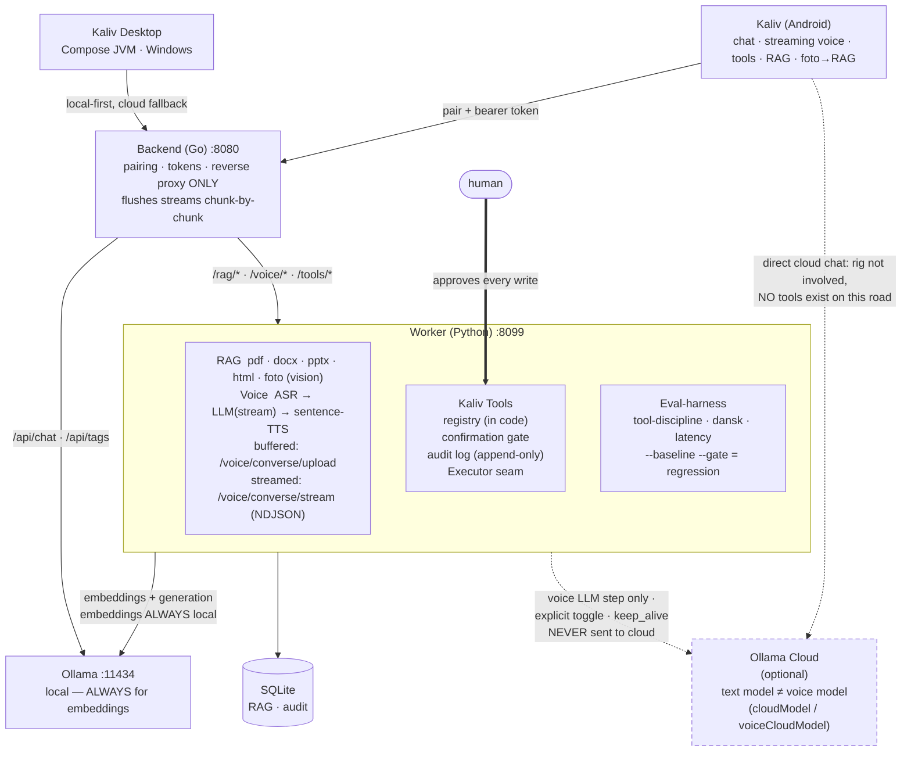
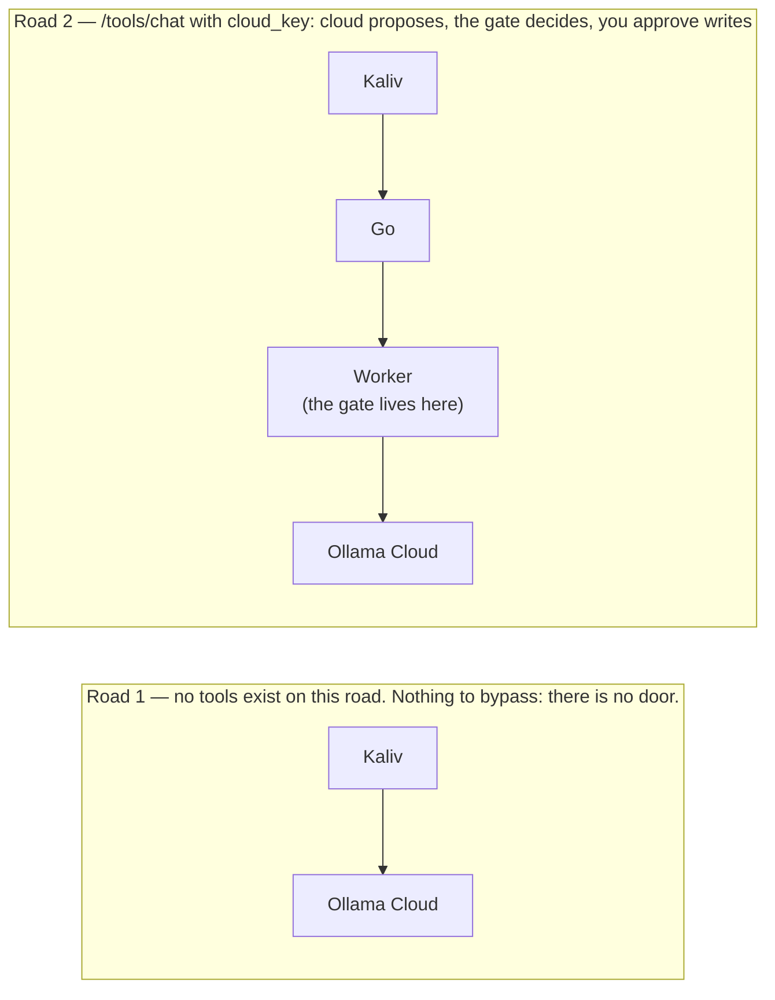

# ModelRig

A local-first AI platform: run models on your own hardware via Ollama, reach them
from a desktop app (**Kaliv** on Windows) and an Android phone (**Kaliv**), with
Danish voice (ASR→LLM→TTS, streamed sentence-by-sentence), RAG document ingest
(pdf/docx/pptx/html/photos), a confirmation-gated tool layer, and an optional
Ollama Cloud brain for when local isn't enough. The backend keeps the ModelRig
name; everything user-facing is Kaliv.

Version: **1.55.0** — streaming voice (Kaliv speaks the first sentence while the
rest generates), dedicated voice cloud model, deterministic emoji-strip, photo→RAG.
See STATUS.md line 3 for the always-current one-liner.

## Architecture



**Two cloud roads, and they are not the same thing.**



Embeddings NEVER go to the cloud. `oc.embed()` has no `base_url` and no
`api_key` parameter, so the RAG index cannot be built over the network —
enforced by the signature, not by a runtime check. Only the LLM step can leave
the rig, and only with the toggle on. When a cloud model proposes a write, the
card says who asked: *"Cloud-modellen foreslår: …"*

**Voice** — audio never leaves the house. ASR (faster-whisper, CUDA) and TTS
(Piper, Danish) always run on the rig. Only the transcribed question may go to
the cloud, and only with the toggle on.

**Tools** — the model proposes; the gate decides. Reads run. Writes stop at a
confirmation card and execute the arguments that were shown: the worker parks
them, so no client can alter them after approval. *Risk* decides whether a
human is asked, not origin. A tool result cannot trigger another tool — the
follow-up turn is sent with `tools=[]`. Off by default (`KALIV_TOOLS_ENABLED=1`).
See `KRAVSPEC_V5_TOOLS.md`.

**The Go server is a proxy and nothing more.** Gate, whitelist and audit live in
the worker, so an old or tampered client cannot find a friendlier backend.

Cloud fallback (desktop): if local is down/insufficient →
Ollama Cloud (https://ollama.com, model `:cloud`) with `OLLAMA_API_KEY`.

**Two cloud roads, and they are not the same thing.**

```
  road 1   Kaliv ─────────────────────────────▶ Ollama Cloud
           The rig is never involved. There are NO tools on this road.
           Nothing to bypass: there is no door, not an open one.

  road 2   Kaliv ──▶ Go ──▶ Worker ──▶ Ollama Cloud
                            └─ gate ─┘
           /tools/chat with cloud_key. A cloud model proposes, the gate
           decides, you approve every write. The card says who asked:
           "Cloud-modellen foreslår: …"
```

**Voice** — audio never leaves the house. ASR (faster-whisper, CUDA) and TTS
(Piper, Danish) always run on the rig. Only the transcribed question may go to
the cloud, and only with the toggle on.

**Tools** — the model proposes; the gate decides. Reads run. Writes stop at a
confirmation card and execute the arguments that were shown: the worker parks
them, so no client can alter them after approval. *Risk* decides whether a
human is asked, not origin. A tool result cannot trigger another tool — the
follow-up turn is sent with `tools=[]`. Off by default (`KALIV_TOOLS_ENABLED=1`).
See `KRAVSPEC_V5_TOOLS.md`.

**The Go server is a proxy and nothing more.** Gate, whitelist and audit live in
the worker, so an old or tampered client cannot find a friendlier backend.

Cloud fallback (desktop): if local is down/insufficient →
Ollama Cloud (https://ollama.com, model `:cloud`) with `OLLAMA_API_KEY`.

**Two cloud roads, and they are not the same thing.**

```
  road 1   Kaliv ─────────────────────────────▶ Ollama Cloud
           The rig is never involved. There are NO tools on this road.
           Nothing to bypass: there is no door, not an open one.

  road 2   Kaliv ──▶ Go ──▶ Worker ──▶ Ollama Cloud
                            └─ gate ─┘
           /tools/chat with cloud_key. A cloud model proposes, the gate
           decides, you approve every write. The card says who asked:
           "Cloud-modellen foreslår: …"
```

**Voice** — audio never leaves the house. ASR (faster-whisper, CUDA) and TTS
(Piper, Danish) always run on the rig. Only the transcribed question may go to
the cloud, and only with the toggle on.

**Tools** — the model proposes; the gate decides. Reads run. Writes stop at a
confirmation card and execute the arguments that were shown: the worker parks
them, so no client can alter them after approval. *Risk* decides whether a
human is asked, not origin. A tool result cannot trigger another tool — the
follow-up turn is sent with `tools=[]`. Off by default (`KALIV_TOOLS_ENABLED=1`).
See `KRAVSPEC_V5_TOOLS.md`.

**The Go server is a proxy and nothing more.** Gate, whitelist and audit live in
the worker, so an old or tampered client cannot find a friendlier backend.

Cloud fallback (desktop): if local is down/insufficient →
Ollama Cloud (https://ollama.com, model `:cloud`) with `OLLAMA_API_KEY`.

- **backend/** — Go, stdlib only. Device pairing (short `XXXX-XXXX` codes) →
  hashed bearer tokens, device list + **revoke**, brute-force **rate limiting** on
  claim, then reverse-proxies chat/models to Ollama (streaming) and RAG to the
  worker. Auth is loopback-free.
- **worker/** — Python FastAPI. RAG: **chunk** (overlapping) → embed via Ollama →
  SQLite → cosine retrieval → optional synthesis, plus **streaming RAG chat**
  (retrieve + stream the answer). Source management: list, stats, delete, filter.
- **desktop/** — Compose Desktop (JVM). **Streaming** chat with local-first +
  Ollama Cloud fallback, model picker, branded UI.
- **android/** — Compose Android V1. Talk to your **rig** (backend → local models
  + RAG) **or directly to Ollama Cloud** (no rig needed). Material 3 dark UI,
  dependency-free **Markdown** rendering (code blocks + copy), Keystore-encrypted
  cloud key. Source — build locally (an APK ships on the GitHub release).
- **tools/** — `modelrig-cli.py`, a dependency-free reference client (pair, chat,
  RAG, device mgmt, `doctor` health check, token `rotate`). Runnable today; used
  to drive the e2e test.
- **tests/** — worker unit + RAG tests, backend smoke + V1 tests, and an
  end-to-end integration test. `sh tests/run_tests.sh` runs all 55 assertions.
- **deploy/** — env reference, a Windows launcher (`run-windows.ps1`), and systemd
  units for running the worker + backend as services.

## ⚠️ The one gotcha that wastes an afternoon
The backend defaults to binding **`127.0.0.1`**. That is unreachable from your
phone or any other machine. Before pairing Android, set:
```bash
MODELRIG_HOST=0.0.0.0 ./modelrig-server      # LAN
# or bind a Tailscale IP for remote access
```
The backend logs this warning at startup; the Android pairing screen repeats it.

## Run order (local dev)

**The easy way:** `scripts\start-kaliv.bat` starts all three processes correctly
(including `MODELRIG_HOST=0.0.0.0` for phone reachability) and runs `/health/full`
at the end. See `scripts/START_HERE.md`. The manual steps below are the long way.
```bash
# 0. Ollama running with your models
ollama pull qwen3:14b        # confirmed primary (MODELS.md); qwen3:8b if VRAM is tight
ollama pull nomic-embed-text

# 1. Worker (RAG) — optional, only if you use /rag/*
cd worker && pip install -r requirements.txt
uvicorn app.main:app --host 0.0.0.0 --port 8099

# 2. Backend
cd ../backend && go build -o modelrig-server ./cmd/modelrig-server
MODELRIG_HOST=0.0.0.0 ./modelrig-server

# 3. Pair a device
./modelrig-server -pair            # (server stopped) OR:
curl -X POST http://localhost:8080/api/v1/pair/start   # (server running)

# 4a. Desktop
cd ../desktop && gradle run

# 4b. Android
cd ../android && ./gradlew assembleDebug

# 4c. Or the reference CLI (works today, no build)
python tools/modelrig-cli.py --url http://localhost:8080 pair --code XXXX-XXXX
python tools/modelrig-cli.py doctor    # backend / worker / ollama health
python tools/modelrig-cli.py chat "hello"
```

Run the tests (Unix/WSL, needs Go + Python worker deps):
```bash
sh tests/run_tests.sh
```

## Build status at a glance

| Module   | State                                        | Verified by                          |
|----------|-----------------------------------------------|--------------------------------------|
| backend  | Go server, pairing + reverse proxy            | ✅ `go build` + `go test` (config, httpapi) in CI |
| worker   | FastAPI: RAG, voice, tools, eval              | ✅ **298 tests** in CI (unit 52 · tools 124 · backup 17 · RAG 48 · paths 12 · migrate 7 · eval 18 · vision 12 · voice-stream 8) |
| android  | Kaliv APK (minSdk 26)                         | ✅ built in CI, `kaliv-latest.apk` on every release |
| desktop  | Kaliv Windows JAR (Compose JVM)               | ✅ built in CI, `Kaliv-windows-x64-X.Y.Z.jar` |
| exes     | server + worker Windows executables           | ✅ built in CI, attached to every release |

Every release ships 6 assets from a green CI run. Mutation-checked regression
tests guard the bug classes that bit on real hardware (env trimming, path
anchoring, keep_alive-to-cloud). The **honest rule** stands: compiled ≠ shipped,
and CI-green ≠ works-on-device — the last mile is always on-device testing.

See **STATUS.md** for the per-release history (line 3 is always the current
one-liner) and **ROADMAP.md** for where this is going (closed-ended at V15).

**Building and testing the clients locally?** See **CLIENT_BUILD_AND_TEST.md**.

## License
MIT — see LICENSE.
