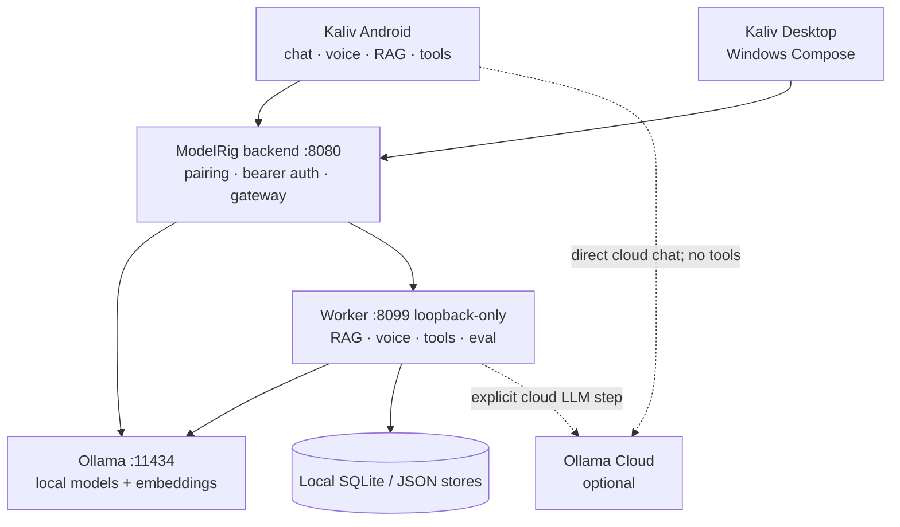

# ModelRig / Kaliv

ModelRig is a local-first AI platform for Anders' Windows rig and Android phone.
**ModelRig** is the backend/appliance; **Kaliv** is the user-facing desktop and
Android assistant.

It combines:

- local Ollama models;
- optional direct Ollama Cloud chat;
- Danish voice: local ASR → LLM → local TTS;
- RAG ingest for text, PDF, DOCX, PPTX, HTML and photos;
- a server-side tool gate with human confirmation for model-initiated writes;
- Windows autostart, supervision and transactional update/rollback.

The authoritative software version is always [`VERSION`](VERSION). Current
priorities and accepted risks live in [`ROADMAP.md`](ROADMAP.md) and
[`SECURITY.md`](SECURITY.md).

## Architecture



### Trust boundaries

- The **Go backend is the only remote gateway**. Remote calls require a bearer
  device token; localhost gets no authentication bypass.
- The **worker is loopback-only** and has no independent remote authentication.
- Tailscale/WireGuard is the sanctioned remote transport. Do not expose the
  plain HTTP backend directly to the internet.
- Embeddings are always local. Audio stays local; only the transcript may reach
  cloud when the user explicitly enables cloud voice.
- Model-initiated writes are parked server-side and require a human confirmation
  card. The arguments shown are the arguments executed.
- Direct cloud chat is a separate road and has no tool layer at all.

See [`SECURITY.md`](SECURITY.md) for the complete threat model, credential
storage and accepted risks.

## Repository layout

| Path | Purpose |
|---|---|
| `backend/` | Go gateway, pairing, token store, proxies, supervisor and updater |
| `worker/` | FastAPI RAG, voice, tools, eval and hardened ASGI entrypoint |
| `android/` | Kaliv Android app |
| `desktop/` | Kaliv Windows desktop app |
| `scripts/` | Windows launch/autostart and validation helpers |
| `deploy/` | Environment reference and service launchers |
| `tests/` | Backend, worker, integration and workflow contract tests |

## Start the rig on Windows

The normal appliance path is:

```powershell
scripts\start-kaliv.bat
```

It starts Ollama, the hardened worker and the backend, then prints
`/health/full`. For persistent appliance mode, install the scheduled supervisor
as described in [`deploy/README.md`](deploy/README.md).

### Manual development start

```powershell
# 1. Ollama
ollama serve
ollama pull qwen3:14b
ollama pull nomic-embed-text

# 2. Worker — loopback only
cd worker
pip install -r requirements.txt
python -m uvicorn app.entrypoint:app --host 127.0.0.1 --port 8099

# 3. Backend — use 0.0.0.0 or a Tailscale IP for the phone
cd ..\backend
go build -o modelrig-server.exe .\cmd\modelrig-server
$env:MODELRIG_HOST = "0.0.0.0"
.\modelrig-server.exe
```

`app.entrypoint:app` is mandatory for production/manual runtime. It wraps
FastAPI outside the request parser so chunked uploads are bounded before being
buffered and voice temp audio is removed after the final stream frame. Directly
launching `app.main:app` is only for focused route tests.

## Pair a client

With the backend running:

```powershell
.\modelrig-server.exe -pair
```

The CLI asks the live server to create the code. If the server is genuinely
offline, it writes to the same exe-anchored device store that normal startup
uses. A reachable but unhealthy server never triggers a second file writer.

The backend defaults to `127.0.0.1`; that address cannot be reached from the
phone. Set `MODELRIG_HOST=0.0.0.0` for LAN access or bind a Tailscale IP.

## Worker hardening

The production worker entrypoint enforces two process-boundary guarantees:

1. `KALIV_MAX_UPLOAD_MB` applies to requests with or without `Content-Length`,
   before FastAPI parses and buffers their JSON body.
2. Temporary `alva_voice_*` directories are removed after the last active HTTP
   response completes or is cancelled, including streaming voice responses.

Focused regression coverage lives in `tests/worker_hardening.py`.

## Streaming contract

A stream ending is not automatically a successful operation.

- Desktop chat requires Ollama's terminal `done=true` line.
- Desktop and Android model pulls require terminal `status=success` and then
  verify that the model appears in the installed-model list.
- Mid-stream protocol errors are surfaced rather than silently converted into a
  completed answer/download.

Android chat/RAG/voice terminal unification remains a separate client refactor;
see the active validation file and PR notes rather than assuming it is complete.

## Tests

The shared CI workflow runs on every push and pull request:

```bash
sh tests/run_tests.sh
```

CI additionally performs:

- version-source consistency checks;
- Go build, vet and tests;
- Python syntax/undefined-name linting;
- all matching backend, worker, integration and workflow-contract tests;
- Windows-native updater/supervisor tests;
- Android compilation and JVM unit tests;
- desktop compilation.

Test counts are intentionally not hardcoded here; CI is the current source of
truth. Green CI proves code/build behavior, not the physical rig, phone, network
or release channel. Those results belong in the current `VALIDATION-*.md` file.

## Releases and updates

Tag releases use one draft-first authority:

1. ensure a private draft exists;
2. build and upload Android, desktop and appliance assets;
3. generate `SHA256SUMS.txt`;
4. verify the complete asset set while it is still a draft;
5. publish and mark latest only in the final step.

A bare tag cannot create a public half-release. The invariant is pinned by
`tests/workflow_release.py`.

The Windows updater performs whole-set transactional update and rollback. See
[`UPDATER_DESIGN.md`](UPDATER_DESIGN.md) and [`deploy/README.md`](deploy/README.md).

## Project documentation

- [`ROADMAP.md`](ROADMAP.md): current Now / Next / Later and decisions
- [`SECURITY.md`](SECURITY.md): trust boundaries, credentials and risks
- [`UPDATER_DESIGN.md`](UPDATER_DESIGN.md): transactional appliance updates
- `VALIDATION-*.md`: hardware/on-device proof for a concrete version
- [`HISTORY.md`](HISTORY.md): historical development record
- [`STATUS.md`](STATUS.md) and [`HANDOFF.md`](HANDOFF.md): historical logs; not
  substitutes for `VERSION`, roadmap or current validation

## License

MIT — see [`LICENSE`](LICENSE).
