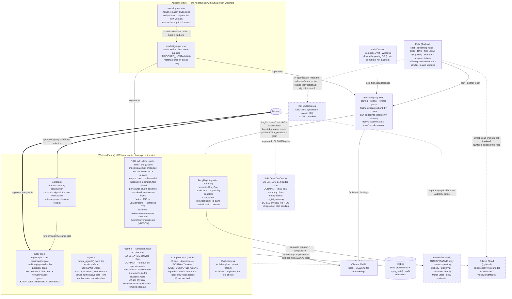
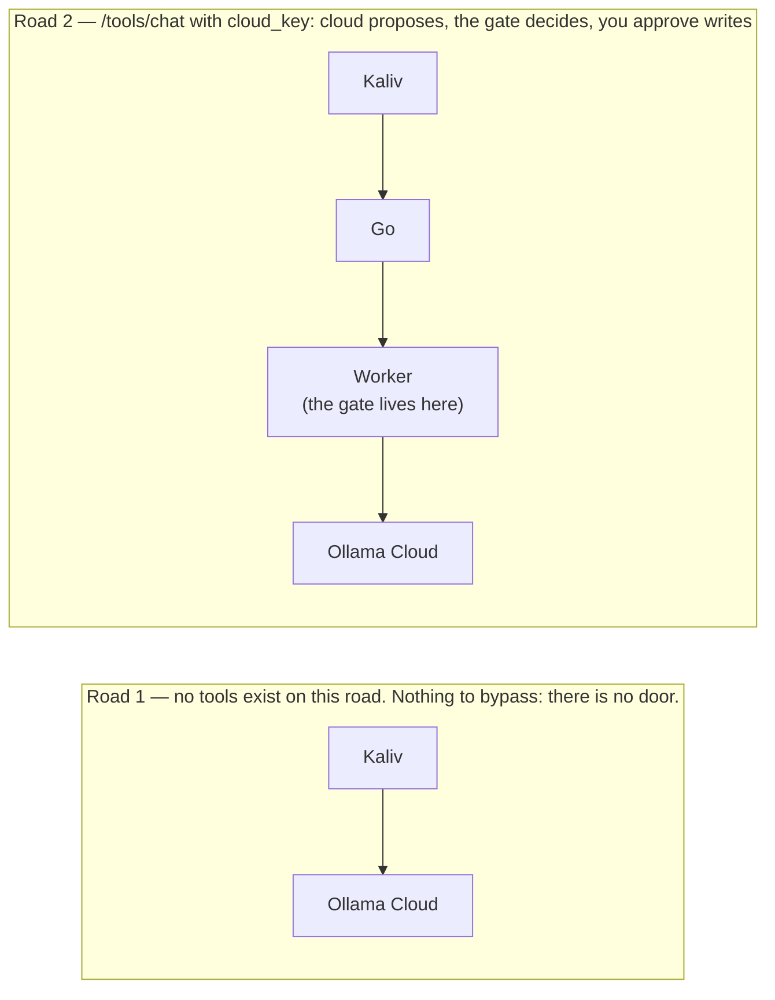

# ModelRig

A local-first AI platform: run models on your own hardware via Ollama, reach them
from a desktop app (**Kaliv** on Windows) and an Android phone (**Kaliv**), with
Danish voice (ASR→LLM→TTS, streamed sentence-by-sentence), RAG document ingest
(pdf/docx/pptx/html/photos), a confirmation-gated tool layer, and an optional
Ollama Cloud brain for when local isn't enough. The backend keeps the ModelRig
name; everything user-facing is Kaliv.

Current version: see `VERSION`. For what actually exists right now — tools with their
risk/sensitivity, the dormant switches and their defaults, design-doc status — see
**CURRENT_STATE.md**, which is GENERATED from the code and CI-checked for drift.

For body-domain ownership, standalone **`Ternedal/BodyRig` is the authority** for
`.mrbody`, BodyPrint, Movement Identity, Motor State and body realization semantics.
ModelRig owns reasoning and semantic BodyRig-facing intent; its internal `bodyrig`
package and mirrored contracts are compatibility/integration consumers. See
`docs/BODYRIG_AUTHORITY.md`.

**The 2.0 line (August 2026)** rebuilt the Android client against a design
authority (`docs/design/DDR-001`, tokens generated from a single JSON source)
and added the things a phone-first client actually needs:

- **QR pairing** — the rig draws the code, the phone scans it. The link never
  carries a token and never pairs by itself: it shows you the host, and only
  then do you connect.
- **In-app updates** — the app reads the `releases/latest` redirect and offers
  `kaliv-latest.apk`. No API, no token, strict semver.
- **Share to Kaliv** — a share lands in a choice, not an action. Nothing is
  indexed because you tapped Share.
- **Answer citations** — "show what was read" lists the retrieved chunks with
  their match scores. It deliberately does NOT claim which sentence used which
  chunk; that link does not exist in the model, so asserting it would be a guess
  dressed as evidence.
- **Offline queue** — write while the rig is away. A queued message is never
  sent by itself when the rig returns.
- **Per-source on/off** in Knowledge, plus first-run onboarding that says out
  loud that the models run on your own machine.

Earlier lines: streaming voice, a self-supervising appliance mode (autostart +
crash-restart + update-with-rollback), and a multi-step agent with human-gated
writes.

## Architecture


```mermaid
flowchart TB
    Desktop["Kaliv Desktop<br/>Compose JVM · Windows<br/>draws the pairing QR (code is minted, not claimed)"]
    Kaliv["Kaliv (Android)<br/>chat · streaming voice · tools · RAG · foto→RAG<br/>QR pairing · share-in · answer citations<br/>offline queue (never auto-sends) · in-app updates"]

    subgraph Appliance["Appliance layer — the rig stays up without a person watching"]
        Sup["modelrig-supervisor<br/>starts worker, then server<br/>supplies MODELRIG_HOST=0.0.0.0<br/>restarts either on exit or hang"]
        Upd["modelrig-updater<br/>newer release? swap exes<br/>verify /healthz reports the new version<br/>restore backup if it does not"]
    end

    Go["Backend (Go) :8080<br/>pairing · tokens · reverse proxy<br/>flushes streams chunk-by-chunk<br/>own endpoints (stdlib only, fail-soft):<br/>/api/v1/system/status · /api/v1/models/unload"]

    subgraph Worker["Worker (Python) :8099 — mounted from app.entrypoint"]
        Pipe["RAG&nbsp;&nbsp;pdf · docx · pptx · html · foto (vision)<br/>ingest is atomic: embed all → BEGIN IMMEDIATE → replace<br/>corpus bound to the model that built it; mismatch fails closed<br/>per-source on/off: absence = enabled, survives re-ingest<br/>Voice&nbsp;&nbsp;ASR → LLM(stream) → sentence-TTS<br/>buffered: /voice/converse/upload<br/>streamed: /voice/converse/stream (NDJSON)"]
        Tools["Kaliv Tools<br/>registry (in code)<br/>confirmation gate<br/>audit log (append-only)<br/>Executor seam<br/>web_research: risk=read + network=public<br/>gated KALIV_WEB_RESEARCH_ENABLED"]
        Sched["Scheduler<br/>at-most-once by construction<br/>claim + budget slot in one transaction<br/>write approvals leave a receipt"]
        A3["Agent 3<br/>mount_agent3() owns the whole surface<br/>DORMANT unless KALIV_AGENT3_ENABLED=1<br/>server-authoritative plan · one confirmation per side effect"]
        A4["Agent 4 — campaign/read architecture<br/>A4-01…A4-25 software chain<br/>DORMANT + default-off operator reads<br/>narrow A4-21 read context · immutable A4-25 snapshot roots<br/>A4-25f physical Windows/Pixel qualification remains separate"]
        BC["BodyRig integration boundary<br/>semantic BodyCue producer + compatibility adapters<br/>standalone Ternedal/BodyRig owns body-domain contracts"]
        CU["Computer Use (Tier B)<br/>I3 see · I4 propose — DORMANT unless KALIV_COMPUTER_USE=1<br/>signed screenshot contract · local-only vision bridge<br/>I5 act: not built"]
        Eval["Eval-harness<br/>tool-discipline · dansk · latency<br/>workflow completion, not tool choice"]
    end

    Dev["KalivDev / DevControl<br/>DC-L01…DC-L14 landed core<br/>DORMANT · local-only authority chain<br/>empty default registry/catalog<br/>DC-L15 physical I0b + DC-L16 product pilot pending"]
    Human(["human"])
    Ollama["Ollama :11434<br/>local — ALWAYS for embeddings"]
    DB[("SQLite<br/>RAG (documents + corpus_meta) · audit · schedules")]
    BodyRig["Ternedal/BodyRig<br/>AUTHORITATIVE body-domain repository<br/>.mrbody · BodyPrint · Movement Identity<br/>Motor State · body realization"]
    Cloud["Ollama Cloud<br/>(optional)<br/>text model ≠ voice model<br/>(cloudModel / voiceCloudModel)"]
    GH["GitHub Releases<br/>kaliv-latest.apk (stable asset URL)<br/>no API, no token"]

    Sup -- "supervises" --> Go
    Sup -- "supervises" --> Worker
    Upd -. "checks releases · rolls back a bad one" .-> Sup

    Desktop -- "local-first, cloud fallback" --> Go
    Kaliv -- "pair + bearer token" --> Go
    Kaliv -. "direct cloud chat: rig not involved,<br/>NO tools exist on this road" .-> Cloud
    Kaliv -. "in-app update: reads the releases/latest redirect,<br/>fetches kaliv-latest.apk — rig not involved" .-> GH
    Go -- "/api/chat · /api/tags" --> Ollama
    Go -- "/rag/* · /voice/* · /tools/* · /schedules/*<br/>Agent 4 operator reads: proxied ONLY, per-device grant" --> Worker
    Human == "approves every write" ==> Tools
    Human == "approves every scheduled write too" ==> Sched
    Sched -- "runs through the same gate" --> Tools
    Worker -- "embeddings + generation<br/>embeddings ALWAYS local" --> Ollama
    Worker --> DB
    Worker -. "voice LLM step only ·<br/>explicit toggle · keep_alive<br/>NEVER sent to cloud" .-> Cloud
    BC -- "semantic contract / compatibility" --> BodyRig
    Human -. "separate physical/human authority gates" .-> BodyRig
    Human -. "separate L15/L16 GO gates" .-> Dev

    classDef ext stroke-dasharray: 6 4;
    class Cloud,GH,BodyRig ext;
    classDef dormant stroke-dasharray: 4 3;
    class A3,A4,CU,Dev dormant;
```

**Two cloud roads, and they are not the same thing.**


```mermaid
flowchart LR
    subgraph R1["Road 1 — no tools exist on this road. Nothing to bypass: there is no door."]
        K1["Kaliv"] --> C1["Ollama Cloud"]
    end
    subgraph R2["Road 2 — /tools/chat with cloud_key: cloud proposes, the gate decides, you approve writes"]
        K2["Kaliv"] --> G2["Go"] --> W2["Worker<br/>(the gate lives here)"] --> C2["Ollama Cloud"]
    end
```

Embeddings NEVER go to the cloud. `oc.embed()` has no `base_url` and no
`api_key` parameter, so the RAG index cannot be built over the network —
enforced by the signature, not by a runtime check. Only the LLM step can leave
the rig, and only with the toggle on. When a cloud model proposes a write, the
card says who asked: *"Cloud-modellen foreslår: …"*

**Voice** — audio never leaves the house. ASR (faster-whisper, CUDA) and TTS
(Piper, Danish) always run on the rig. Only the transcribed question may go to
the cloud, and only with the toggle on.

**Agent 4** — the campaign/read stack now extends beyond the original A4-14
summary. The foundation, product-read and immutable snapshot-authority software
is on `main`, while the runtime remains deliberately dormant and default-off.
The production-shaped surface is read-only, backend-proxied, requires a paired
device plus explicit `agent4:read`, and composes the narrow A4-21 read context
rather than exposing lifecycle/scheduler/resource/handoff/recovery mutation.
A4-19 snapshot-bound paging and A4-20 stale-response invalidation protect the
read product; A4-25a–e establish server-side immutable snapshot authority and
Android snapshot/race handling. **A4-25f remains a separate physical
Windows+Pixel qualification campaign followed by a human GO/NO-GO; CI does not
stand in for that evidence.** See `docs/AGENT_4_IDENTITY.md`,
`docs/AGENT_4_A4_25_SERVER_SNAPSHOT_AUTHORITY.md` and the physical runbooks.

Its architecture is fixed by ADR before behaviour ships; storage must not know
subscribers, and application-driven polling is forbidden. Those boundaries are
not prose alone: CI gates scan the package on every run
(`AGENT_4_ARCHITECTURE_DECISIONS.md` remains the decision authority).

**DevControl / KalivDev** — DC-L01 through **DC-L14 are landed on `main`** as a
separate dormant authority chain for controlled local self-development. The
core includes task/scope authority, Windows containment, signed physical-evidence
contracts, verified local execution, trusted local-only Git, semantic review,
one-time authorization/recovery, local-only candidate materialization and final
package/authority closure. It still has **no normal Kaliv product entrypoint,
no non-empty default registry/catalog and no remote Git/GitHub mutation,
merge/release/deploy authority**. DC-L15 is the fresh physical I0b campaign and
human decision packet; DC-L16 is the later, tightly allowlisted product pilot.
`docs/devcontrol/dc-l14/independent-review-verdict.md` also records that an
independent human DC-L14 verdict has not been recorded; do not synthesize one
from merge status. See `devcontrol/README.md`.

**BodyRig boundary** — `Ternedal/BodyRig` is the source of truth for `.mrbody`,
BodyPrint, Movement Identity, Motor State and body realization. ModelRig owns
semantic assistant intent and BodyRig-facing cue production. The internal
`bodyrig` package and mirrored schemas are compatibility/integration layers, not
a second product authority. See `docs/BODYRIG_AUTHORITY.md`.

**Tools** — the model proposes; the gate decides. Reads run. Writes stop at a
confirmation card and execute the arguments that were shown: the worker parks
them, so no client can alter them after approval. *Risk* decides whether a
human is asked, not origin. Reads may chain within a turn (bounded) so the model
can gather before answering; a write always stops for a human confirmation and is
never chained unapproved — even after an approved write, a subsequent write gets
its own card. Off by default (`KALIV_TOOLS_ENABLED=1`).
See `KRAVSPEC_V5_TOOLS.md`.

**The Go server is a proxy and nothing more.** Gate, whitelist and audit live in
the worker, so an old or tampered client cannot find a friendlier backend.

Cloud fallback (desktop): if local is down/insufficient →
Ollama Cloud (https://ollama.com, model `:cloud`) with `OLLAMA_API_KEY`.

- **backend/** — Go, stdlib only. Device pairing (short `XXXX-XXXX` codes) →
  hashed bearer tokens, device list + **revoke**, brute-force **rate limiting** on
  claim, then reverse-proxies chat/models to Ollama (streaming) and RAG to the
  worker. Auth is loopback-free.
- **worker/** — Python FastAPI. RAG: **chunk** (overlapping) → embed via Ollama →
  SQLite → cosine retrieval → optional synthesis, plus **streaming RAG chat**
  (retrieve + stream the answer). Source management: list, stats, delete, filter.
  Ingest is **atomic**: every embedding is computed before anything is deleted,
  and the replace plus all inserts run in one `BEGIN IMMEDIATE` transaction, so a
  failed embed can no longer leave a source half-replaced. The corpus is **bound
  to the model that built it** (`corpus_meta`), and a query under a different
  model or dimension **fails closed with a named error** instead of returning
  nothing — silence that looks like "no relevant sources" is the one answer a
  disconnected index must never give.
- **desktop/** — Compose Desktop (JVM). **Streaming** chat with local-first +
  Ollama Cloud fallback, model picker, branded UI.
- **android/** — Compose Android V1. Talk to your **rig** (backend → local models
  + RAG) **or directly to Ollama Cloud** (no rig needed). Material 3 dark UI,
  dependency-free **Markdown** rendering (code blocks + copy), Keystore-encrypted
  cloud key. Source — build locally (an APK ships on the GitHub release).
- **tools/** — `modelrig-cli.py`, a dependency-free reference client (pair, chat,
  RAG, device mgmt, `doctor` health check, token `rotate`). Runnable today; used
  to drive the e2e test.
- **tests/** — worker unit + RAG tests, backend smoke + V1 tests, and an
  end-to-end integration test. `sh tests/run_tests.sh` runs the full suite (see CI for the current counts).
- **deploy/** — env reference, a Windows launcher (`run-windows.ps1`), and systemd
  units for running the worker + backend as services.
- **scripts/** — the tooling CI depends on. Generators that own a document
  (`activation_readiness.py`, `current_state.py`, `route_inventory.py`,
  `design_tokens.py`) each have a `--check` that fails on drift, so the
  generated files cannot silently diverge from their source. Also the one-click
  operators for rig days, including `workflow_baseline_one_click.py --check`,
  which answers "is the rig ready" without running or writing anything.
- **eval/** — the specs the harnesses measure against: workflow completion
  (`workflows_v1.json`, 14 workflows), Agent 3 model tasks, the voice baseline
  manifest. `tests/workflow_spec_contract.py` keeps them internally consistent
  — a typo in an expected tool name means a workflow can never pass, and that
  should not be discovered on a rig day.
- **assets/design/kaliv-ui-guide/** — the design authority. `kaliv-ui-tokens.json`
  is the **single** source for colours, spacing, radii and motion; it is
  generated into `KalivTokens.kt` for both clients, and desktop's `Brand.kt`
  reads those rather than keeping its own copies. Two gates hold the chain:
  drift between JSON and the generated files, and any colour literal that
  duplicates a token.
- **brand/** — logo system, app icons and brand guidelines.
  `brand/KALIV_BRAND_HANDOFF.md` is current. **`brand/05_handoff-docs/` is
  superseded**: it describes ModelRig with sapphire blue as the primary action
  colour, and the shipping Kaliv system is brass with no blue in it at all.
  Each of those four files carries a banner saying so.
- **contracts/** — the versioned capability schema and its fixtures, shared by
  the worker and both clients.

## Repository scale

The deterministic `loc-metrics` workflow is now the canonical way to measure
repository source size. At the exact 2026-09-11 landing candidate for #1139,
ModelRig contained **305,666 nonblank tracked source/config lines** and **338,619
physical source/config lines** across 1,472 files: 141,677 product, 105,688 tests,
48,122 scripts and 10,179 config (nonblank counts). Documentation, vendor, build,
generated and common lock/minified files are excluded from that metric.

Run the same definition locally with:

```bash
python scripts/loc_metrics.py
```

CI publishes JSON + Markdown artifacts for PR/main runs, so future documentation
should reference a measured run rather than hand-maintaining a guessed LOC total.

## Scheduler (delivery model)

Scheduled tool runs are **at-most-once by construction**: every claim writes a
durable occurrence row and reserves its budget slot in the same transaction
that advances the due time. Crash recovery consults the audit trail before
refunding anything — a run that provably happened keeps its slot spent. A
pause, renewal or deletion after a claim cancels the in-flight occurrence
(revision guard re-checked right before execution). Every consumed write
approval persists a receipt (device, issue time, consumption time, grant
revision) in the same transaction as the grant — `GET /schedules/{id}` shows
the full history. `ACTIVATION_READINESS.md` runs seven live durability probes
against the real components on every regeneration.

## ⚠️ The one gotcha that wastes an afternoon
The backend defaults to binding **`127.0.0.1`**. That is unreachable from your
phone or any other machine. Before pairing Android, set:
```bash
MODELRIG_HOST=0.0.0.0 ./modelrig-server      # LAN
# or bind a Tailscale IP for remote access
```
The backend logs this warning at startup; the Android pairing screen repeats it.

## Udviklingskanalen: appliancen fra checkouten

Så længe intet er i produktion, kører riggen den kode checkouten holder.
`START_DEV_APPLIANCE.cmd` bygger backend fra HEAD og starter backend + worker
med appliancens egne data og env; `STOP_DEV_APPLIANCE.cmd` bringer den
signerede release tilbage. Ny kode = `git pull` + dobbeltklik. Det er ikke
bevis, og det rører ikke `production_activation` — se `DEV_APPLIANCE.md`.

## Run order (local dev)

**The easy way:** `scripts\start-kaliv.bat` starts all three processes correctly
(including `MODELRIG_HOST=0.0.0.0` for phone reachability) and runs `/health/full`
at the end. See `scripts/START_HERE.md`. The manual steps below are the long way.
```bash
# 0. Ollama running with your models
ollama pull qwen3:14b        # confirmed primary (MODELS.md); qwen3:8b if VRAM is tight
ollama pull nomic-embed-text

# 1. Worker (RAG) — optional, only if you use /rag/*
# Bind to loopback: the worker has NO auth of its own and is meant to be reached
# only by the backend on the same machine. Do not expose it on the LAN.
cd worker && pip install -r requirements.txt
uvicorn app.entrypoint:app --host 127.0.0.1 --port 8099

# 2. Backend
cd ../backend && go build -o modelrig-server ./cmd/modelrig-server
MODELRIG_HOST=0.0.0.0 ./modelrig-server

# 3. Pair a device
./modelrig-server -pair            # (server stopped) OR:
curl -X POST http://localhost:8080/api/v1/pair/start   # (server running)

# 4a. Desktop
cd ../desktop && ./gradlew run   # use the wrapper; a system gradle may be a different version

# 4b. Android
cd ../android && ./gradlew assembleDebug

# 4c. Or the reference CLI (works today, no build)
python tools/modelrig-cli.py --url http://localhost:8080 pair --code XXXX-XXXX
python tools/modelrig-cli.py doctor    # backend / worker / ollama health
python tools/modelrig-cli.py chat "hello"
```

Run the tests (Unix/WSL, needs Go + Python worker deps):
```bash
sh tests/run_tests.sh
```

## Build status at a glance

| Module   | State                                        | Verified by                          |
|----------|-----------------------------------------------|--------------------------------------|
| backend  | Go server: pairing, tokens, reverse proxy — plus its own `/api/v1/system/status` and `/api/v1/models/unload` (stdlib only, fail-soft) | ✅ `go build` + `go test` (config, httpapi) in CI |
| worker   | FastAPI: RAG, voice, tools, jobs, isolation   | ✅ full suite in CI — `tests/worker_*.py` + `tests/workflow_*.py`, auto-globbed (live counts in the CI log; this file does not keep score) |
| android  | Kaliv APK (minSdk 26)                         | ✅ built in CI, `kaliv-latest.apk` on every release |
| desktop  | Kaliv Windows JAR (Compose JVM)               | ✅ built in CI, `Kaliv-windows-x64-X.Y.Z.jar` |
| exes     | server + worker Windows executables           | ✅ built in CI, attached to every release |

Every release ships its full asset set (both APKs, the desktop JAR, the three
Windows exes, the zip and `SHA256SUMS.txt`) from a green CI run: the release is
created as a DRAFT, assets are verified against the expected list, and only
then is it published — so a half-uploaded release is never visible. Regression
tests guard the bug classes that bit on real hardware (env trimming, path
anchoring, keep_alive-to-cloud, retry losing a turn's route, streams ending
without a terminal event). The **honest rule** stands: compiled ≠ shipped, and
CI-green ≠ works-on-device — the last mile is always on-device testing.

See **STATUS.md** for the per-release history (a log, not a status page — for
current state read CURRENT_STATE.md; the old "line 3 is always current"
convention required a human to remember and spent 55 releases wrong
one-liner) and **ROADMAP.md** for where this is going (closed-ended at V15).

**Building and testing the clients locally?** See **CLIENT_BUILD_AND_TEST.md**.

## License
MIT — see LICENSE.