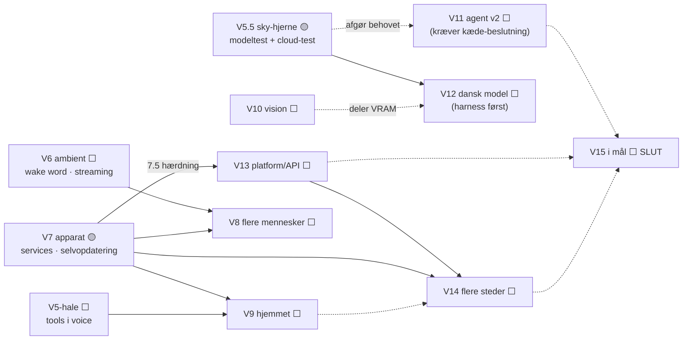
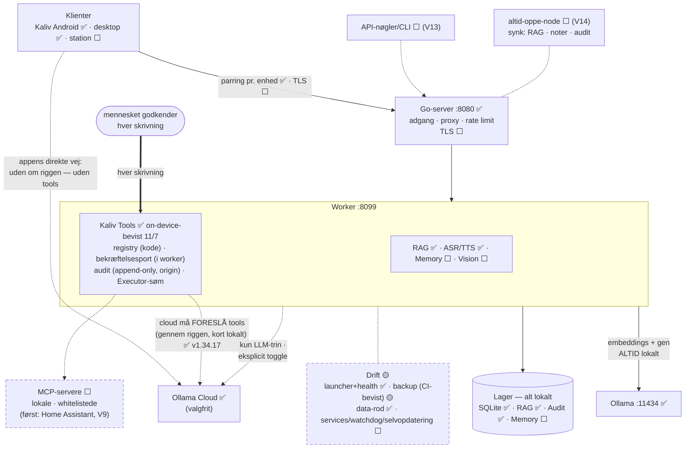

# ModelRig / Kaliv — Roadmap

> **Status 9/7-2026 aften (v1.12.3):** V1 ✅, V2 ✅, V3-kernen (Voice) er nu
> **hardware-bevist på GPU** — tale → large-v3 (CUDA) → hermes3:8b → dansk
> Piper, ende-til-ende på telefonen. Dagens root cause (CUDA-DLL-søgesti)
> fundet og fixet i v1.12.3 (CI grøn, 4 assets). Appen omdøbes **Alva →
> Kaliv** (navn i v1.13.0; ikon afventer Anders' brand-pakke). Udestående
> og nye horisonter: se §9–21 (inkl. målarkitektur i §22).

**Gældende version:** 0.15.5 · **Dato:** 2026-07-04 · **Ejer:** Anders
**Estimat-enhed:** "byggesession" = én autonom arbejdsblok med Claude; leverer typisk 1 tagget release.

---

## 1. Formål og vision

ModelRig er Anders' personlige **Local AI Control Surface**: én privat, selv-hostet
platform (Go-backend + Python RAG-worker + Kotlin-klienter) der styrer lokale og
cloud-modeller på hans præmisser. Roadmappen bringer projektet fra "virker og er
on-brand" (0.15.x) til **stabil daglig driver (V1)**, derefter **fuld kontrolflade
(V2)** og til sidst **udvidet platform (V3)**.

Principper der gælder hele vejen: SQLite-first, minimale afhængigheder, ingen
Docker/cloud uden begrundelse, dansk UI, ærlig skelnen mellem compile-verificeret
og runtime-verificeret, alle leverancer tagget og released på GitHub.

---

## 2. Status ved 0.15.5 *(historisk — se §23 for status pr. v1.34.17, 12/7-2026)*

### Verificeret
- **Server:** 90 test-assertions grønne. Parring → hashede tokens, rotation,
  rate-limit, streaming chat-proxy, RAG-endpoints, deep health, request-ID-logging,
  Ollama Cloud-auth (Bearer-injektion bevist mod fake-cloud).
- **Android (on-device, Anders' Pixel):** app starter, cloud-chat streamer
  (glm-5/gpt-oss), Keystore-krypteret nøgle overlever genstart, brand-palette og
  chat-layout renderer korrekt.
- **Android (compile-verificeret her):** markdown-renderer, per-source
  system-prompts, model-dropdowns (rig + cloud), adaptivt ikon med det ægte mærke
  ekstraheret fra brand-pakken.
- **Flow:** in-sandbox Android-toolchain bygger rigtige APK'er; alle releases
  ligger på GitHub med zip + APK.

### Afventer on-device-bekræftelse
1. Tastatur-adfærd med 0.15.2-kombinationen (`adjustResize` + `imePadding`) —
   screenshot med tastatur åbent mangler.
2. Ikonet (0.15.5, det ekstraherede mærke) på launcheren.
3. Om `ollama.com/api/tags` reelt fylder cloud-model-dropdownen på Anders' konto.

### Kendte mangler (ærlig liste)
- **Ingen samtale-persistens** — alt forsvinder når appen lukkes.
- **Ingen stop-knap** — streaming kan ikke afbrydes.
- **RAG bruges ikke fra appen** — hele RAG-stakken (ingest, retrieval, streaming
  RAG-chat med kilder) er bygget og testet server-side, men Android kan kun ren chat.
  Det er det største gab mellem det byggede og det brugte.
- **Hele historikken sendes hver gang** — ubegrænset payload; dyrt mod cloud-kvote
  og æder lokal kontekst.
- **Debug-signering pr. session:** debug-keystoren genereres i sandkassen, som
  nulstilles mellem sessioner → første APK i en ny session har ny signatur, og
  Android nægter at opdatere oven på (kræver afinstallation = mistet nøgle/prompts).
  Reelt drift-problem, skal løses tidligt.
- Fejl vises råt (`⚠️ Fejl: …`), ingen retry.
- Ikonet er let blødt (kilde-PNG i beskeden opløsning; SVG fra kildefil ønskes).
- Desktop-klienten er ikke rørt/auditeret i denne sessionsrække.
- Ingen CI — builds afhænger af sandbox-toolchainen (geninstalleres pr. session).

---

## 3. V1 — "Stabil daglig driver" ✅ **OPNÅET — `v1.0.0` tagget 8/7-2026** (alle 13 tjeklistepunkter on-device-bekræftet)

**Definition of done:** Anders kan bruge appen hver dag mod rig og cloud uden at
miste data, kan afbryde svar, kan stille RAG-spørgsmål mod sit eget indeks fra
telefonen, og kan installere nye versioner oven på gamle uden afinstallation.

### 0.16 — Fundament der ikke smuldrer (1–2 sessioner) — ✅ leveret i `v0.16.0` (afventer on-device-verifikation)
- **Stabil app-signering.** Dedikeret release-keystore med fast signatur på tværs
  af sessioner. Anbefaling: keystore committes i det private repo; password i
  Notion Secrets (hentes pr. session ligesom PAT). Éngangsomkostning: skiftet fra
  debug-signatur kræver **én** afinstallation → cloud-nøgle + prompts indtastes
  igen én gang. Kommunikeres i release-noten.
  *Acceptkriterie:* APK'er bygget i to forskellige sessioner kan installeres oven
  på hinanden.
- **Samtale-persistens.** Android's indbyggede SQLite (ingen ny dependency).
  Skema v1: `conversation(id, title, source, model, created_at, updated_at)` +
  `message(id, conv_id, role, content, created_at)`; versionering via
  `PRAGMA user_version`. Løbende autosave; seneste samtale genåbnes ved start;
  simpel samtaleliste (ny / åbn / slet — omdøb og søgning er V2).
  *Acceptkriterie:* samtaler overlever app-kill og telefon-genstart.
- **Stop-knap.** `call.cancel()` eksponeres i begge klienter (CloudClient har
  allerede hook'en); send-knappen bliver stop-ikon under streaming.
  *Acceptkriterie:* streaming stopper < 1 sekund efter tryk.

### 0.17 — RAG i lommen (1–2 sessioner) — ✅ leveret i `v0.17.0` (afventer on-device-verifikation)
- **RAG-tilstand i appen** (kun synlig når rig er aktiv): toggle Chat/RAG der
  kalder backendens streaming RAG-chat i stedet for ren chat. Kilderne fra
  første NDJSON-linje vises som chips over svaret (kilde-transparens er hele
  pointen med RAG). Præcis endpoint-path verificeres mod koden ved implementering.
- **Historik-trimning:** send system-prompt + seneste N beskeder inden for et
  tegn-budget (start: N=20 / ~24.000 tegn, konstant i koden). Gælder både rig og
  cloud. Ingen summarization i V1 (bevidst fravalg — koster kald og kompleksitet).
- *Hvis let:* kilde-filter-dropdown (fra `rag-sources`) i RAG-tilstand.
  *Acceptkriterier:* RAG-svar med synlige kilder on-device; payload er bounded
  uanset samtalelængde.

### 0.18 — Fejl-UX og drift (1 session) — ✅ leveret i `v0.18.0` (afventer on-device-verifikation)
- Pæn fejlhåndtering: netværk nede / 401 / ukendt model vises menneskeligt, med
  **"Prøv igen"** på sidste besked (manuel retry — automatisk backoff er fravalgt
  i V1 for enkelhed).
- **Driftdokumentation:** Tailscale-opsætning (rig nås uden for hjemmenetværk),
  backup/restore af `modelrig-data.json` + worker-databasen, geninstallations-guide.

### 0.19 — V1-hærdning — ✅ delvist leveret i `v0.19.0` (afventer Anders' bekræftelse for `v1.0.0`)
- Fuld regression: server-suiten grøn (90/90 — bekræftet). ✅
- Docs ajour (README, STATUS, ROADMAP, CLIENT_BUILD_AND_TEST — rettede en
  forældet "intet Android SDK"-påstand i STATUS.md, tilføjede RAG/retry-tjek). ✅
- **Tilbage (kræver Anders, ikke mere kode):** luk V1-tjeklisten i `STATUS.md`
  (8 punkter) → så tags `v1.0.0` med det samme. `v0.19.0` er bevidst *ikke*
  `v1.0.0` — den tag sætter jeg ikke uden bekræftelse; det ville være falsk
  sikkerhed.

### Bevidste fravalg i V1
Multitråds-UI ud over simpel liste, summarization, automatisk retry, desktop-paritet,
CI, RAG-ingest fra telefonen. Alt sammen bevidst skubbet — se V2.

**V1 samlet estimat: 4–6 byggesessioner.**

---

## 4. V2 — "Kontrolflade" (leveres som v1.1 → v1.x; tag `v2.0.0` når komplet) ✅ **KOMPLET — udløser `v2.0.0`** (8/7-2026: alle 6 punkter + begge haleender leveret)

> **Formel lukning (besluttet 9/7-2026 aften):** `v2.0.0`-tagget blev aldrig
> sat — release-tags fortsatte som `v1.x`, og det bliver de ved med. Faser
> lukkes fremover med dato + notat her i docs, ikke med tags. **Reel lukning
> udestår dog on-device** (~10 min, 3 tjek): (1) txt/md-ingest via
> filvælgeren fra telefonen, (2) model-administration: pull + slet en lille
> model fra appen, (3) samtale: omdøb → søg → del som markdown. Se §23.

Tema: fra chat-app til det, navnet lover — en kontrolflade for hele rig'en.

1. **RAG-administration fra appen.** ✅ **Leveret i `v0.20.2`** (Android).
   Filvælger (Storage Access Framework) i RAG-kilde-dropdownen, læser
   txt/md-tekst og ingester via `ModelRigClient.ingestText()`. Backend-
   kontrakten var allerede permanent testet (`worker_rag.py`/`e2e.py`); ny
   Android-side kode er compile-verificeret, ikke on-device-testet endnu.
   PDF/DOCX-udtræk fortsat udenfor scope. Desktop mangler samme feature.
2. **Presets/personaer.** ✅ **Leveret** — Android i `v0.19.8`, desktop i
   `v0.19.9` (samme skema, samme UX). Gemte system-prompts pr. kilde med
   hurtigskift (SQLite-tabel, chips). Kørt tidligt, uafhængigt af
   V1-tjeklisten. Ikke on-device-testet endnu.
3. **Model-administration.** ✅ **Leveret** — backend + Android i `v0.20.0`,
   desktop i `v0.20.1` (samme metoder, virker mod begge kilder). Pull/slet/
   kørende modeller via backend-proxy mod Ollamas API, streaming download-
   fremgang. 9 permanente backend-tests (99 assertions total). Ikke
   on-device-testet endnu.
4. **Samtale-oplevelse.** ✅ **Leveret i `v0.20.6`** (Android). Omdøb
   (inline, samme mønster som presets), søgning (live filter på titler),
   markdown-eksport/deling via Androids indbyggede deling. Ikke
   on-device-testet endnu. Desktop mangler samme feature.
5. **Desktop-paritet.** ✅ **Audit gennemført + første løft leveret** (0.19.1,
   kørt sideløbende med V1 mens Anders' bekræftelse afventes). Fund fra audit:
   - **Kompilerer OG pakker nu rent** (`BUILD SUCCESSFUL` for både `build` og
     `packageUberJarForCurrentOS`) — opgraderet fra "uverificeret kildekode" til
     "compile- og pakke-verificeret". Ikke *kørt* (headless sandbox, intet
     display) — det er stadig åbent, og et Linux-bygget jar/installer kan
     ikke bruges på Windows (native Skiko er OS-specifik selv i en uber-jar).
   - **Netværkskoden er solid**: `ChatRouter`/`OllamaClient` matcher de samme
     verificerede Ollama-API-shapes som Android bruger. Ingen bugs fundet.
   - **Local→cloud-fallback: findes nu på begge platforme.** ~~Android kræver
     manuelt Rig/Cloud-skift.~~ **Rettelse (1.0.2)**: Android HAVDE allerede
     automatisk fallback i den primære send-sti (rig-chat prøver rig'en, falder
     transparent tilbage til cloud hvis den fejler før noget emitteres — samme
     "fald ikke tilbage midt-stream"-kontrakt som desktops `ChatRouter`, med et
     `fellBackToCloud`-flag vist til brugeren). ROADMAP var forældet på dette
     punkt. Det REELLE hul var at **retry-stien manglede samme fallback** —
     "Prøv igen" mod en nede rig fejlede i stedet for at falde tilbage. Fikset
     i 1.0.2, så begge send-stier er konsistente.
   Leveret i 0.19.1: **brand-farver rettet** (matcher nu Androids verificerede
   palette), **dansk UI** (matchede ikke tidligere projektets faste regel),
   **system-prompt pr. kilde** (samme mønster som Android, med samme kendte
   forenkling — prompten følger den *foretrukne* kilde, ikke nødvendigvis den
   der reelt svarer efter et fallback).
   Leveret i 0.19.2: **markdown-rendering** portet fra Android (næsten ordret —
   ingen Android-specifikke API'er i den originale fil).
   Leveret i 0.19.3: **SQLite-persistens** (`org.xerial:sqlite-jdbc`, samme
   skema som Android), runtime-verificeret med en midlertidig smoke-test mod
   rigtig SQLite (ikke kun compile-verificeret). Kun stille genindlæsning af
   seneste samtale — ingen samtale-browser endnu.
   Leveret i 0.19.4: **RAG-tilstand** (`net/RagClient.kt`), samme mønster og
   forenkling som Android (enkelt-skud pr. spørgsmål), runtime-verificeret mod
   en rigtig lokal HTTP-server (samme metode som SQLite-testen).
   **Paritetslisten er nu fuldført** (brand, dansk UI, system-prompts, markdown,
   persistens, RAG). Samtale-browser (liste/skift/slet) ✅ **leveret i
   `v0.20.7`** — bevidst afgrænset til Android's oprindelige 0.16.0-scope
   (ikke det nyere 0.20.6 søgning/omdøb/del, som afventer on-device-
   bekræftelse først).
6. **CI (GitHub Actions).** ✅ **Leveret** (`.github/workflows/build-and-release.yml`,
   v0.19.5). Ved tag-push (`v*`): kører hele server-suiten (90 assertions),
   bygger Android-debug-APK, og bygger **genuint cross-platform desktop-jars**
   (Windows/macOS/Linux-runnere hver især — løser det jeg selv flaggede i
   0.19.1: en Linux-bygget jar kan ikke køre på Windows, men en
   **Windows-runner** kan bygge en ægte Windows-jar). Til sidst pakkes
   kilde-zip'en (samme excludes som hele sessionen) og alt uploades automatisk
   til releasen via `softprops/action-gh-release`. Fjerner sandbox-toolchainen
   som flaskepunkt — reproducerbare builds fremover, ikke afhængige af at jeg
   geninstallerer JDK/Gradle/Android SDK hver session. Verificeret ved reelt at
   tagge og observere kørslen (se release-noten for v0.19.5).
7. *Evt.* Robolectric-tests for kritisk Android-logik (trimning, persistens) —
   ny dependency, tages kun hvis fejl i praksis retfærdiggør den.

**V2 samlet estimat: 5–8 byggesessioner.**

---

## 5. V3 — "Kaliv: personlig assistent" (brand: Alva 8/7 → **Kaliv** 9/7-2026)

**Navnehierarki (Anders' beslutninger):** appen hed **Alva** fra 8/7
(`v1.2.0`) og hedder fra 9/7 aften **Kaliv**; motoren forbliver **ModelRig**,
`applicationId` er urørlig (`dk.ternedal.modelrig`, APK-signatur).
Navne-rebranden (launcher, UI, persona, docs; env-vars som `KALIV_*` med
`ALVA_*`-fallback så riggen ikke knækker) lander i `v1.13.0`. **Ikonet
afventer Anders' brand-pakke** (leverancekrav sendt 9/7: transparent
forgrund ≤40 %, separat baggrund, valgfri monokrom) og skibes som egen
lille release. Undersystemer følger med: Kaliv Voice, Kaliv Memory, Kaliv
Tools, Kaliv UI — historik i `BRAND_IDENTITY.md` og
`ALVA_VOICE_ROADMAP_DELTA.md`.

Flere af undersystemerne findes allerede under andre navne:
- **Alva Memory** = eksisterende RAG + samtale-persistens + presets (leveret).
- **Alva UI** = eksisterende Android/desktop-oplevelse (rebrandet, ikke ny).
- **ModelRig Core** = eksisterende Go-backend + worker + Ollama-routing.

### 🎙️ Alva Voice — PRIORITERET spor (nyt, stort)

Samlet Voice I/O: push-to-talk → VAD → ASR → LLM-streaming → sentence-chunking
→ TTS → audio-queue → barge-in. **Dette er hovedsporet fremad.** Fuld
kvalitetssikring, modelverifikation, licens-flag, MVP-scope og milepæle med
acceptkriterier ligger i **`ALVA_VOICE_ROADMAP_DELTA.md`**. Kernepunkter:
- **MVP holdes smalt**: push-to-talk + Silero VAD + faster-whisper (MIT, let)
  + eksisterende Ollama-streaming + Piper TTS (fri). Beviser latency-kæden med
  mindst mulig ny afhængighed.
- **Parakeet dansk ASR er kandidat, ikke låst**: bedre dansk kvalitet, MEN
  NVIDIA Open Model License + tung NeMo-afhængighed (bryder exe-simpliciteten).
  Verificeret 8/7. Fase 2, som isoleret modelbytte.
- **Nøglemetrik**: time-to-first-audio — Alva taler efter første sætnings-chunk.
- **Barge-in er V1-krav** men teknisk svært (akustisk ekko) — headset-først i MVP.
- **Kræver beslutninger fra Anders før kode**: NeMo-afhængighed ja/nej,
  headset-først ja/nej, Parakeet-licens-accept. Se delta-dok §6.

### Øvrige V3-punkter (uprioriteret, efter Voice-MVP)

- **Vision:** ✅ **Leveret i `v1.1.0`** (Android — billeder til vision-modeller
  via Ollamas images-felt). Compile-verificeret, afventer on-device-test med en
  vision-model.
- **Share-target:** "Del til Alva" fra enhver app → RAG-ingest eller chat.
- **Baggrunds-generering** med notifikation (foreground service).
- **Multi-rig-profiler** ✅ **Leveret i `v0.20.8`**, on-device-bekræftet 8/7.
- **Widget / Quick Settings-tile**; **Biometrisk lås** foran cloud-nøglen.
- **Alva Tools / agent-tools** (modellen kalder værktøjer via rig'en). Kræver
  stadig den gennemtænkte sikkerhedsmodel — størst usikkerhed i hele roadmappen.

---

## 6. Kvalitet og test pr. milepæl

- Server-suiten (90+ assertions) skal være grøn ved hvert tag; nye backend-endpoints
  får tests i samme release.
- Android forbliver **compile-verificeret her + on-device-tjekliste** i hver
  release-note (kort, konkret, afkrydselig). Automatiske UI-tests er bevidst
  fravalgt i V1 (emulator i sandbox er tung/usikker); revurderes i V2 (pkt. 7).
- Backend/worker-versionskonstanter bumpes i takt med app'en, så `/healthz`
  matcher release-tagget (etableret praksis).
- Skelnen **compile-verificeret vs. runtime-verificeret** fastholdes eksplicit i
  STATUS.md ved hver release.

---

## 7. Risici

1. **Signatur-skiftet (0.16):** én planlagt afinstallation; mistes hvis den ikke
   kommunikeres tydeligt → står i release-noten med fed.
2. **Insets/tastatur på andre enheder:** notorisk flaky domæne; verificeret på
   Pixel/Android 15, andre enheder kan afvige.
3. **Ollama Cloud-drift:** endpoints/kvoter/modelnavne kan ændre sig; isoleret i
   `CloudClient` (ét sted at rette).
4. ~~**Sandbox-toolchain pr. session:** ~5–10 min reinstallations-overhead og risiko
   for versionsdrift indtil CI (V2 pkt. 6) fjerner afhængigheden.~~ **Løst:**
   CI (`v0.19.5+`) fjerner afhængigheden — 6+ releases bevist stabilt siden.
5. **RAG-kvalitet:** delvist adresseret i `v0.20.11` (relevans-tærskel så
   irrelevante matches ikke tvinges ind som kontekst; sætningsbevidst
   chunking) — og **tærskel-adfærden er nu live-bekræftet on-device**
   (6/7-2026: "hej" mod en reel kilde gav ærligt "I don't know" uden
   kilder, i stedet for støj-kontekst). Selve 0.3-værdien er stadig et
   udgangspunkt, ikke empirisk tunet — forvent justering ved daglig brug.
6. **PDF-ingest (V2)** er en kendt scope-fælde; startes smalt og udvides kun ved behov.
7. **Ikon-skarphed:** afhænger af SVG fra kildefilen (åbent spørgsmål 2).

---

## 8. Åbne spørgsmål

1. ~~**Desktop i V1 eller V2?**~~ **Afgjort: V2.** Anders sagde "kør efter
   roadmap" uden indsigelse mod anbefalingen; 0.16–0.18 er bygget derefter.
2. **Findes logoets SVG/kildefil?** Delvist afgjort — Anders leverede
   `ModelRig_logo_icon_exports.zip` (rasterexports af det godkendte design,
   ikke vektor), brugt siden 0.16.0. En ægte SVG ville stadig gøre ikonet
   pixel-skarpt, men er ikke blokerende for V1.
3. **CI via GitHub Actions ok** trods "ingen cloud uden grund"? Stadig åbent —
   relevant først i V2 (§4 pkt. 6).
4. **RAG-dokumenttyper:** hvad er vigtigst efter txt/md — PDF? DOCX? Stadig
   åbent — relevant først i V2 (§4 pkt. 1).
5. ~~**Release-keystore-placering?**~~ **Afgjort: privat repo**
   (`android/signing/`), password også i Notion Secrets som backup. Implementeret
   i 0.16.0.

---

## 9. V4 — Horisonter (tilføjet 9/7-2026 aften)

Retninger EFTER at V3-kernen (Voice) er hardware-bevist. Uprioriteret indtil
Anders vælger; hvert punkt er markeret med hvad der kræves.

### Nær — ✅ AFSLUTTET 10/7-2026
- ~~tap-to-stop + Kaliv-navnerebrand~~ ✅ **v1.13.0**
- ~~Kaliv-ikon~~ ✅ **v1.12.4** (+ hele paletten i **v1.16.0**, splash og
  velkomstskærm i **v1.17.0**)
- ~~Barge-in-kalibrering~~ ✅ **værktøjet leveret i v1.15.0** (live RMS +
  top + justerbar tærskel). Selve kalibreringen kræver Anders' telefon.
- ~~PPTX/HTML-ingest~~ ✅ **leveret i v1.14.0** (10/7). PPTX: shapes, tabeller
  og talernoter via python-pptx. HTML: stdlib — ingen ny afhængighed, aldrig 501.

### Mellem (små beslutninger, kendt teknik)
- **Streaming-ASR**: delvis transskription mens der tales (i dag sendes hele
  filen efter slip). Største oplevede latency-gevinst efter TTFA-chunking
  [kræver protokol-ændring app↔worker]
- **Wake word "Hey Kaliv"** (openwakeword, opt-in) [beslutning:
  altid-lyttende mikrofon ja/nej]
- **OCR for scannede PDF'er** — i dag ærlig 422 [beslutning: Tesseract
  (Apache-2.0) vs. alternativer]
- **Desktop-voice**: paritet på Windows-klienten [efter mobil er poleret]
- **Kaliv Memory v2**: RAG over egne samtaler ("hvad sagde vi om X i
  sidste uge?") — alt lokalt [design: indeksering + sletning]

### Horisont (kræver arkitektur- og sikkerhedsbeslutninger)
- **Kaliv Tools / agent-tools**: modellen kalder værktøjer via riggen.
  Fortsat størst usikkerhed i roadmappen: whitelist, bekræftelses-UX,
  prompt-injection-værn [kravspec før kode]
- **Multi-enhed**: flere klienter mod samme rig, per-enheds-parring
  [moderat backend-arbejde]
- **Proaktiv Kaliv**: påmindelser/baggrundsopgaver med notifikationer
  [foreground service; beslutning om hvor "levende" Kaliv skal være]

---

## 10. V5 — "Kaliv handler" (agent-laget) ✅ **OPNÅET — on-device-bevist 11/7-2026** (notes.md skrevet via note_append gennem kort + audit på Anders' rig)

Tema: fra samtale til handling — Kaliv må røre ting på riggen, men kun
gennem en sikkerhedsmodel der er designet FØR første linje tool-kode.
Løfter V4's største "kræver beslutning"-punkt til et fuldt spor.

0. ~~Kravspec før kode~~ ✅ skrevet 10/7 (`KRAVSPEC_V5_TOOLS.md`),
   godkendt af Anders samme dag; de fem åbne spørgsmål besvaret
   (bl.a.: cloud MÅ foreslå tools, risiko afgør kortet — 10/7).
1. ~~Fundament i workeren~~ ✅ **leveret som KODE-registry, ikke MCP**
   (bevidst afvigelse: mindre overflade, ingen tredjeparts-servere før
   NTFS-ACL-forudsætningen er på plads). Registry + enable/disable pr.
   tool + `ollama_tool_schema` (disabled tools annonceres ikke engang).
   MCP-klient er flyttet til V5.5/V6-overvejelse.
2. ~~Første tools — read-only~~ ✅ `rig_status` (disk m.m.) kører frit;
   filsøgning/-læsning venter bevidst på **NTFS-ACL-forudsætningen**
   (separat Windows-konto før vilkårlige fil-stier — står ved magt).
3. ~~Skrivende tools bag bekræftelse~~ ✅ `note_append` bag kortet;
   gate håndhævet i WORKER (ingen klient kan omgå); append-only audit
   med origin (local/cloud); tool-output er DATA og kan ikke kæde
   (`tools=[]` på svar-turen). On-device-bevist 11/7.
4. **Tools i voice-flowet** ⬜ (uændret): Kaliv siger højt hvad den vil
   gøre og venter på "ja" før eksekvering. Næste naturlige V5-hale.

**Exit-kriterium:** ~~ét læsende og ét skrivende tool virker fra tekst,
med bekræftelse + audit-log, on-device-bekræftet~~ ✅ **11/7-2026**
(stemme-delen udestår → punkt 4). Faktisk forbrug: ~12 releases
(v1.18→v1.27) + en hel device-test-dag (v1.34.5→.17) for at bevise det
— spec-arbejdet var IKKE det usikre led; det var "virker-på-rigtig-
hardware"-klassen af fejl (se TROUBLESHOOTING.md).

---

## 10.5. V5.5 — "Kaliv med sky-hjerne" (cloud-assisteret agent) 🟡 NYT SPOR 12/7-2026

Tema: de lokale 8B-modeller narrer tool-kald i prosa og glemmer dansk —
en størrelsesgrænse, ikke en kodefejl. En cloud-model på agent-stien løser
begge, MED gaten intakt (kortet kører lokalt, uanset hvem der foreslår).

0. ~~Verifikation af eksisterende flow~~ ✅ **v1.34.17**: cloud-tools-stien
   er trådet korrekt ende-til-ende (app sender cloud-config på TOOLS-stien;
   worker router på cloud_key; write kræver kort med origin=cloud; T30
   beviser hele stien med stubbet upstream, mutationstjekket).
   **Ollama Cloud kræver NUL ny integration** — flowet fandtes.
1. **On-device cloud-agent-test** ⬜ [Anders, protokol i CLOUD_TOOLS.md §A]:
   cloud-model + Tools til → kort med "cloud-modellen foreslår" → godkend →
   notes.md + audit med origin=cloud.
2. **Lokal model-opgradering parallelt** ⬜ [Anders, protokol i MODELS.md]:
   qwen3:14b (tæt på 12GB) / qwen3:8b som fallback — afgør hvor langt
   lokal kan nå på tool-pålidelighed + dansk før cloud er nødvendig.
3. **Auto-rute til cloud når Tools er på** ⬜ [design klar, CLOUD_TOOLS.md §B]:
   opt-in switch (default fra), manuel "Skift" vinder altid, kun hvis
   cloud-nøgle findes, chip viser "via cloud (tools)". Gate uændret.
   Bygges EFTER pkt. 1+2 har vist behovet.
4. **Evt. Claude/OpenAI-adapter** ⬜ [kun hvis Ollama Clouds modeludvalg
   ikke rækker]: reelt arbejde — andet request/tool-schema-format.

**Åbne beslutninger (Anders):** provider; skal auto-cloud undgå RAG-kontekst
(privacy: personlige dokumenter auto-sendes ellers); omkostningsloft.

**Exit-kriterium:** et cloud-foreslået write godkendt og udført on-device
med origin=cloud i audit; beslutning truffet om auto-rute.

---

## 11. V6 — "Kaliv omkring dig" (ambient & multi-enhed)

Tema: altid tilgængelig, flere enheder, proaktiv — med samtykke og alt
lokalt. Bygger på V4's streaming-ASR og V5's tool-lag.

1. **Wake word "Hey Kaliv"** som opt-in mode [beslutning: altid-lyttende
   mikrofon ja/nej] — openwakeword på enheden; intet forlader telefonen
   før wake-ordet er hørt.
2. **Flydende samtaleloop**: streaming-ASR + kalibreret barge-in →
   dialog uden knapper.
3. **Multi-enhed**: per-enheds-parring; flere Android-klienter mod samme
   rig — evt. en pensioneret Android-enhed som fast Kaliv-station i
   hjemmet [moderat backend-arbejde].
4. **Proaktiv Kaliv** [beslutning: hvor "levende" må den være]:
   påmindelser og baggrundsjobs med notifikationer (foreground service).
5. **Kaliv Memory v3 — profil**: langtidspræferencer på tværs af
   samtaler, alt lokalt, med se/redigér/slet-UI [privacy-design].
6. **Desktop-voice**: fuld paritet på Windows-klienten.

**Exit-kriterium:** "Hey Kaliv" → svar → opfølgning håndfrit på mindst
to enheder; en proaktiv påmindelse leveres uden at appen er åben.
Estimat: 6–10 byggesessioner.

---

## 12. V7 — "Kaliv som apparat" (drift & robusthed)

Tema: fra tre cmd-vinduer til et apparat. Når Kaliv er ambient (V6) og må
handle (V5), bliver DRIFTEN det svageste led — riggen skal overleve
genstart, opdatere sig selv og kunne reddes.

1. **Windows-services**: Ollama, worker og server som services med
   autostart + watchdog (genstart ved crash). Erstatter
   tre-vinduers-ritualet i HANDOFF §2.
2. **Selvopdatering**: rig-agent der ser nye GitHub-releases, henter,
   verificerer (checksum) og ruller tilbage ved fejl [beslutning:
   fuldautomatisk vs. ét-kliks-godkendelse].
3. ~~Backup/restore~~ 🟡 **PÅBEGYNDT (v1.30.0, hærdet v1.34.16)**:
   `worker/app/backup.py` pakker RAG + data + audit + tools-state + notes
   som ét verificeret arkiv; round-trip bevist i CI. v1.34.16 rettede at
   backup læste device-tokens fra FORKERT env-var (restore ville ikke have
   gendannet parringen). **Mangler stadig:** verifikation på selve riggen.
4. **Sundhed & observabilitet** 🟡 **PÅBEGYNDT (v1.31.0 + launcher)**:
   `/health/full` giver samlet verdict (worker, Ollama, ASR+device, TTS,
   tools, disk); `?deep=true` round-trip'er en embedding; `start-kaliv.bat`
   (v1.34.13) starter hele stakken korrekt og viser health FØR telefonen
   tages op; worker/server logger nu data_root/device-store ved opstart.
   **Mangler:** GPU/VRAM-metrikker, logrotation.
5. **Hærdning** 🟡 **PÅBEGYNDT (v1.34.10–.16, "apparat-robusthed")**:
   data-filer working-dir-uafhængige (data-rod + `ResolveDataPath` — RAG/
   audit/kill-switch/tokens overlever opstart fra vilkårlig mappe;
   `migrate_data.py` samler gamle filer); alle env-reads trimmes (mellemrums-
   fælden); misvisende fejlbeskeder navngiver nu den ægte årsag.
   **Mangler:** TLS på LAN [beslutning: selvsigneret + pinning], token-
   rotation, rate limits.
6. **Strøm/termik** [valgfrit]: GPU-idle-politik, planlagt dvale/vågn.

**Exit-kriterium:** koldt strømsvigt → riggen kommer op af sig selv; en
ny release installeres uden manuel zip-dans; restore fra backup er
bevist én gang. Estimat: 4–7 sessioner.
*Note:* pkt. 1–3 kan trækkes frem før V5/V6, hvis dagligbrug kræver det.

---

## 13. V8 — "Kaliv i huset" (flere mennesker)

Tema: fra personlig til fælles — husstand og gæster, uden at nogen kan
se andres data. Forudsætter V5's sikkerhedsmodel og V7's robusthed.

1. **Multi-bruger-model**: profiler pr. person, per-bruger-parring af
   enheder; roller (ejer / husstand / gæst).
2. **Data-isolation**: samtaler, RAG-kilder og memory adskilt pr.
   bruger; delte kilder som eksplicit tilvalg.
3. **Tool-rettigheder pr. rolle**: gæst = read-only eller intet; kun
   ejer godkender nye tools [bygger på V5-whitelist].
4. **Stemmeprofil (eksperiment)** [beslutning: biometri i hjemmet
   ja/nej]: lokal speaker-id — "hvem taler?" — forlader aldrig huset.
5. **Husstands-koordination**: fælles lister/påmindelser med ejerskab.

**Exit-kriterium:** to personer bruger samme rig fra hver sin telefon
uden at kunne se hinandens data; en gæsteprofil kan chatte men intet
ændre. Estimat: 5–8 sessioner.

> **Efter V8-noten er promoveret:** "Kaliv lærer" er nu et rigtigt spor
> med go/no-go — se **V12 (§17)**.

---

## 14. V9 — "Kaliv i hjemmet" (fysisk verden) ⬜ NYT SPOR 12/7-2026

Tema: fra riggen til huset — Kaliv må røre den fysiske verden (lys, varme,
sensorer), gennem PRÆCIS samme sikkerhedsmodel som V5: forslag → kort →
audit. Det er her den udskudte MCP-klient-beslutning fra V5 lander naturligt:
første EKSTERNE integration, mod ét velafgrænset system.

1. **Home Assistant-bro** [teknikvalg: HA's MCP-integration vs. REST/
   WebSocket-API — afgøres af hvad HA-versionen på riggen udstiller]:
   HA er det oplagte mål — lokal-først som ModelRig selv, alt bliver i huset.
2. **Read-only først** [lav risiko, samme mønster som V5.2]: "er der lys
   tændt?", "hvad er temperaturen?" — sensor-læsninger kører frit som
   rig_status gør i dag.
3. **Styring bag kortet**: "sluk lyset i stuen" → kort → udfør → audit
   (origin + entitet). [Beslutning senere: whitelist af "ufarlige" domæner
   (lys/kontakter) til kort-fri styring — IKKE i MVP; låse/varme ALDRIG
   kort-frit.]
4. **Voice-styring af hjemmet**: kræver V5's hale (tools i voice-flowet)
   — "Kaliv, sluk lyset" med mundtligt "ja" som bekræftelse.
5. **Kaliv-station (valgfrit hardware-spor)**: dedikeret enhed i stuen.
   Vej A: pensioneret Android-telefon (0 kr, V6.3's model). Vej B:
   Raspberry Pi 5 + mic-array + højttaler (groft estimat 1.000–1.500 kr).
   [Beslutning: kun hvis vej A viser sig utilstrækkelig — start gratis.]

**Forudsætninger:** V7.1 (services/altid-oppe — et hjem-API der forsvinder
når et cmd-vindue lukkes er værre end intet) + V5-hale for voice-delen.
**Exit-kriterium:** én sensor læses og én lampe styres fra Kaliv med kort +
audit, on-device-bevist. Estimat: 4–7 sessioner (MCP-valget er det usikre).

---

## 15. V10 — "Kaliv ser" (vision) ⬜ NYT SPOR 12/7-2026

Tema: billeder ind i alle flows. Fundamentet FINDES allerede: appen sender
`imageB64`, og tools-stien bærer billedet (T23-testet) — men ingen lokal
model KIGGER på det endnu.

1. **Lokal vision-model** [teknikvalg: llama3.2-vision:11b (~8 GB) vs.
   qwen-VL-familien — afgøres af dansk-kvalitet og VRAM]:
   **Ærlig VRAM-kabale:** ASR large-v3 (~3 GB) + gen-model (~5–6 GB) +
   VLM (~8 GB) kan IKKE alle være resident på 12 GB samtidig. Kræver
   keep_alive-jonglering eller model-swap ved billedturer → latens-hit.
   [Beslutning: accepteres swap-latensen, eller er vision cloud-only?]
2. **"Hvad er det her?"**: foto fra telefonen → beskrivelse i chatten.
   MVP — rører ingen anden del af systemet.
3. **Foto → RAG**: tag et billede af et dokument/en tavle → tekst
   ekstraheres → ingesteres som kilde. Løser samtidig V4's OCR-punkt for
   fotos (scannede PDF'er er stadig separat beslutning).
4. **Vision i tools-flowet**: "læs denne kvittering og lav en note med
   beløbet" — billede + tool-kald i samme tur (stien bærer det allerede).

**Forudsætninger:** ingen hårde — kan bygges nu. Konkurrerer om VRAM med
V12-eksperimenter.
**Exit-kriterium:** et foto beskrives korrekt på dansk on-device, og ét
dokumentfoto er søgbart i RAG. Estimat: 3–5 sessioner.

---

## 16. V11 — "Agent v2" (kæder, planer, skema) ⬜ NYT SPOR 12/7-2026

Tema: fra ét tool pr. tur til opsynede FLERTRINS-handlinger. **OBS:** V5's
MVP forbød bevidst tool-kæder (sikkerhedsbeslutning). Dette spor OPHÆVER
det forbud — kontrolleret — og kræver derfor Anders' eksplicitte
beslutning før første linje kode. [Ingen kode før godkendelse — som V5.]

1. **Plan-forhåndsvisning**: modellen foreslår en plan (max 3 trin), Anders
   ser HELE planen før noget kører. Reads i planen kører frit; hvert WRITE
   får stadig sit eget kort. Abort når som helst.
2. **Skemalagte jobs (scheduler)**: cron-agtige jobs — "hver morgen kl. 7:
   læs kalenderen og læg et resumé i noterne". Driver V6.4 (proaktiv).
   [Beslutning: må et skemalagt job indeholde writes? Design-forslag:
   kun mod forhåndsgodkendt skabelon, aldrig frie writes uden kort.]
3. **Fil-tools låses op**: V5.2's udskudte filsøgning/-læsning — når
   NTFS-ACL-forudsætningen (separat Windows-konto) er på plads. Står
   ved magt som hård forudsætning.
4. **Generaliseret MCP-klient**: hvis V9's HA-bro blev MCP, generaliseres
   klienten her til flere whitelistede lokale MCP-servere.

**Forudsætninger:** V5 ✅ + Anders' kæde-beslutning + (pkt. 3) NTFS-ACL.
**Exit-kriterium:** én 2-trins-plan (read→write) vist, godkendt og udført
med kort på write-trinnet; ét skemalagt read-job kørt i 7 dage uden babysitting.
Estimat: 4–6 sessioner efter beslutningen.

---

## 17. V12 — "Kaliv lærer dansk" (model-suverænitet, forskningsspor) ⬜ 12/7-2026

Promoverer "Efter V8"-noten til et rigtigt spor — med en benhård go/no-go
så vi ikke brænder uger på et eksperiment uden udbytte. Motivation: de to
tilbageværende svagheder (tool-narration, dansk-drift) er MODEL-grænser.
V5.5 afprøver købe-vejen (større/cloud-model); dette spor er bygge-vejen.

0. **Eval-harness FØRST** [1–2 sessioner, værdi uanset udfald]: automatiseret
   dansk-benchmark over egne testcases — (a) kalder den værktøjet eller
   narrerer den? (b) holder den dansk over 10 ture? (c) svarkvalitet på
   Anders' faktiske opgavetyper. Køres mod hver ny modelkandidat — gør
   ALLE fremtidige modelvalg til målinger i stedet for fornemmelser.
1. **Go/no-go**: kør harness mod qwen3:14b/8b + bedste nye åbne modeller
   (landskabet flytter sig hurtigt). **Kun hvis** gap består OG cloud er
   uacceptabel (privacy/pris) → gå til 2. Ellers: sporet LUKKES med data.
2. **QLoRA-eksperiment** [kun efter go]: finjustér 7–8B på egne data
   (samtaler/notes — alt lokalt, privacy er gratis her). 12 GB rækker,
   men langsomt (dage pr. kørsel). Mål: dansk-fasthed + tool-disciplin,
   IKKE ny viden.
3. **Eval igen**: kun en model der SLÅR baseline på harnessen udrulles.

**Ærlig forventning:** udbyttet er usikkert; nye åbne modeller kan gøre
sporet overflødigt før det starter — det er PRÆCIS hvad harnessen afgør
billigt. Estimat: harness 1–2 sessioner; resten ubundet forskning.

---

## 18. V13 — "Kaliv som platform" (API udad) ⬜ RETNING 12/7-2026

> **Ærlighedsmarkør for V13–V15:** jo længere ude, jo mere spekulativt.
> Dette er RETNING, ikke løfter — hvert spor genbesøges når dets
> forudsætninger faktisk er landet. Skrevet på Anders' anmodning 12/7.

Tema: andre systemer må tale TIL Kaliv — scripts, automations, cron på
andre maskiner. Promoverer "Kaliv-API/webhooks"-noten. For en IT-arkitekt
er scriptability den reelle værdi: Kaliv som byggeklods, ikke kun app.

1. **Kaliv-API v1**: dokumenteret HTTP-API (den findes de facto — Go-
   serverens ruter — men udokumenteret og parring-bundet). Pr.-integration
   API-nøgler adskilt fra enheds-parring [beslutning: scopes pr. nøgle
   (chat / rag / tools-read) — writes ALDRIG via API uden kort, se pkt. 3].
2. **Webhooks ind/ud**: "når X sker, fortæl Kaliv" (ind) og "når Kaliv
   fuldfører Y, kald Z" (ud). [Teknikvalg: polling vs. push; retry-politik.]
3. **Writes over API — den hårde beslutning**: en maskine kan ikke trykke
   på et kort. Design-forslag (samme som V11.2): kun mod FORHÅNDSGODKENDTE
   skabeloner ("append til netop denne note"), aldrig frie writes.
   [Kræver Anders' eksplicitte beslutning — som V11's kæder.]
4. **CLI-klient** [lille]: `kaliv ask "..."` fra en terminal — laveste
   friktion for scripts, genbruger API-nøglerne.

**Forudsætninger:** V7.5-hærdning (TLS, rotation, rate limits) — et API
udad UDEN dem er en foræring til angreb; audit får origin=api.
**Exit-kriterium:** et eksternt script stiller et RAG-spørgsmål og får
svar via nøgle (ikke parring); en webhook-ind udløser et read-flow; audit
viser origin=api. Estimat: 3–5 sessioner efter V7.5.

---

## 19. V14 — "Kaliv flere steder" (føderation & strøm) ⬜ RETNING 12/7-2026

Tema: riggen er en gaming-PC — den er dyr at have tændt 24/7 og er ét
single point of failure. Promoverer "føderation mellem rigge"-noten, men
jordet i det FAKTISKE problem: strøm og altid-oppe.

1. **Split-rig**: lille altid-oppe-node (N100-mini-PC, groft 1.500–2.500 kr,
   ~6–10 W) kører server + små modeller + hjem-API (V9); 3060-riggen
   vækkes (Wake-on-LAN) til tunge ture (store modeller, vision, ASR
   large). [Beslutning: hvilke ture retfærdiggør opvågning — latens vs.
   strøm.] Roaming udenfor hjemmet ER allerede løst (Tailscale).
2. **Tilstandssynk mellem noder**: RAG-index, noter, memory, audit på
   tværs. [Teknikvalg: Syncthing (færdig, filniveau) vs. litestream/
   SQLite-replikering (renere for DB'erne) — IKKE eget synk-format.]
   Konflikthåndtering: append-only-data (audit, noter) er trivielt;
   memory/state kræver last-writer-wins + log.
3. **Failover-ærlighed**: hvis GPU-noden er nede, siger Kaliv det og
   falder tilbage til lille model / cloud (V5.5-politikken genbruges) —
   aldrig tavs degradering.
4. **Status-flade (valgfrit hardware)**: e-ink-skærm på hylden med
   rig-helbred + dagens resumé (groft 300–600 kr). Ren `/health/full`-
   forbruger — kan bygges når som helst, hører hjemme her tematisk.

**Forudsætninger:** V7 komplet (services + selvopdatering — at drive TO
noder uden det er dobbelt smerte); V13's API gør node-snak renere.
**Exit-kriterium:** telefonen taler til altid-oppe-noden; en tung tur
vækker 3060'eren automatisk; en note skrevet på én node findes på begge
efter synk. Estimat: 6–10 sessioner — synk-valget er det usikre.

---

## 20. V15 — "Kaliv i mål" (modenhed, ikke flere features) ⬜ SLUTPUNKT 12/7-2026

Tema: roadmappen skal ENDE et sted. V15 er bevidst IKKE nye evner — det
er sporet der gør platformen færdig: sikkerhedsgennemgang, dokumentation,
og overgang til kedelig, forudsigelig drift. Succes = Kaliv er ikke et
projekt længere, men et apparat man glemmer.

1. **Trusselsmodel + sikkerhedsgennemgang**: systematisk gennemgang af
   HELE overfladen (parring, API-nøgler, tools, hjem-styring, føderation)
   mod en skrevet trusselsmodel. [Beslutning: ekstern pentest (koster
   reelt, typisk 15.000–40.000+ kr) vs. struktureret selv-review med
   værktøjer — for et personligt system er selv-review + hårde defaults
   sandsynligvis proportionalt.]
2. **Eval-harnessen (V12.0) bliver permanent regressions-gate**: hver
   modelopgradering og hver release måles — dansk-fasthed, tool-disciplin,
   svarkvalitet. Grønt kan fejle, også for modeller.
3. **Dokumentations-konsolidering**: HANDOFF/STATUS/TROUBLESHOOTING/
   KRAVSPEC'er samles til én vedligeholdt bog — "sådan drives Kaliv" —
   skrevet til Anders-om-to-år, ikke til udviklingssessionerne.
4. **Vedligeholdstilstand defineret**: hvad opdateres (modeller, deps,
   CVE'er), hvor ofte, og hvad rører vi IKKE. Målet er at kunne lade
   platformen ligge i måneder uden forfald.
5. **Exit-interview med roadmappen**: hvad blev bygget vs. planlagt,
   hvilke beslutninger var rigtige/forkerte — skrevet ned mens det huskes.

**Forudsætninger:** de spor Anders faktisk har VALGT at bygge er landet —
V15 lukker det byggede, ikke alt det mulige.
**Exit-kriterium:** trusselsmodellen er skrevet og gennemgået; harnessen
kører i CI; dokumentbogen findes; tre måneders drift uden indgreb.
Estimat: 3–5 sessioner + kalendertid (drift-beviset).

---

## 21. Rækkefølge og afhængigheder (V5.5 → V15)

Sporene er IKKE en kø — de har forskellige forudsætninger og kan delvist
parallelliseres. Kortet (render-verificeret):



**Læsning:** V10 (vision) og V12.0 (eval-harness) kan startes NÅR SOM HELST.
V9 venter på V7.1 + V5-halen. V11 venter på en beslutning. V13–V14 venter
på V7's hærdning/komplethed (stiplede pile = "informerer", fulde = "kræver").
V15 er bevidst SIDST — den lukker det Anders faktisk valgte at bygge.
*De tidligere "Efter V12"-noter er promoveret: API → V13 (§18), føderation →
V14 (§19), e-ink → V14 pkt. 4. Roadmappen er hermed LUKKET-endet: der findes
ikke et V16 — nye idéer optages i eksisterende spor eller afvises.*

---

## 22. Målarkitektur — slutbilledet V1→V15 konvergerer mod



✅ = bygget og CI-verificeret · ⬜ = planlagt (V6–V8)

**Isolationstrappen** (kravspec §5b) — Executor-sømmen findes, så hvert trin
kan hægtes på uden at rive arkitekturen op:

```
   InProcessExecutor  ✅  rig_status, note_append (Anders' risikoaccept 10/7)
        ↓
   separat proces     ⬜  KRAV før tools med vilkårlige filstier
        ↓
   egen Windows-konto ⬜  KRAV før 3.-parts MCP-servere
   + NTFS-ACL + Job Object
```

**Invarianter — gælder i alle versioner, brydes aldrig:**
- Modellen vælger *hvilket* tool og *hvilke* argumenter; aldrig *om*
  bekræftelse kræves. Det afgør registryet, i kode, uden for dens rækkevidde
- Et tool-resultat kan ikke udløse endnu et tool i samme tur (`tools=[]`)
- `applicationId` = `dk.ternedal.modelrig` (APK-signaturen fryses for evigt)
- **Lyd forlader aldrig huset.** Kun det transskriberede spørgsmål kan gå
  til cloud, kun ved eksplicit toggle; nøgler bruges én gang, gemmes aldrig
- Alt persistent er lokalt, synligt og sletbart af ejeren
- Ingen skrivende tool-handling uden eksplicit bekræftelse; alt i audit-log
- Tools findes KUN i workeren. Appens direkte cloud-vej har ingen tools —
  der er intet at omgå, fordi der ikke er nogen dør på den vej
- Embeddings bygges ALTID på den lokale Ollama. `oc.embed()` har hverken
  `base_url` eller `api_key` — RAG-indekset kan ikke bygges over nettet
- Én statuskode = én betydning; status-endpoints laver ikke arbejde
- Faser lukkes med dato i docs; release-tags forbliver `v1.x`
- CI bygger kun Windows + Android — aldrig Linux/macOS-desktop

**Komponentansvar:** server = adgang og routing, aldrig forretningslogik;
worker = al orkestrering (RAG, voice, tools, memory) på loopback;
klienter = tynde og danske; Ollama = eneste lokale LLM-runtime.

---

## 23. Konkrete næste skridt (pr. 12/7-2026 morgen — efter device-test-dagen)

**Hvor vi står:** V1–V5 opnået; V5 on-device-bevist 11/7 (note skrevet gennem
kort + audit på riggen). Forbindelseskæden robust (bind, parring, data-rod).
CI virker (repo public). Seneste release: **v1.34.17**, alle fire versionssteder
synkrone. De to reelle svagheder tilbage er MODEL-adfærd (tool-narration,
dansk-drift), ikke kode — deraf V5.5-sporet.

1. **Anders — SIKKERHED, haster (2 min):** revokér det gamle PAT
   (`github.com/settings/tokens`) — repo'et er PUBLIC og tokenet ligger i
   git-remote + Notion. Nyt token → opdater remote + Notion.
   *Det eneste udestående sikkerhedspunkt i hele projektet.*
2. **Anders — data-migration ved næste rig-opstart (5 min):** hent v1.34.15+,
   se `data_root=<sti>` i worker-loggen, kør `python -m app.migrate_data`
   (dry-run) → `--apply`, så gammel ingesteret viden følger med til data-roden.
3. **Anders — modeltest (10 min, MODELS.md):** `ollama pull qwen3:14b` (+ 8B
   fallback) → kør 3-punkts-protokollen (kalder den værktøjet? holder den
   dansk? passer den i VRAM med ASR/TTS på samme kort?). Afgør hvor langt
   lokal rækker.
4. **Anders — cloud-agent-test (5 min, CLOUD_TOOLS.md §A):** cloud-model +
   Tools til → kort med "cloud-modellen foreslår" → godkend → audit viser
   origin=cloud. Beviser V5.5 pkt. 1.
5. **Efter 3+4 — beslutninger:** (a) lokal model vs. auto-cloud-rute (V5.5
   pkt. 3 — design klar, lille at bygge); (b) skal auto-cloud undgå
   RAG-kontekst (privacy); (c) V5-hale: tools i voice-flowet, eller V7-spor
   (services/selvopdatering) — apparatdriften er nu det svageste led.
6. **Claude — næste byggesession** (efter Anders' valg i 5): enten V5.5 pkt. 3
   (auto-rute, ~1 session) eller V7 pkt. 1 (Windows-services, ~2 sessioner).
7. **Nye horisonter (12/7):** V9–V15 tilføjet (§14–20) med afhængighedskort
   (§21) — roadmappen er nu lukket-endet med V15 som bevidst slutpunkt. To ting kan startes NÅR SOM HELST uden at vente på noget:
   V10 (vision — fundamentet findes) og V12.0 (eval-harnessen — gør alle
   fremtidige modelvalg til målinger). Resten venter på V7/beslutninger.
