# Kaliv Development Control — landed core through DC-L14

_Last reviewed against `main` on 2026-09-11._

Kaliv Development Control (DevControl) is the dormant, bounded self-development authority chain defined by `docs/devcontrol/ADR-DC-001_DEVCONTROL_AUTHORITY_BOUNDARY.md` and the DC-L00 landing decomposition.

**Current truth:** DC-L01 through **DC-L14 are on `main`**. That does **not** make KalivDev an activated product. The final fresh physical I0b campaign (`DC-L15`) and the first controlled product pilot (`DC-L16`, issue #423) remain separate work. The default registry/catalog remains empty and normal ModelRig/Kaliv product code must not import `kaliv_dev_control`.

## Authority chain at a glance

```mermaid
flowchart LR
    L01["L01–L03\ntask/scope contracts\nlocal reads + catalog\nGET-only GitHub read"]
    L04["L04–L06\nphysical isolation evidence\nWindows containment\nTier-A authority identities"]
    L07["L07–L09\nruntime closure/staging\nverified local execution\ntrusted local-only Git"]
    L10["L10–L12\nEd25519 verification\nsemantic review\none-time authorization + recovery"]
    L13["L13\nlocal-only candidate materialization"]
    L14["L14\nfinal authority closure\nreproducible wheel/sdist"]
    L15["L15\nfresh physical I0b\n+ pilot decision packet"]
    L16["L16\ncontrolled KalivDev product pilot\nfeature-flagged + allowlisted"]

    L01 --> L04 --> L07 --> L10 --> L13 --> L14 --> L15 --> L16

    classDef pending stroke-dasharray: 5 3;
    class L15 pending;
    class L16 pending;
```



The dashed stages are **not implied by the landed core**. A green software suite cannot manufacture physical I0b evidence or the human pilot decision.

## Landed slices

### DC-L01 — task and repository authority

Immutable task contracts, canonical repository-relative scope, bounded reads/search, fail-closed patching, deterministic raw-byte receipts, fixed command templates, exact-HEAD/clean-state binding, bounded subprocess supervision and disposable Git sandboxes.

### DC-L02 — campaign/review structure

Hash-chained campaign state, crash-durable publication, compare-and-swap campaign store, independent structural review requests/verdicts and deterministic draft-PR proposals. Merge authority stays human.

### DC-L03 — catalog/toolchain and read-only GitHub boundary

Immutable catalog/toolchain contracts plus fixed-host HTTPS **GET-only** GitHub reads. No remote mutation authority is introduced.

### DC-L04 — signed physical Windows-isolation evidence

Canonical unsigned/signed physical reports, eleven mandatory probe identities, exact authority binding, separate collection/approval actors and create-once evidence publication. Historical evidence is not silently promoted into final authority.

### DC-L05 — native Windows containment

Dormant product-side containment using Job Objects, AppContainer/restricted token, process/memory limits, kill-on-close, bounded stdout/stderr capture, exact cwd/environment handling and process-tree cleanup.

### DC-L06 — Tier-A authority identities

Execution-lease identity, reviewed environment policy, canonical workspace/file authority, signed physical-evidence capture, leased catalog materialization and launch-plan identity. No command is activated by landing the identities.

### DC-L07 — runtime closure and staging evidence

Bounded create-once publication, runtime staging receipts, signed multi-file runtime closures, launch-plan identities and bounded binary-safe result models. Positive staging evidence is issued only after durability requirements are satisfied.

### DC-L08 — verified-only local Tier-A execution

Fresh lease rematerialization from signed evidence, exact closure/cwd/workspace/bundle revalidation immediately before launch, existing Windows containment, bounded outputs, timeout/process-tree shutdown and runtime-lifetime locks.

### DC-L09 — trusted local-only Git and command receipts

Operator-reviewed Git runtime manifests, isolated HOME/config/hooks/temp, no-shell `TrustedGitRunner`, remote protocols/prompts/credentials disabled, before/after/reset snapshots, bounded diffs and Git-aware command receipts. The execution facade remains local-only.

### DC-L10 — asymmetric verification and semantic review

Verification-only Ed25519 authority with pinned public keys/epochs/revocation plus exact-task semantic review requests and structured independent verdicts. No private-key loader, signer or network mutation adapter is part of this layer.

### DC-L11 — draft-PR readiness and publisher dry-run

Deterministic draft-PR readiness proposals, separately authenticated publisher identity/request and a dry-run receipt. All repository-write/network-write/commit/branch/push/PR/merge/release/deploy result flags remain false.

### DC-L12 — one-time authorization and authenticated recovery

Verification-only Ed25519 authorization for one exact signed publisher request, crash-durable nonce consumption, authenticated replay recovery and an external monotonic keyring-state boundary. No local file can act as the monotonic anchor.

### DC-L13 — local-only candidate materialization

Consumes the verified L12 chain and may create only a deterministic candidate commit plus proposed branch inside a new isolated **local bare repository**. No remote, credential helper, push, GitHub mutation, ready conversion, reviewer request, merge, release, deploy or activation authority exists.

### DC-L14 — final authority closure and packaging

Closes the reviewable Tier-A authority inventory and package boundary. The authority bundle is generated and cryptographically locked; wheel/sdist are produced through the exact packaging toolchain; supported artifacts exclude `kaliv_dev_control._compatibility_v1` and still contain no live publisher, remote Git/GitHub mutation, credential/private-key, merge, release, deployment or activation adapter.

## Governance note for DC-L14

PR #395 landed DC-L14 on 2026-09-04. The repository's own `docs/devcontrol/dc-l14/independent-review-verdict.md` still records **“Independent human verdict: not recorded.”** Treat that as an explicit governance gap to reconcile; do not retroactively invent an approval because the code is on `main` or CI is green.

This note does not claim the code failed technical qualification. It preserves the distinction between automated technical qualification and the separately required human-review record.

## What is still deliberately absent

Even with L01–L14 landed, DevControl does **not** provide a normal Kaliv product flow:

- `default_registry()` and the normal task catalog remain empty;
- normal `worker/`, `backend/`, `desktop/` and `android/` product paths do not activate the package;
- there is no always-on/background developer agent or unattended cadence;
- there is no remote Git transport, credential mechanism or live GitHub write adapter;
- there is no push, live PR creation/update, ready-for-review mutation, reviewer request, merge, release, deployment or production activation authority.

## Next authority gates

### DC-L15 — fresh physical I0b

DC-L15 must run a **fresh physical** campaign on the exact intended candidate, including packaged-artifact inspection, native Windows isolation, process-tree containment, workspace/path/executable checks, timeout/cancel, network/remote-Git absence, signatures/verifiers, replay/recovery, raw evidence and cleanup. It ends in a human GO/NO-GO packet; it does not activate a product.

### DC-L16 — controlled KalivDev product pilot

Only after L15 GO may a first product pilot expose one tightly allowlisted local task through a real Kaliv entrypoint. The pilot stays default-off, scoped to one canonical workspace/repository, uses the existing containment/trusted-Git chain, has kill-switch/revoke semantics and proves no remote write/push/PR/merge/release/deploy side effect.

## Physical evidence operator flow

The physical harness writes one canonical unsigned report matching `schemas/windows-isolation-physical-report-v1.schema.json`. Signing and verification are separate operator actions; the key file remains outside the developer workspace.

```bash
PYTHONPATH=devcontrol/src python -m kaliv_dev_control sign-physical-report \
  /operator/evidence/i0b-unsigned.json \
  /operator/evidence/i0b-signed.json \
  --key-file /operator/keys/isolation.key \
  --key-id operator-key-2026

PYTHONPATH=devcontrol/src python -m kaliv_dev_control verify-physical-report \
  /operator/evidence/attestation.json \
  --evidence-root /operator/evidence \
  --key-file /operator/keys/isolation.key \
  --key-id operator-key-2026
```

## Validation

```bash
PYTHONPATH=devcontrol/src python -m unittest discover -s devcontrol/tests -p 'test_*.py' -v
PYTHONPATH=devcontrol/src python -m kaliv_dev_control validate-task task.json
python3 tests/workflow_test_coverage.py
cd backend && go test ./cmd/modelrig-version-check
```

For the machine-readable landing plan see `docs/devcontrol/DEVCONTROL_LANDING_SLICES.json`. Exact-path/provenance/review evidence for L14 lives under `docs/devcontrol/dc-l14/`.