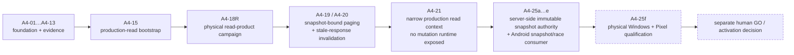

# Agent 4 identity and ownership contract

**Owner:** Sol  
**Runtime status:** dormant, caller-driven and default-off  
**Authoritative branch prefix:** `agent/a4-*`  
**Status reviewed:** 2026-09-11

## Ownership

Sol owns:

- `worker/app/agent4/**`;
- Agent 4-specific tests and support cases;
- `agent4/**` and `docs/AGENT_4_*` contracts.

Host/backend/client integration outside those paths remains Claude-owned. Shared
integration boundaries and `HANDOFF.md` require parity evidence and coordination.

## Foundation identities

| ID | Scope |
|---|---|
| `A4-01` | foundation, lifecycle and startup recovery |
| `A4-02` | durable checkpoints |
| `A4-03` | resource leases and caller-driven admission |
| `A4-04` | retry classification and durable failure handling |
| `A4-05` | health policy, intervention coordinator and service adapters |
| `A4-06` | append-only campaign timeline, immutable evidence references and durable delivery |
| `A4-07` | verified, bounded timeline query cursors and stable snapshot paging |
| `A4-08` | bounded durable consumer batches over the A4-06 delivery cursor |
| `A4-09` | explicit dormant single-process composition of the B-reference architecture |
| `A4-10` | bounded transport-independent operator reads over the composed B runtime |
| `A4-11` | authoritative campaign state, durable audit-projection intents and caller-driven reconciliation |
| `A4-12` | first-class directly addressable evidence records bound to validated timeline heads |
| `A4-13` | bounded hash-bound evidence query paging and transport-independent operator reads |

These IDs remain the foundation, but **they are no longer the end of the implemented chain**.

## Current read-product and snapshot chain

The later Agent 4 work moved the dormant foundation into a narrow, still-default-off product-read path without granting writer activation.

Key current documents:

- `AGENT_4_A4_15_PRODUCTION_READ_BOOTSTRAP.md` — production-read integration boundary;
- `AGENT_4_A4_19_CAMPAIGN_LIST_PAGING.md` — server-verified, hash-bound snapshot paging;
- `AGENT_4_A4_25_SERVER_SNAPSHOT_AUTHORITY.md` — immutable server-side snapshot authority and the concurrency boundary;
- `agent4/A4-18R_PHYSICAL_READ_PRODUCT.md` — physical read-product qualification runbook;
- `agent4/A4-25F_PHYSICAL_QUALIFICATION_RUNBOOK.md` — isolated snapshot-authority physical qualification.

A4-25a through A4-25e are software/contract work. A4-25f is deliberately different: it is physical qualification evidence. Passing software CI does not synthesize that evidence.

## Production-read boundary

The only production-shaped Agent 4 surface remains **read-only and opt-in**:

- `KALIV_AGENT4_OPERATOR_API` is default-off;
- the backend only proxies the narrow read surface;
- a paired device additionally needs the explicit `agent4:read` grant;
- A4-21 production composition exposes a narrow `Agent4OperatorReadContext`, not the full lifecycle/scheduler/resource/handoff/recovery runtime;
- snapshot reads are bound to server-side immutable authority roots rather than client-created consistency claims.

No import, constructor or read request starts a cadence, dispatches Agent 3 work or grants lifecycle mutation authority.

## Physical acceptance is still separate

The A4-18R and A4-25f runbooks are **qualification procedures, not proof that a physical campaign has happened**. A completed run must be bound to the exact qualified repository revision, real Windows/Pixel execution, cleanup evidence and an explicit human GO/NO-GO decision.

Historical qualified target SHAs remain useful evidence for the campaigns they describe, but they are not automatically authority for a later `main`. Re-anchoring a future physical campaign to a newer release/current-main candidate is a separate qualification step, not a documentation shortcut.

## Retired aliases

Early draft PRs used ModelRig task numbers `T-030` through `T-034` for Agent 4 scopes. Those numbers already belong to unrelated Agent 3/ROADMAP work and are retired as Agent 4 identities.

Historical PR numbers and Git branch refs remain provenance, but they do not define the work identity. New Agent 4 work uses the `A4-*` identity family and must fit the single reference architecture in `AGENT_4_ARCHITECTURE_DECISIONS.md`.

## Dormancy invariant

The Agent 4 package remains dormant. Importing it starts no thread, timer, host cadence, network request or Agent 3 work. Storage does not own subscribers, application-driven polling remains forbidden, and side effects require explicit caller action through the governed handoff boundary.

Physical qualification, product activation and recurring orchestration are separate authorities. None is implied by the existence of the software stack.