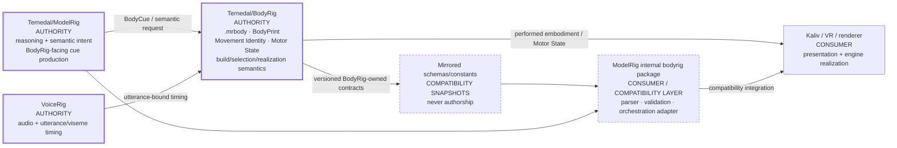

# ADR-BODYRIG-001 — Cross-repo BodyRig authority

Status: accepted for implementation in ModelRig

Issue: #1052

## Context

ModelRig and standalone BodyRig describe one conceptual boundary:

- ModelRig owns reasoning and semantic assistant intent;
- VoiceRig owns speech/audio and timing;
- BodyRig owns body identity and embodiment realization;
- Kaliv / VR clients own presentation and renderer-specific integration.

ModelRig also contains an internal `bodyrig` Python package, vendored contract material and cross-repo compatibility tests. That code is useful, but without an explicit authority decision it can be mistaken for a second source of truth.

This ADR resolves authorship. It does not move runtime code and it does not weaken compatibility testing.

## Authority diagram

The important direction is authorship: a parser, mirror or adapter can consume a BodyRig contract without becoming its owner.

## Decision

### 1. Standalone BodyRig is the product/contract authority

`Ternedal/BodyRig` is the authoritative repository for BodyRig-owned contract families, including:

- `.mrbody` package semantics and package validation;
- BodyPrint/body identity semantics;
- Movement Identity and source-derived body-performance semantics;
- Motor State and embodiment-state semantics, including later contract versions such as Motor State v3;
- body build, selection, activation and realization semantics;
- the renderer-neutral embodiment/runtime contract as that contract is migrated and versioned in standalone BodyRig.

BodyRig contract authorship must not be inferred from whichever repository happens to contain a parser or adapter first.

### 2. ModelRig owns intent, not body realization

`Ternedal/ModelRig` remains authoritative for:

- assistant reasoning and response planning;
- semantic body intent emitted after planning;
- the bounded translation from assistant intent into the BodyRig-facing cue request;
- ModelRig-side orchestration, lifecycle and compatibility handling.

ModelRig must not become authoritative for body identity, package build semantics, Movement Identity or renderer-specific body realization.

### 3. ModelRig's internal `bodyrig` package is a compatibility/integration layer

The existing internal package is retained. Its role is explicitly:

- compatibility parsing/validation;
- ModelRig-side storage and orchestration;
- local adapter/runtime integration needed by current clients;
- cross-repo compatibility enforcement.

Its existence does **not** grant independent BodyRig product or contract authority.

A future migration may move or replace implementation, but that must be a separate change with contract tests and runtime evidence. This ADR deliberately avoids a flag-day rewrite.

### 4. Mirrored contracts are consumers, not authorities

ModelRig may vendor schemas or mirror constants when that is necessary for deterministic local validation. A mirrored file is always a compatibility snapshot of a BodyRig-owned contract.

When BodyRig changes a BodyRig-owned contract:

1. BodyRig authors and versions the change;
2. breaking changes require a new contract major;
3. ModelRig updates its consumed-major declaration and compatibility snapshot deliberately;
4. cross-repo tests must prove compatibility on the exact ModelRig candidate;
5. unknown major versions fail closed rather than being guessed.

Copying a schema or implementation into ModelRig never transfers authorship.

## Contract ownership table

| Contract family | Authority | ModelRig role |
|---|---|---|
| `.mrbody` | `Ternedal/BodyRig` | consumer / validator / store |
| BodyPrint / body identity | `Ternedal/BodyRig` | consumer / compatibility adapter |
| Movement Identity | `Ternedal/BodyRig` | consumer / semantic-cue producer only |
| Motor State | `Ternedal/BodyRig` | consumer / orchestration adapter |
| embodiment runtime / realization | `Ternedal/BodyRig` | client-facing compatibility integration |
| assistant intent | `Ternedal/ModelRig` | authority |
| BodyRig-facing cue production | `Ternedal/ModelRig` | authority for semantic request production only |
| speech audio + timing | VoiceRig | consumer / correlation by utterance id |
| presentation / renderer implementation | Kaliv / VR client | consumer of embodiment output |

The machine-readable form of this decision is `contracts/bodyrig-authority-v1.json`.

## Versioning rule

ModelRig declares the BodyRig contract major it consumes in the authority manifest.

- compatible additions may remain within the same major;
- breaking changes require a new major;
- ModelRig must reject an unknown major until an explicit compatibility update lands;
- compatibility adapters may support more than one major during a migration, but each supported major must be explicit and tested.

## Enforcement

`tests/workflow_mrbody_cross_repo_contract.py` enforces the authority manifest in addition to the existing `.mrbody` compatibility checks. CI must fail if:

- the standalone BodyRig authority is removed or replaced by ModelRig for BodyRig-owned families;
- the ModelRig internal package is promoted from compatibility adapter to product authority;
- the consumed contract major becomes invalid or implicit;
- fail-closed unknown-major behavior is relaxed;
- mirrored contracts are declared authoritative.

## Non-goals

This ADR does not:

- activate Agent 3, scheduler, BodyRig or any production feature;
- claim physical BodyRig acceptance;
- delete or rename the current ModelRig `bodyrig` package;
- prove standalone BodyRig and ModelRig are currently release-compatible beyond the existing exact tests;
- establish VoiceRig or renderer repository governance.

## Consequence

The architecture can evolve without confusing implementation location with contract ownership. Standalone BodyRig authors body-domain contracts; ModelRig consumes them deliberately and proves compatibility.