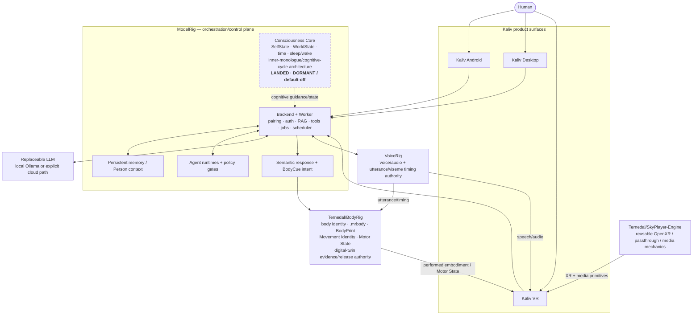
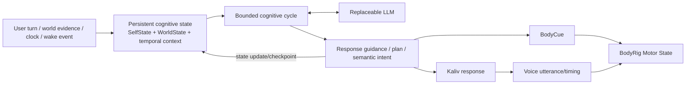
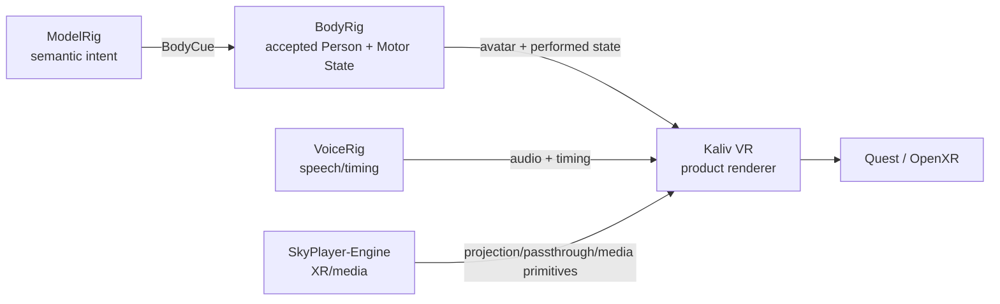

# Kaliv system definition

> **Purpose:** canonical product definition and whole-system architecture.
>
> This document defines what Kaliv is and where authority belongs. It does **not**
> claim current runtime readiness. For what is actually on `main`, read
> `CURRENT_STATE.md`; for activation evidence, read `ACTIVATION_READINESS.md`.
> Those generated documents remain the current-state authority.

## Product definition

**Kaliv is a local-first embodied AI platform that combines persistent cognitive
state, replaceable model reasoning, memory, voice, tools and a source-derived
digital body across desktop, mobile and VR.**

`ModelRig` is the backend/control-plane repository. Everything user-facing is
**Kaliv**.

The long-term product is not defined by one particular LLM. The model is a
replaceable cognitive engine. Persistent system state, memory, policy,
personality/continuity and embodiment are separate layers so that replacing the
model can improve cognitive ability without replacing the person-like continuity
of the system.

This is an architectural/product definition, not a claim of biological or
phenomenal consciousness.

## Whole-system architecture

The diagram deliberately separates **authority** from **implementation
location**. A parser, adapter or renderer may consume another subsystem's
contract without becoming its owner.

## Responsibility and authority

| Layer | Owns | Does not own |
|---|---|---|
| **ModelRig** | reasoning orchestration, RAG, tools, jobs/scheduling, memory integration, semantic assistant intent, BodyRig-facing cue production | Body identity, voice identity, renderer-specific body semantics |
| **Consciousness Core** | persistent cognitive-state architecture: SelfState, WorldState, temporal continuity, sleep/wake lifecycle, bounded inner-monologue/cognitive-cycle orchestration | LLM weights, BodyRig identity, unrestricted autonomous authority |
| **LLM** | replaceable reasoning/language capability for a turn/cycle | persistent identity or system authority merely by being the active model |
| **VoiceRig** | voice/audio and utterance/viseme timing authority | body identity or cognitive policy |
| **BodyRig** | `.mrbody`, BodyPrint, Movement Identity, Motor State, body realization semantics, source/physical/human digital-twin evidence | assistant reasoning or Kaliv application UX |
| **Kaliv clients** | interaction and presentation | redefining BodyRig/VoiceRig semantic authority |
| **SkyPlayer-Engine** | reusable XR/media mechanics | Kaliv product policy, body identity or ModelRig reasoning |

## Cognitive continuity model

The intended continuity loop is event-driven rather than model-identity-driven:

The LLM may change. The persisted state and authority boundaries do not silently
move with it.

## Embodiment model

Kaliv VR is the first-party embodied surface:

A visually plausible avatar is not automatically an accepted digital twin.
BodyRig's source, physical and human evidence chain remains authoritative for
identity-bearing embodiment.

## Evidence states

Use these terms consistently across documentation:

- **implemented** — software exists on the referenced branch/revision;
- **landed** — effective implementation exists on current `main`;
- **dormant/default-off** — landed software is intentionally unavailable until
  its explicit activation gate is satisfied;
- **draft** — work exists in an unmerged branch/PR and is not current product
  authority;
- **software-qualified** — automated checks for the exact revision pass;
- **physically qualified** — required real-device/rig evidence exists;
- **human accepted** — an explicitly required visual/quality decision has been
  recorded by a human;
- **production activated** — the subsystem's canonical release/activation gate,
  and only that gate, has granted production authority.

CI-green must never be rewritten as physical or human acceptance.

## Whole-system completion criterion

The complete Kaliv vision is reached only when one coherent system can:

1. use a replaceable local/cloud LLM without making that model the persistence
   or identity authority;
2. maintain durable memory and cognitive continuity through the accepted
   Consciousness Core path;
3. converse through the accepted VoiceRig path;
4. use tools/agents/scheduling only through their explicit policy and approval
   boundaries;
5. bind a real, source-derived and human/physically accepted BodyRig Person;
6. render that same accepted embodiment in Kaliv VR while preserving the
   BodyRig/VoiceRig authority boundaries;
7. expose the experience across Kaliv Desktop, Android and VR; and
8. retain exact evidence for the software, device and human gates required by
   each subsystem.

No single green CI run, model response, generated avatar or renderer screenshot
is sufficient to claim the whole system complete.

## Related authorities

- `CURRENT_STATE.md` — generated truth for what is wired on current `main`.
- `ACTIVATION_READINESS.md` — generated activation/readiness evidence.
- `docs/BODYRIG_AUTHORITY.md` — cross-repository body-domain authority.
- `vr/README.md` and `vr/RENDERING.md` — Kaliv VR implementation/rendering
  boundary.
- `AGENT_4_ARCHITECTURE_DECISIONS.md` — Agent 4 decision authority.
- `docs/devcontrol/` — DevControl authority and activation boundaries.
- `ROADMAP.md` — direction and sequencing, not current-state authority.
