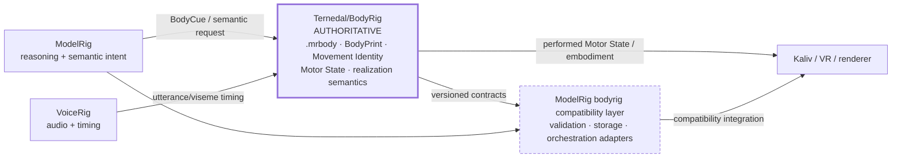

# BodyRig integration in ModelRig

> **Authority notice:** standalone `Ternedal/BodyRig` is the authoritative BodyRig product/contract repository. This directory is retained as **ModelRig-side integration and historical design material**. If a BodyRig-owned contract here disagrees with standalone BodyRig, standalone BodyRig wins. See `../BODYRIG_AUTHORITY.md`.

## ModelRig's responsibility

ModelRig owns assistant reasoning and **semantic** body intent. It may translate a planned response into a bounded BodyRig-facing cue and may carry compatibility parsers/adapters required by current clients.

ModelRig does **not** own:

- `.mrbody` semantics;
- BodyPrint/body identity;
- source-derived Movement Identity;
- Motor State;
- body build/selection/activation/realization semantics;
- renderer-specific body realization.

Those are authored by `Ternedal/BodyRig` and consumed deliberately by ModelRig.

## Current boundary

Mirrored schemas/constants are snapshots for deterministic compatibility testing; copying them into ModelRig never transfers authorship.

## What remains useful in this directory

The older `SPEC.md`, `BODYPRINT.md`, `PROTOCOL.md` and `ROADMAP.md` files capture the original ModelRig-local BodyRig design and historical integration assumptions. Treat them as design/history unless a current cross-repo test explicitly consumes them.

For current BodyRig architecture, source sufficiency, Movement Identity, BodyCue v2 / Motor State v3, digital-twin M1–M6 and physical acceptance, use the standalone repository documentation, especially:

- `Ternedal/BodyRig/README.md`;
- `Ternedal/BodyRig/docs/ARCHITECTURE.md`;
- `Ternedal/BodyRig/docs/MOTOR_STATE.md`;
- `Ternedal/BodyRig/HANDOFF.md`.

## ModelRig invariants

1. ModelRig emits semantics, not low-level bone transforms.
2. VoiceRig remains authoritative for speech/audio timing.
3. BodyRig-owned unknown contract majors fail closed.
4. ModelRig's internal `bodyrig` package is a consumer/compatibility layer, not a second BodyRig product authority.
5. Cross-repo compatibility must be proven on the exact ModelRig candidate before a BodyRig contract-major change is accepted.