# VisionRig -> Consciousness Core admission

This adapter accepts legacy VisionRig `PerceptionEvent/v3` and current additive `PerceptionEvent/v4`, projecting both into the existing C20
WorldEvidence boundary. It does not create a second world model.

```mermaid
flowchart LR
    V["VisionRig<br/>sensor + structured perception"]
    P["PerceptionEvent/v3 or current v4"]
    G["Admission gate<br/>loopback-only · default-off<br/>strict JSON · 256 KiB"]
    E["WorldEvidenceEvent<br/>epistemic_status=inferred<br/>canonical provenance"]
    W["Transient WorldState"]
    A["world_change<br/>attention candidate"]
    S["Existing supervisor policy"]
    C["Later bounded cognitive cycle"]

    V --> P
    P -.-> G
    G --> E
    E --> W
    W --> A
    A -. "no model call here" .-> S
    S -. "only if authorized" .-> C
```



The key boundary is deliberate: **VisionRig owns sensing and perception;
Consciousness Core owns admission into its transient world model.** The adapter
does not promote recognition output into identity authority and does not grant
durable-memory, execution or scheduling authority.

## Activation

The route is absent unless the exact opt-in is set:

```text
KALIV_CONSCIOUSNESS_VISIONRIG_ENABLED=1
```

When enabled, the private loopback-only endpoint is:

```text
POST /experimental/consciousness/visionrig-event
```

The request body is a strict `visionrig/perception-event/v3` or additive `v4` object and is
bounded to 256 KiB. Loopback admission happens before body parsing. The route
also requires an `application/json` media type before parsing; simple
cross-origin browser POST media types such as `text/plain` are rejected.

## Epistemic mapping

VisionRig results are projected as:

```text
WorldEvidenceEvent
epistemic_status = inferred
source_ref       = canonical SHA-256 of the complete VisionRig event
subject_ref      = hashed VisionRig sensor descriptor
observed_sequence= VisionRig frame sequence
```

The bridge intentionally labels the result `inferred`, not `observed`.
Object detection, recognition and spatial fusion are interpretations of sensor
data even when some measurements (such as Kinect depth) are metric.

## Cognitive summary

The proposition is deliberately bounded and structural. It can contain:

- entity-kind counts;
- up to six highest-confidence non-text labels;
- inferred scene/place label plus its confidence when present;
- count + nearest measured metric depth;
- bounded IR summary for v4 (`mean_intensity`, `contrast`, `hotspot_fraction`);
- relation predicate counts;
- OCR item count;
- landmark-group count;
- dropped-frame count.

It deliberately does **not** place raw OCR text, `identity_hint`, raw
landmarks, RGB pixels, raw IR arrays or depth maps into Consciousness Core context.
Those require separately reviewed semantics.

## Source sequencing

For each VisionRig `source_id`, the mounted receiver keeps a process-local
monotonic frame-sequence guard. Exact replay of the same event/sequence remains
idempotent, but a lower sequence or a different event reusing the latest
sequence fails closed with HTTP 409. The sequence guard advances only after
successful world-evidence admission.

## Attention

Admission reuses C20-B. A new event updates transient WorldState first and queues
one linked `world_change` cognition event. The deterministic salience heuristic
can increase for people, close measured objects and interaction/motion
relations, but is capped below 1.0.

Admission itself performs no ThoughtEngine call. Existing supervisor policy owns
whether a later cognitive step runs.

## Authority

The receipt fixes:

```text
model_calls=0
self_state_store_write_applied=false
durable_memory_write_authority=false
execution_authority=false
scheduling_authority=false
production_activation=false
```

VisionRig therefore supplies sensory evidence and attention candidates without
gaining memory, tool, scheduler, BodyRig, VoiceRig or action authority.


## PerceptionEvent/v3/v4 compatibility

V4 is additive and preserves the v3 authority boundary. ModelRig accepts at
most four `InfraredObservation` items. Each observation contains only bounded,
normalized summary values plus a sample count and fixed method identifier. Raw
infrared pixels are rejected by strict schema validation and never enter
Consciousness Core context.

V3 remains accepted unchanged so VisionRig and ModelRig can be rolled out
independently without a breaking deployment window.
