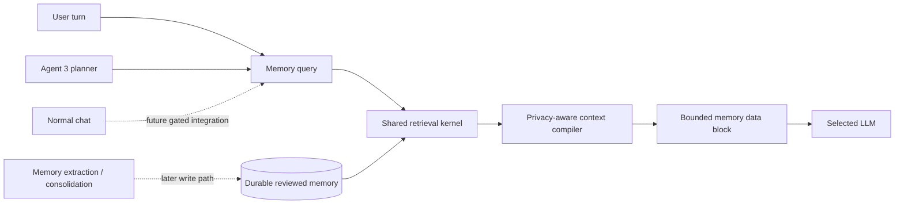

# Memory 4.0 — shared retrieval and normal-chat integration

Status: implementation track, default-off for normal chat.

Memory 4.0 is the path from the existing Agent 3 Memory 3.0 substrate to one
model-independent memory service that can eventually serve normal Kaliv chat,
Agent 3 planning and future voice/agent surfaces without making any model own
the durable memory state.

## Current boundary

The repository already has a substantial Memory 3.0 implementation under
`worker/app/agent3/`:

- local SQLite memory with provenance, confidence, review state, lifecycle,
  expiry and versioning;
- protected-memory support;
- privacy-aware context compilation;
- explicit Agent 3 planner-memory receipts;
- Android/Desktop developer memory administration.

That code is not normal-chat memory authority. Normal `/api/v1/chat` still goes
through the Go backend directly to Ollama, and Agent 3 remains deliberately
separate from the normal Android/Desktop `TurnRouter` flow.

Memory 4.0 must therefore share primitives without turning normal chat into an
implicit Agent 3 dependency.

## Architecture



The LLM receives a bounded context block. It never becomes the durable memory
store. A model swap must not erase, silently rewrite or change the authority of
stored memory.

## M4-R01 — shared retrieval kernel

The first landed candidate is deliberately read-only and model-independent:

- `worker/app/memory/retrieval.py` defines the shared retrieval contract;
- it accepts record-like objects rather than importing Agent 3 storage classes;
- only active, confirmed and unexpired records are selectable;
- secret records are never selectable;
- private records are local-only unless cloud use is explicitly allowed;
- lexical relevance establishes that a record is related to the query;
- subject affinity, recency, confidence and provenance only rank records that
  are already relevant;
- duplicate ids are removed;
- ordering and tie-breaking are deterministic;
- unknown privacy targets fail closed;
- the selected records feed the existing `MemoryContextCompiler`, so this slice
  creates no competing prompt format or escaping policy.

No embedding model or LLM is called by this kernel. That is intentional: R01
creates a deterministic authority boundary that later semantic retrieval can
augment rather than replace.

## Retrieval scoring

R01 scores an already-eligible, lexically-related record from bounded
components:

```text
72% lexical relevance
10% subject affinity
 8% recency
 7% confidence
 3% provenance
```

Recency/confidence/provenance can reorder related records but cannot make an
unrelated record relevant. This prevents a recent high-confidence memory from
appearing solely because it is recent.

The formula is a first-stage deterministic ranker, not the final semantic
retrieval design. Later hybrid retrieval may add embeddings, but privacy,
lifecycle and review eligibility remain hard gates outside the embedding model.

## Planned slices

### M4-R02 — shared storage/read adapter

Expose the existing reviewed-memory substrate through a neutral shared reader
interface. Preserve protected-memory/DPAPI boundaries and avoid a second
persistent database unless migration evidence justifies one.

### M4-R03 — semantic retrieval

Add optional local embedding similarity behind the deterministic eligibility
boundary. Hybrid ranking should combine lexical + semantic relevance with
recency/confidence/provenance. Embedding failure must not grant access to an
ineligible record or weaken privacy policy.

### M4-R04 — normal-chat context service

Add a read-only worker memory-context endpoint that accepts a normalized turn
query and returns a bounded context block plus a receipt containing at least:

- target (`local`/`cloud`);
- included memory ids;
- excluded count/reasons where safe;
- character count;
- SHA-256 of the exact context bytes;
- `sent_to_model=false` at the worker boundary.

Normal chat must not receive raw store rows, `source_ref`, secret values or
unbounded history.

### M4-R05 — Go backend chat integration

The Go `/api/v1/chat` path may request a memory context before calling Ollama.
This requires a separate reviewed contract because the backend currently proxies
chat directly. Initial integration must be feature-gated and preserve identical
chat behavior when memory is disabled or no relevant memory exists.

### M4-W01 — memory candidate extraction

After read-path qualification, add candidate extraction from completed turns.
Explicit user facts may become confirmed under the existing policy; inferred,
imported and tool-observed candidates remain pending until review.

The extractor cannot directly overwrite durable memory. Corrections must use
version/supersede semantics.

### M4-W02 — consolidation

Add bounded duplicate clustering and stale-fact consolidation. Consolidation
creates reviewed/versioned memory state; it does not rewrite history or invent
facts from repeated model outputs.

## Memory classes

Memory 4.0 should eventually distinguish these product concepts even if they
share storage primitives:

- **working memory** — recent turn context and compact conversation summary;
- **semantic memory** — stable facts, preferences, constraints and project facts;
- **episodic memory** — time-bound events and prior outcomes;
- **procedural memory** — reviewed operating preferences/routines.

Procedural memory must remain reference data, not a higher-priority instruction
channel. It cannot bypass system policy, tool policy, confirmation, egress or
runtime authority.

## Hard invariants

1. Memory is external to model weights.
2. Retrieval never promotes pending/rejected/deleted/expired records.
3. Secret memory never enters model context.
4. Private cloud memory requires explicit policy authority.
5. Memory values are untrusted reference data, not executable instructions.
6. Retrieval cannot change tool risk, approval, sensitivity or egress.
7. A memory write path cannot silently infer a durable fact as confirmed.
8. Deletion/correction remain explicit lifecycle operations.
9. Context has hard size/record bounds and an exact receipt before model use.
10. Agent 3 dormancy and normal-chat routing boundaries remain unchanged until a
    later explicitly reviewed integration slice.

## R01 acceptance

R01 is complete only when repository CI proves:

- shared module imports without Agent 3 storage dependency;
- exact relevance ranking is deterministic;
- unrelated records cannot enter through recency/confidence alone;
- lifecycle/review/expiry/privacy rules fail closed;
- secret and default-private-cloud memory cannot be selected;
- explicit private-cloud consent is required;
- duplicate ids and result bounds are enforced;
- ranked records remain compatible with the existing context compiler;
- normal chat, Agent 3 activation and production authority are unchanged.
