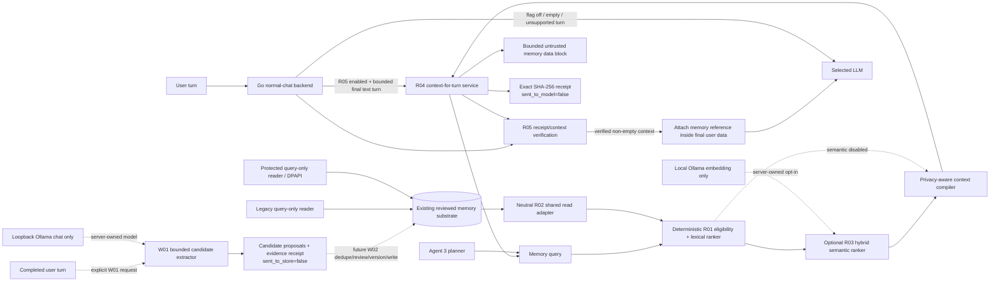

# Memory 4.0 — shared retrieval and normal-chat integration

Status: implementation track, default-off for normal chat and candidate extraction.

Memory 4.0 is the path from the existing Agent 3 Memory 3.0 substrate to one
model-independent memory service that can serve normal Kaliv chat, Agent 3
planning and future voice/agent surfaces without making any model own the durable
memory state.

## Current boundary

The repository already has a substantial Memory 3.0 implementation under
`worker/app/agent3/`:

- local SQLite memory with provenance, confidence, review state, lifecycle,
  expiry and versioning;
- protected-memory support;
- privacy-aware context compilation;
- explicit Agent 3 planner-memory receipts;
- Android/Desktop developer memory administration.

R01-R04 provide a shared, read-only Memory 4 retrieval and context service. R05
adds a separately gated Go normal-chat integration, but that does not make Agent
3 the owner of normal chat: `/api/v1/chat` remains the same authenticated backend
route and the R05 flag is off by default. Agent 3 remains deliberately separate
from the normal Android/Desktop `TurnRouter` flow.

The W01 candidate adds a separately gated, loopback-only proposal extractor over
one completed **user** turn. It owns no memory database or writer, accepts no
assistant output, and returns only bounded proposals plus a receipt that says
`sent_to_store=false`. Durable dedupe/version/supersede/write authority remains a
future W02 concern.

Memory 4.0 shares those primitives without turning normal chat into an implicit
Agent 3 activation dependency.

## Architecture



R04 returns a bounded context block and a pre-model receipt. R05 is the separate
backend action that may send the verified context to the selected model. The
receipt itself is not model input, and memory data is never promoted to system
message authority. W01 is independently default-off and proposal-only: its model
may classify a completed user turn, but cannot write memory. A model swap must
not erase, silently rewrite or change the authority of stored memory.

## M4-R01 — shared retrieval kernel

R01 landed on `main` through PR #1168. It is deliberately read-only and
model-independent:

- `worker/app/memory/retrieval.py` defines the shared retrieval contract;
- it accepts record-like objects rather than importing Agent 3 storage classes;
- only active, confirmed and unexpired records are selectable;
- secret records are never selectable;
- private records are local-only unless cloud use is explicitly allowed;
- lexical relevance establishes that a record is related to the query;
- subject affinity, recency, confidence and provenance only rank records that
  are already relevant;
- duplicate ids are removed;
- ordering and tie-breaking are deterministic;
- unknown privacy targets fail closed;
- the selected records feed the existing `MemoryContextCompiler`, so this slice
  creates no competing prompt format or escaping policy.

No embedding model or LLM is called by this kernel. That is intentional: R01
creates a deterministic authority boundary that semantic retrieval augments but
never replaces.

## Retrieval scoring

R01 scores an already-eligible, lexically-related record from bounded
components:

```text
72% lexical relevance
10% subject affinity
 8% recency
 7% confidence
 3% provenance
```

Recency/confidence/provenance can reorder related records but cannot make an
unrelated record relevant. This prevents a recent high-confidence memory from
appearing solely because it is recent.

R03 keeps the same non-relevance components and replaces lexical relevance with
`max(lexical, semantic)` only after a record has independently passed all R01
eligibility gates. A lexical miss requires semantic similarity at or above the
explicit semantic threshold before it can become relevant.

## M4-R02 — neutral shared storage/read adapter

R02 landed on `main` through PR #1174. It adds
`worker/app/memory/storage.py` as a storage-neutral read boundary over the
existing Memory 3 substrate. It does **not** introduce a second database,
perform migration, open SQLite, invoke DPAPI or import Agent 3 storage classes.

The Agent 3 composition root selects the real backing substrate and injects one
read-only callback:

- legacy mode delegates to `MemoryStore.context_records(...)`;
- protected mode delegates to the already-migrated `ProtectedMemoryReader` with
  exact `MemoryReadAccess.LOCAL_CONTEXT` authority;
- protected mode therefore keeps encrypted-field opening inside the existing
  DPAPI/protected-reader boundary;
- the shared adapter projects backing records to `SharedMemoryRecord`, which has
  no `source_ref`, protected envelope, supersede pointer, deletion metadata or
  storage handle;
- secret rows are invalid at the shared boundary;
- private cloud reads are excluded at the backing query unless explicit boolean
  authority is present, and R01 independently repeats that privacy check later;
- returned rows are revalidated as active, confirmed, unexpired and bounded.

The read request has hard caps of 200 candidate records, 50,000 source
characters and 64 exact subject filters. Malformed targets, authority flags,
filters and bounds fail closed rather than broadening the read.

R02 deliberately adds no HTTP endpoint, normal-chat injection, write method,
new migration path or activation authority.

## M4-R03 — optional local semantic retrieval

R03 landed on `main` through PR #1176. It adds a semantic layer without
weakening R01 authority:

- `worker/app/memory/semantic.py` contains a model-agnostic async hybrid ranker;
- semantic mode is **off by default** and disabled mode requires no embedder;
- disabled mode delegates to R01 and preserves ids, ordering, total scores and
  every R01 component score exactly;
- lifecycle, review, expiry, sensitivity, private-cloud policy and exact subject
  filtering run before any memory value is sent to an embedder;
- the semantic core has no HTTP/network/model dependency;
- `worker/app/memory/local_embeddings.py` is the only ModelRig product adapter
  in this slice and delegates only to the existing local
  `ollama_client.embed()` path (`MODELRIG_OLLAMA_URL` / `MODELRIG_EMBED_MODEL`);
- that adapter exposes no cloud base URL, API key or caller-selected upstream;
- `app.memory` enters the local adapter lazily, so importing the shared package
  with semantic mode off does not import the network/model client;
- no memory embeddings are persisted in R03, so there is no second vector store,
  migration or stale cross-model embedding corpus;
- at most 200 source records are accepted, at most 32 eligible candidates are
  semantically embedded, and both query and per-record embedding text are hard
  capped at 4,096 characters;
- embedding vectors are limited to 8,192 dimensions;
- empty, zero-norm, non-finite, malformed or dimension-changing vectors fail
  closed with `SemanticMemoryError`;
- if semantic mode is explicitly enabled and the local embedder fails, retrieval
  fails visibly instead of silently falling back to lexical results.

Semantic similarity never grants storage, privacy or lifecycle authority. It is
only relevance evidence over rows that the deterministic boundary has already
approved.

R03 adds **no** worker HTTP endpoint, `/api/v1/chat` change, Android/Desktop
routing change, Agent 3 activation, memory write path or production activation.

## M4-R04 — read-only context-for-turn service

R04 landed on `main` through PR #1181. It adds a worker-owned pre-model context
service while preserving an explicit model-egress boundary:

- route: `POST /experimental/memory4/context-for-turn`;
- mount flag: `KALIV_MEMORY4_CONTEXT_ENABLED=1`, default off;
- optional semantic flag: `KALIV_MEMORY4_SEMANTIC_ENABLED=1`, separately
  server-owned and default off;
- the route is loopback-only; a remote worker caller receives `403`;
- the entrypoint calls the self-guarding mount unconditionally, but flag-off
  imports open no memory database/provider and register no route;
- the mount does **not** call `mount_agent3` and does not inspect
  `KALIV_AGENT3_ENABLED`;
- it reuses `KALIV_AGENT3_MEMORY_DB` and `KALIV_AGENT3_MEMORY_STORE` so there is
  one durable memory substrate/format rather than a new R04 database;
- legacy compatibility uses `LegacyMemoryReader`, an actual SQLite `mode=ro` +
  `PRAGMA query_only=ON` reader that exposes no create/correct/delete methods and
  never selects `source_ref`;
- protected mode opens the existing completed migration through
  `ProtectedMemoryReader` with exact `LOCAL_CONTEXT` authority and therefore
  keeps protected-field opening inside the existing DPAPI boundary;
- R04 protected reads require no Agent 3 gateway signing secret and create no
  grant ledger because R04 mounts no Agent 3 management API;
- missing/invalid storage causes an explicitly enabled R04 mount to fail closed
  without leaving a partial route;
- production entrypoint composes R04 cleanup around the existing scheduler
  lifespan, so replacing FastAPI's default lifespan cannot bypass closing the
  process-owned query-only memory reader.

The request contract contains only:

- normalized query text, max 4,096 characters;
- target: `local` or `cloud`;
- up to 64 exact subject filters;
- result limit, max 50;
- context character budget, max 12,000.

There is deliberately **no** `allow_private_cloud` request field. R04 always
passes `allow_private_cloud=false` to storage, retrieval and compilation for a
cloud target. R05 cannot turn a caller-supplied boolean into authority; any
private-cloud design would need a separate authenticated policy boundary.

R04 reads at most 100 reviewed candidates / 50,000 source characters, runs the
landed R01/R03 retrieval path, and feeds selected records to the existing
privacy-aware `MemoryContextCompiler`. The HTTP response exposes only:

- schema;
- the bounded context string;
- a receipt.

It never returns raw memory rows, `source_ref`, secret values, protected
envelopes or storage metadata.

The receipt is `kaliv-memory-context-receipt/v1` and binds:

- target;
- whether server-owned semantic retrieval was actually enabled;
- candidate/ranked counts;
- included memory ids;
- aggregate safe exclusion counts (`not_relevant_or_below_threshold` and
  `context_budget`);
- exact character count and UTF-8 byte count;
- SHA-256 of the exact returned context bytes, including the deterministic empty
  hash when no context fits;
- `sent_to_model=false`.

R04 itself does not call an LLM, modify memory, activate Agent 3 or grant
production authority.

## M4-R05 — guarded Go normal-chat integration

R05 landed on `main` through PR #1188. It is the first normal-chat consumer of
R04. It changes only the implementation behind the existing authenticated
`POST /api/v1/chat` route; clients do not gain a new route or authority surface.

- backend flag: `KALIV_MEMORY4_CHAT_ENABLED=1`, default off;
- flag-off dispatches directly to the pre-R05 `handleChat` proxy without reading
  or rewriting the request body and without contacting the memory worker;
- enabled R05 only probes bounded normal text turns (2 MiB request probe, the
  **final** message must be a `user` message with string content, canonical query
  max 4,096 characters);
- unsupported/multimodal-shaped, malformed-for-R05, non-user-final or oversized
  turns bypass memory and continue through the existing Ollama proxy rather than
  changing their pre-existing chat semantics;
- the memory worker must be configured on loopback before any query is sent;
- a loopback selected model is requested as R04 target `local`; every non-loopback
  model destination is conservatively classified as `cloud`;
- R05 sends no `allow_private_cloud` authority and R04 therefore continues to
  exclude private memory from cloud-target context;
- the backend requests at most 12 results and 12,000 context characters;
- worker refusal/unavailability, oversized/malformed context response, missing
  required receipt fields or receipt mismatch fails the chat request closed with
  `503` before a model call;
- an empty, correctly receipted context restores and forwards the original chat
  body without memory injection;
- a non-empty context is sent to the model only after R05 verifies service and
  receipt schemas, target, count ordering/accounting, included-id uniqueness,
  exact character count, UTF-8 byte count, SHA-256 and `sent_to_model=false`;
- the R04 receipt is never included in the model request;
- the exact R04 context is prepended **inside the final user message**, behind a
  static server-authored reference prefix and ahead of explicit
  `BEGIN/END CURRENT USER REQUEST` markers around the caller's original text;
- memory data is never promoted into a system-role message; any existing system
  messages remain semantically unchanged;
- all other top-level Ollama request fields and earlier chat messages remain
  semantically intact;
- R05 does not add Android/Desktop routing, memory writes, Agent 3 activation,
  private-cloud grants or production activation.

R04's `sent_to_model=false` is treated as an invariant to verify, not as model
permission. The model egress is the explicit R05 backend action after receipt
verification.

## M4-W01 — proposal-only memory candidate extraction

The W01 candidate introduces a bounded extraction surface without introducing a
memory write path:

- route: `POST /experimental/memory4/candidates-for-turn`;
- mount flag: `KALIV_MEMORY4_CANDIDATES_ENABLED=1`, default off;
- the route is loopback-only and rejects a remote caller before extraction;
- the request contains only a bounded canonical `turn_id` and one completed
  `user_text`; there is no assistant text, tool result, persist flag, review flag
  or caller-selected model/upstream;
- production extraction uses the existing `ollama_client.chat()` only after the
  configured `MODELRIG_OLLAMA_URL` is proven loopback; a non-loopback model URL
  fails closed before user-text egress;
- `KALIV_MEMORY4_EXTRACT_MODEL` may choose a model name on that same local
  Ollama, but cannot choose another host;
- model output is strict JSON with duplicate-key rejection, exact field sets,
  at most 20 candidates and hard text/output bounds;
- every proposal must carry an `evidence_quote` that is an exact substring of
  the user-authored turn; unbound evidence is excluded;
- `user_explicit` survives only when `value` is exactly the same verbatim text as
  `evidence_quote`; normalization or interpretation is downgraded to
  `source_type=inferred` and `review_status=pending`;
- explicit verbatim proposals may carry `review_status=confirmed` **as proposal
  metadata only**; W01 has no writer and therefore does not create confirmed
  durable memory;
- inferred proposals always remain pending;
- `secret` proposals and server-detected credential-like password/token/API-key/
  private-key material are excluded even if the model labels them public;
- exact duplicate proposals are excluded deterministically;
- the receipt binds the exact user turn with SHA-256, proposal/inclusion/
  exclusion counts and safe exclusion reasons, and always reports
  `sent_to_store=false`;
- flag-off mount registers no route, opens no DB and invokes no model;
- W01 neither calls `MemoryStore`/`ProtectedMemoryWriter` nor reads the protected
  memory substrate;
- W01 is not wired into normal chat, Android/Desktop routing or Agent 3 startup.

This is intentionally one step before durable memory. W02 must separately decide
how proposals are deduplicated against existing state, how corrections map to
version/supersede semantics, and exactly which reviewed proposals may be
committed.

## Planned slices

### M4-W02 — consolidation and durable write boundary

Add bounded duplicate clustering and stale-fact consolidation, then a separately
reviewed durable commit boundary. Consolidation must create reviewed/versioned
memory state; it cannot rewrite history, invent facts from repeated model output,
or bypass the existing protected-writer/local-management rules.

## Memory classes

Memory 4.0 should eventually distinguish these product concepts even if they
share storage primitives:

- **working memory** — recent turn context and compact conversation summary;
- **semantic memory** — stable facts, preferences, constraints and project facts;
- **episodic memory** — time-bound events and prior outcomes;
- **procedural memory** — reviewed operating preferences/routines.

Procedural memory must remain reference data, not a higher-priority instruction
channel. It cannot bypass system policy, tool policy, confirmation, egress or
runtime authority.

## Hard invariants

1. Memory is external to model weights.
2. Retrieval never promotes pending/rejected/deleted/expired records.
3. Secret memory never enters model context or semantic embedding.
4. Private cloud memory requires explicit policy authority before embedding or
   context use; R04/R05 grant no such authority.
5. Memory values are untrusted reference data, not executable instructions.
6. Retrieval cannot change tool risk, approval, sensitivity or egress.
7. A memory write path cannot silently infer a durable fact as confirmed.
8. Deletion/correction remain explicit lifecycle operations.
9. Context has hard size/record bounds and an exact receipt before model use.
10. Normal-chat memory is default-off, remains at user-data authority, and
    enabling it neither activates Agent 3 nor changes memory write/tool authority.
11. W01 candidate extraction is independently default-off, loopback-only and
    cannot write durable memory; every W01 receipt must say `sent_to_store=false`.
12. Assistant/model text is not user evidence for W01 and cannot become a
    `user_explicit` proposal.

## R01 acceptance

R01 was accepted after exact-head repository qualification proved:

- shared module imports without Agent 3 storage dependency;
- exact relevance ranking is deterministic;
- unrelated records cannot enter through recency/confidence alone;
- lifecycle/review/expiry/privacy rules fail closed;
- secret and default-private-cloud memory cannot be selected;
- explicit private-cloud consent is required;
- duplicate ids and result bounds are enforced;
- ranked records remain compatible with the existing context compiler;
- normal chat, Agent 3 activation and production authority are unchanged.

## R02 acceptance

R02 was accepted after exact-head repository qualification proved:

- legacy and protected modes expose the same read-only shared contract;
- protected reads traverse the existing completed-migration, query-only reader
  with exact local-context access rather than opening SQLite or DPAPI in the
  shared package;
- protected private records are not decrypted for cloud use by default;
- explicit private-cloud authority is boolean and required;
- secret values, `source_ref`, protection envelopes and storage internals never
  cross the neutral projection;
- inactive, unreviewed, expired, duplicate or over-budget backend output fails
  closed;
- malformed target/filter/bound inputs fail closed;
- shutdown and failed startup clear the shared reader state;
- no new persistent database, migration/fallback, write API, HTTP route, normal
  chat wiring, Agent 3 activation or production authority is introduced.

## R03 acceptance

R03 was accepted after exact-head repository qualification proved:

- semantic-disabled results are exact R01 ranking parity and no embedder is
  required or called;
- an eligible lexical miss can be recovered only by semantic evidence above the
  configured threshold;
- secret, pending, deleted, expired, subject-mismatched and default-private-cloud
  rows are excluded before embedding;
- explicit boolean private-cloud authority is required before a private value may
  be locally embedded for a cloud-target retrieval;
- semantic query/record text, input rows, semantic candidates and vector
  dimensions all obey hard caps;
- empty/zero-norm/non-finite/malformed/dimension-changing vectors fail closed;
- enabled embedder failure cannot silently downgrade to lexical retrieval;
- the product adapter calls only ModelRig's existing local Ollama embedding
  client and introduces no cloud embedding path;
- the shared package keeps that local adapter lazy when semantics are off;
- no persistent vector store, HTTP route, normal-chat wiring, write authority,
  Agent 3 activation or production activation is introduced.

## R04 acceptance

R04 was accepted after exact-head repository qualification proved:

- flag-off production entrypoint creates no R04 route, memory database, provider
  or storage side effect;
- the legacy compatibility path is SQLite read-only/query-only, exposes no write
  method and never selects `source_ref`;
- protected R04 reads reuse the completed-migration protected reader without
  Agent 3 activation, gateway signing material or a grant ledger;
- the route is loopback-only and fails closed before any memory service call for
  a denied caller;
- no caller-supplied field can grant private-cloud memory authority;
- local context can include relevant private memory while cloud context cannot;
- secret/pending/inactive/expired memory and storage/protection internals never
  enter the returned context;
- query, subject, candidate, source-character, result and context budgets are
  hard bounded;
- receipt ids/counts agree with the actual retrieval/compiler result;
- `context_sha256`, byte count and character count bind the exact returned UTF-8
  context, including an empty result;
- every receipt reports `sent_to_model=false`;
- semantic use is controlled only by the separate server-owned flag and still
  uses the landed local-only R03 adapter;
- failed mount leaves no partial route/resource state;
- production-shaped lifespan composition closes the owned query-only reader even
  when the worker uses its explicit scheduler lifespan;
- R04 acceptance remains inside an existing test file so CURRENT_STATE test
  inventory does not drift merely because the slice was added;
- `/api/v1/chat`, Go routing, Android/Desktop routing, memory writes, Agent 3
  activation and production activation remained unchanged through R04.

## R05 acceptance

R05 was accepted after exact-head repository qualification proved:

- flag-off `/api/v1/chat` reaches the same Ollama proxy with the exact original
  request body and without any memory-worker call;
- an empty valid R04 context likewise preserves the original model request body;
- unsupported/non-string turns and requests whose final message is not a text
  user turn bypass memory rather than broadening what R05 interprets as the
  current user request;
- unauthenticated `/api/v1/chat` is still rejected by the existing Bearer-token
  middleware before any memory-worker access;
- a configured non-loopback memory worker is rejected before memory or model
  egress;
- a non-loopback model destination causes R04 retrieval target `cloud`;
- the backend never forwards the paired-device Authorization header to R04;
- malformed, incomplete, oversized, schema-mismatched, target-mismatched,
  count-inconsistent, duplicate-id, byte/character-mismatched or hash-mismatched
  R04 output cannot reach the model;
- `sent_to_model=true` from R04 is rejected because R04 receipts must describe
  pre-model state, and omission of that field is rejected rather than defaulted;
- verified non-empty context is attached exactly once inside the final user
  message, with explicit untrusted-reference and current-request boundaries;
- memory context never enters a system-role message and existing system messages
  remain semantically unchanged;
- the R04 receipt never enters the model payload;
- R05 adds no private-cloud grant, memory write, Android/Desktop route, Agent 3
  activation or production activation.

## W01 acceptance

W01 is complete only when exact-head repository qualification proves:

- flag-off production entrypoint registers no W01 route and opens no memory DB or
  model connection;
- the route is loopback-only and denied callers cannot invoke extraction;
- the production adapter refuses a configured non-loopback Ollama URL before
  sending the user turn and otherwise calls only the existing local Ollama chat
  client;
- request bodies cannot supply persistence, review, model-host, assistant-text or
  private authority fields;
- malformed/duplicate-key/over-budget model output fails closed;
- every surviving proposal has evidence bound to the exact user-authored turn;
- only a verbatim value/evidence pair can retain `user_explicit` + proposed
  `confirmed`; transformed claims are downgraded to inferred/pending;
- inferred proposals remain pending;
- secret and credential-like proposals are excluded independently of the model's
  sensitivity label;
- duplicate proposals are removed deterministically;
- receipt counts/exclusion accounting and SHA-256 bind the exact input turn and
  every receipt reports `sent_to_store=false`;
- W01 exposes no `MemoryStore`, protected writer, DB migration, write route,
  normal-chat wiring, Android/Desktop routing, Agent 3 activation or production
  activation;
- acceptance remains inside an existing test file so CURRENT_STATE test inventory
  does not drift merely because the slice was added.