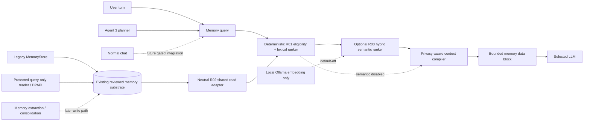

# Memory 4.0 — shared retrieval and normal-chat integration

Status: implementation track, default-off for normal chat.

Memory 4.0 is the path from the existing Agent 3 Memory 3.0 substrate to one
model-independent memory service that can eventually serve normal Kaliv chat,
Agent 3 planning and future voice/agent surfaces without making any model own
the durable memory state.

## Current boundary

The repository already has a substantial Memory 3.0 implementation under
`worker/app/agent3/`:

- local SQLite memory with provenance, confidence, review state, lifecycle,
  expiry and versioning;
- protected-memory support;
- privacy-aware context compilation;
- explicit Agent 3 planner-memory receipts;
- Android/Desktop developer memory administration.

That code is not normal-chat memory authority. Normal `/api/v1/chat` still goes
through the Go backend directly to Ollama, and Agent 3 remains deliberately
separate from the normal Android/Desktop `TurnRouter` flow.

Memory 4.0 must therefore share primitives without turning normal chat into an
implicit Agent 3 dependency.

## Architecture



The LLM receives a bounded context block. It never becomes the durable memory
store. A model swap must not erase, silently rewrite or change the authority of
stored memory.

## M4-R01 — shared retrieval kernel

R01 is landed on `main` through PR #1168. It is deliberately read-only and
model-independent:

- `worker/app/memory/retrieval.py` defines the shared retrieval contract;
- it accepts record-like objects rather than importing Agent 3 storage classes;
- only active, confirmed and unexpired records are selectable;
- secret records are never selectable;
- private records are local-only unless cloud use is explicitly allowed;
- lexical relevance establishes that a record is related to the query;
- subject affinity, recency, confidence and provenance only rank records that
  are already relevant;
- duplicate ids are removed;
- ordering and tie-breaking are deterministic;
- unknown privacy targets fail closed;
- the selected records feed the existing `MemoryContextCompiler`, so this slice
  creates no competing prompt format or escaping policy.

No embedding model or LLM is called by this kernel. That is intentional: R01
creates a deterministic authority boundary that semantic retrieval augments but
never replaces.

## Retrieval scoring

R01 scores an already-eligible, lexically-related record from bounded
components:

```text
72% lexical relevance
10% subject affinity
 8% recency
 7% confidence
 3% provenance
```

Recency/confidence/provenance can reorder related records but cannot make an
unrelated record relevant. This prevents a recent high-confidence memory from
appearing solely because it is recent.

R03 keeps the same non-relevance components and replaces lexical relevance with
`max(lexical, semantic)` only after a record has independently passed all R01
eligibility gates. A lexical miss requires semantic similarity at or above the
explicit semantic threshold before it can become relevant.

## M4-R02 — neutral shared storage/read adapter

R02 landed on `main` through PR #1174. It adds
`worker/app/memory/storage.py` as a storage-neutral read boundary over the
existing Memory 3 substrate. It does **not** introduce a second database,
perform migration, open SQLite, invoke DPAPI or import Agent 3 storage classes.

The Agent 3 composition root selects the real backing substrate and injects one
read-only callback:

- legacy mode delegates to `MemoryStore.context_records(...)`;
- protected mode delegates to the already-migrated `ProtectedMemoryReader` with
  exact `MemoryReadAccess.LOCAL_CONTEXT` authority;
- protected mode therefore keeps encrypted-field opening inside the existing
  DPAPI/protected-reader boundary;
- the shared adapter projects backing records to `SharedMemoryRecord`, which has
  no `source_ref`, protected envelope, supersede pointer, deletion metadata or
  storage handle;
- secret rows are invalid at the shared boundary;
- private cloud reads are excluded at the backing query unless explicit boolean
  authority is present, and R01 independently repeats that privacy check later;
- returned rows are revalidated as active, confirmed, unexpired and bounded.

The read request has hard caps of 200 candidate records, 50,000 source
characters and 64 exact subject filters. Malformed targets, authority flags,
filters and bounds fail closed rather than broadening the read.

R02 deliberately adds no HTTP endpoint, normal-chat injection, write method,
new migration path or activation authority. The shared reader is merely exposed
from the existing composition root for later R03/R04 use.

## M4-R03 — optional local semantic retrieval

R03 adds a semantic layer without weakening R01 authority:

- `worker/app/memory/semantic.py` contains a model-agnostic async hybrid ranker;
- semantic mode is **off by default** and disabled mode requires no embedder;
- disabled mode delegates to R01 and preserves ids, ordering, total scores and
  every R01 component score exactly;
- lifecycle, review, expiry, sensitivity, private-cloud policy and exact subject
  filtering run before any memory value is sent to an embedder;
- the semantic core has no HTTP/network/model dependency;
- `worker/app/memory/local_embeddings.py` is the only ModelRig product adapter
  in this slice and delegates only to the existing local
  `ollama_client.embed()` path (`MODELRIG_OLLAMA_URL` / `MODELRIG_EMBED_MODEL`);
- that adapter exposes no cloud base URL, API key or caller-selected upstream;
- no memory embeddings are persisted in R03, so there is no second vector store,
  migration or stale cross-model embedding corpus;
- at most 200 source records are accepted, at most 32 eligible candidates are
  semantically embedded, and both query and per-record embedding text are hard
  capped at 4,096 characters;
- embedding vectors are limited to 8,192 dimensions;
- empty, zero-norm, non-finite, malformed or dimension-changing vectors fail
  closed with `SemanticMemoryError`;
- if semantic mode is explicitly enabled and the local embedder fails, retrieval
  fails visibly instead of silently falling back to lexical results.

Semantic similarity never grants storage, privacy or lifecycle authority. It is
only relevance evidence over rows that the deterministic boundary has already
approved. Secret, pending, rejected, deleted, expired or default-private-cloud
memory must therefore be filtered before the query embedding is even requested
when no eligible candidate remains.

R03 still adds **no** worker HTTP endpoint, `/api/v1/chat` change, Android/Desktop
routing change, Agent 3 activation, memory write path or production activation.

## Planned slices

### M4-R04 — normal-chat context service

Add a read-only worker memory-context endpoint that accepts a normalized turn
query and returns a bounded context block plus a receipt containing at least:

- target (`local`/`cloud`);
- included memory ids;
- excluded count/reasons where safe;
- character count;
- SHA-256 of the exact context bytes;
- `sent_to_model=false` at the worker boundary.

Normal chat must not receive raw store rows, `source_ref`, secret values or
unbounded history.

### M4-R05 — Go backend chat integration

The Go `/api/v1/chat` path may request a memory context before calling Ollama.
This requires a separate reviewed contract because the backend currently proxies
chat directly. Initial integration must be feature-gated and preserve identical
chat behavior when memory is disabled or no relevant memory exists.

### M4-W01 — memory candidate extraction

After read-path qualification, add candidate extraction from completed turns.
Explicit user facts may become confirmed under the existing policy; inferred,
imported and tool-observed candidates remain pending until review.

The extractor cannot directly overwrite durable memory. Corrections must use
version/supersede semantics.

### M4-W02 — consolidation

Add bounded duplicate clustering and stale-fact consolidation. Consolidation
creates reviewed/versioned memory state; it does not rewrite history or invent
facts from repeated model outputs.

## Memory classes

Memory 4.0 should eventually distinguish these product concepts even if they
share storage primitives:

- **working memory** — recent turn context and compact conversation summary;
- **semantic memory** — stable facts, preferences, constraints and project facts;
- **episodic memory** — time-bound events and prior outcomes;
- **procedural memory** — reviewed operating preferences/routines.

Procedural memory must remain reference data, not a higher-priority instruction
channel. It cannot bypass system policy, tool policy, confirmation, egress or
runtime authority.

## Hard invariants

1. Memory is external to model weights.
2. Retrieval never promotes pending/rejected/deleted/expired records.
3. Secret memory never enters model context or semantic embedding.
4. Private cloud memory requires explicit policy authority before embedding or
   context use.
5. Memory values are untrusted reference data, not executable instructions.
6. Retrieval cannot change tool risk, approval, sensitivity or egress.
7. A memory write path cannot silently infer a durable fact as confirmed.
8. Deletion/correction remain explicit lifecycle operations.
9. Context has hard size/record bounds and an exact receipt before model use.
10. Agent 3 dormancy and normal-chat routing boundaries remain unchanged until a
    later explicitly reviewed integration slice.

## R01 acceptance

R01 was accepted after exact-head repository qualification proved:

- shared module imports without Agent 3 storage dependency;
- exact relevance ranking is deterministic;
- unrelated records cannot enter through recency/confidence alone;
- lifecycle/review/expiry/privacy rules fail closed;
- secret and default-private-cloud memory cannot be selected;
- explicit private-cloud consent is required;
- duplicate ids and result bounds are enforced;
- ranked records remain compatible with the existing context compiler;
- normal chat, Agent 3 activation and production authority are unchanged.

## R02 acceptance

R02 was accepted after exact-head repository qualification proved:

- legacy and protected modes expose the same read-only shared contract;
- protected reads traverse the existing completed-migration, query-only reader
  with exact local-context access rather than opening SQLite or DPAPI in the
  shared package;
- protected private records are not decrypted for cloud use by default;
- explicit private-cloud authority is boolean and required;
- secret values, `source_ref`, protection envelopes and storage internals never
  cross the neutral projection;
- inactive, unreviewed, expired, duplicate or over-budget backend output fails
  closed;
- malformed target/filter/bound inputs fail closed;
- shutdown and failed startup clear the shared reader state;
- no new persistent database, migration/fallback, write API, HTTP route, normal
  chat wiring, Agent 3 activation or production authority is introduced.

## R03 acceptance

R03 is complete only when exact-head repository qualification proves:

- semantic-disabled results are exact R01 ranking parity and no embedder is
  required or called;
- an eligible lexical miss can be recovered only by semantic evidence above the
  configured threshold;
- secret, pending, deleted, expired, subject-mismatched and default-private-cloud
  rows are excluded before embedding;
- explicit boolean private-cloud authority is required before a private value may
  be locally embedded for a cloud-target retrieval;
- semantic query/record text, input rows, semantic candidates and vector
  dimensions all obey hard caps;
- empty/zero-norm/non-finite/malformed/dimension-changing vectors fail closed;
- enabled embedder failure cannot silently downgrade to lexical retrieval;
- the product adapter calls only ModelRig's existing local Ollama embedding
  client and introduces no cloud embedding path;
- no persistent vector store, HTTP route, normal-chat wiring, write authority,
  Agent 3 activation or production activation is introduced.
