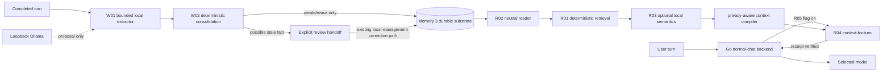

# Memory 4.0 — shared retrieval, normal-chat context and bounded writes

Status: implementation track. Normal-chat memory remains default-off unless an
explicit server-owned feature flag enables a reviewed integration boundary.

Memory 4.0 builds one model-independent memory architecture for Kaliv/ModelRig.
Durable memory remains outside model weights and outside any individual model's
authority. The same substrate can serve normal chat, Agent 3 planning and future
voice/agent surfaces without making normal chat depend on Agent 3 activation.

## Current architecture

The landed substrate is deliberately split into narrow authority boundaries:

- **R01** — deterministic reviewed-memory eligibility and lexical retrieval;
- **R02** — storage-neutral bounded reader over the existing legacy/protected
  Memory 3 substrate;
- **R03** — optional local semantic ranking after deterministic eligibility;
- **R04** — loopback, read-only context-for-turn service with an exact receipt;
- **R05** — default-off Go `/api/v1/chat` integration that verifies the R04
  receipt before attaching memory as untrusted user-data reference context;
- **W01** — bounded local candidate extraction from a completed turn;
- **W02** — deterministic candidate deduplication, safe create/reuse and
  stale-fact review handoff. W02 does not automatically correct durable facts.



The read path and write path are intentionally asymmetric. Retrieval may select
only already-reviewed memory. Extraction may propose new memory, but model output
never owns durable review, privacy, correction, deletion or supersede authority.

## R01 — shared retrieval kernel

R01 landed through PR #1168. `worker/app/memory/retrieval.py` is read-only and
model-independent.

Eligibility runs before ranking:

- lifecycle must be active;
- review state must be confirmed;
- expired rows are excluded;
- secret rows are never eligible;
- private rows are local-only unless a separate caller has explicit private-cloud
  authority;
- malformed privacy targets and malformed records fail closed.

Lexical relevance determines whether a record is related to the request. Subject
affinity, recency, confidence and provenance can reorder related rows but cannot
make an unrelated row relevant. Duplicate ids are removed and ordering is
deterministic.

The R01 scoring split is:

```text
72% lexical relevance
10% subject affinity
 8% recency
 7% confidence
 3% provenance
```

R01 returns records, not prompt text. Selected records still pass through the
existing privacy-aware context compiler.

## R02 — neutral storage/read adapter

R02 landed through PR #1174. `worker/app/memory/storage.py` accepts one injected
bounded read callback from the composition root. The shared package does not open
SQLite, invoke DPAPI, migrate data or expose writes.

Legacy mode delegates to the existing MemoryStore context reader. Protected mode
delegates to the completed-migration `ProtectedMemoryReader`; decryption stays
inside that boundary. The neutral projection strips `source_ref`, protection
envelopes, supersede pointers, deletion metadata and storage handles.

The adapter independently revalidates lifecycle, review, expiry, sensitivity,
privacy and duplicate-id constraints. The request is bounded to 200 source rows,
50,000 source characters and 64 exact subject filters.

## R03 — optional local semantic retrieval

R03 landed through PR #1176. Semantic retrieval is server-owned and off by
default. Disabled mode is exact R01 parity and requires no embedder.

When enabled:

- all R01 eligibility/privacy gates run before an embedding call;
- only the existing local Ollama embedding adapter is used;
- no cloud embedding base URL/API-key surface is exposed;
- there is no persistent Memory 4 vector store;
- source rows, semantic candidates, text length and vector dimensions have hard
  caps;
- zero-norm, non-finite, malformed or dimension-changing vectors fail closed;
- embedder failure does not silently downgrade an explicitly enabled semantic
  request to lexical-only results.

Semantic similarity supplies relevance evidence only. It never grants review,
privacy, lifecycle, storage or tool authority.

## R04 — read-only context-for-turn service

R04 landed through PR #1181. The worker route is:

`POST /experimental/memory4/context-for-turn`

It is mounted only when `KALIV_MEMORY4_CONTEXT_ENABLED=1`, is loopback-only and
opens no write surface. Protected mode reuses the existing protected reader; the
service does not activate Agent 3 or create a management grant ledger.

The request is bounded and has no caller-controlled private-cloud grant. The
response contains only a bounded context string and a receipt. Raw memory rows,
`source_ref`, protected envelopes and storage metadata do not cross the service
boundary.

The receipt binds target, semantic mode, candidate/ranked counts, included ids,
exclusion accounting, exact character count, UTF-8 byte count and SHA-256 of the
exact context. Every R04 receipt reports `sent_to_model=false`; R04 itself never
calls an LLM.

## R05 — guarded normal-chat context integration

R05 landed through PR #1188. It changes only the existing authenticated
`POST /api/v1/chat` implementation and is default-off behind
`KALIV_MEMORY4_CHAT_ENABLED=1`.

Flag-off keeps the pre-R05 request path unchanged. Enabled R05 only considers a
bounded final text user turn. Unsupported/multimodal-shaped turns bypass Memory
4 rather than changing baseline chat semantics.

Before model egress, R05 verifies the R04 service/receipt schemas, target,
counts, included-id uniqueness, byte/character lengths, SHA-256 and
`sent_to_model=false`. A verified non-empty context is attached inside the final
user message as explicitly untrusted reference data. It is never promoted to a
system message, and the receipt itself is never sent to the model.

R05 grants no memory write authority and no private-cloud exception.

## W01 — bounded candidate extraction

W01 landed through PR #1194 and was hardened by #1201/#1202.
`worker/app/memory/extraction.py` owns the model-independent extraction contract;
`worker/app/memory/local_extraction.py` is the only product adapter and may call
only the configured loopback Ollama chat endpoint.

### Bounds and model authority

The completed user text and assistant text are each capped at 16,000 characters,
caller-owned `source_ref` at 1,000 characters, model output at 64,000 characters,
and one extraction result at 16 candidates. Candidate fields also have explicit
per-field bounds. Unknown fields, malformed JSON and duplicate JSON keys fail
closed.

The extractor may propose subject, predicate, value, kind, sensitivity,
provenance, confidence and evidence. It cannot supply `source_ref`, review state,
ids, supersede targets, write operations, correction tokens or deletion
authority.

Sensitivity is conservative server policy. Obvious credential/key/token content
is escalated to `secret`. Other non-secret W01 output is clamped to `private`.
Secret candidates remain pending.

### #1201/#1202 confirmed-authority hardening

Literal evidence does **not** prove model-authored semantics. A user saying
`I live in Copenhagen` does not authorize the extractor to confirm a generated
relation such as `favorite_city=Copenhagen` merely because `Copenhagen` is a
literal substring.

Automatic confirmation therefore requires the candidate evidence to be the
entire exact canonical user turn. For a qualifying non-secret proposal, the
server discards the model's structured semantics and normalizes the confirmed
memory to:

```text
subject      = user
predicate    = verbatim_user_statement
value        = <entire exact user turn>
kind         = note
sensitivity  = private
source_type  = user_explicit
confidence   = 1.0
review       = confirmed
```

Entity-only evidence, structured interpretations, paraphrases, inferred,
imported and tool-observed candidates remain pending. This rule is important to
W02: downstream consolidation must not reconstruct the structured authority W01
intentionally refused to grant.

W01 still performs no durable write by itself.

## W02 — bounded deduplication and stale-fact review consolidation

W02 is implemented by:

- `worker/app/memory/consolidation.py` — deterministic storage-neutral planner;
- `worker/app/agent3/memory_consolidation.py` — composition with the existing
  legacy/protected create/read APIs.

No model, embedding or network call participates in consolidation.

### Input authority and bounds

One plan accepts at most 16 W01 candidates and 200 active durable records. W02
revalidates candidate fields and the hardened W01 contract.

A candidate claiming `review_status=confirmed` is accepted only if it exactly
matches the server-owned verbatim shape from #1202: `user`,
`verbatim_user_statement`, `note`, `private`, `user_explicit`, confidence `1.0`,
and `evidence == value`. Handcrafted/model-semantic confirmed candidates fail
closed.

Structured W01 interpretations remain pending. Secret candidates must remain
pending. Malformed review/lifecycle/provenance/sensitivity values, non-finite
numbers and bound violations fail closed.

### Candidate identity and deduplication

Confirmed verbatim statements use exact statement value as part of their
consolidation identity. This is deliberate: two different user statements are
independent notes even though their conservative server-owned subject/predicate
are the same.

Therefore:

- exact duplicate confirmed statements collapse to one decision;
- an exact durable confirmed statement is reused rather than written twice;
- a different confirmed verbatim statement produces a separate create decision;
- it never supersedes a previous statement simply because both use
  `user/verbatim_user_statement`.

Pending structured candidates use case-insensitive `(subject, predicate)` as
their semantic slot. Multiple candidate values or conflicting candidate metadata
for one slot produce review decisions rather than order-dependent persistence.

### Existing durable state

For a single matching active record:

- exact value + compatible kind/privacy/review may be reused;
- kind mismatch fails to review;
- reusing an under-classified durable sensitivity fails to review;
- an expired match requires review;
- a different structured value becomes `stale_fact_requires_review`, bound to
  the exact existing memory id and its `updated_at` optimistic token.

W02 deliberately does **not** call `MemoryStore.correct()` or
`ProtectedMemoryWriter.correct()` from raw W01 candidate authority. The review
handoff identifies a possible stale fact; actual replacement continues through
the existing explicit local-management correction/version/supersede path. That
path creates a new row and preserves the old row as superseded history.

This separation is the consequence of #1201: a model-produced pending relation
may be useful enough to ask for review, but it is not authoritative enough to
rewrite reviewed durable meaning.

### Persistence adapter

Only `create`, `reuse` and `review` decisions exist in W02.

Before `reuse`, the adapter re-reads the matching durable state and requires the
same id, value, kind and exact `updated_at` token. Before `create`, it verifies
that an equivalent candidate identity was not concurrently persisted. A stale
plan fails closed.

Legacy create uses the existing `MemoryStore.create()` path. Protected planning
reads with exact `MemoryReadAccess.LOCAL_MANAGEMENT`; protected create writes with
exact `MemoryWriteAccess.LOCAL_MANAGEMENT` through the existing
`ProtectedMemoryWriter`. W02 itself does not open SQLite, decrypt DPAPI payloads
or manipulate protection envelopes.

W02 applies one decision at a time and makes no false cross-decision transaction
claim. `reuse` and `review` do not mutate durable state.

### Deliberately not activated

W02 adds no automatic `/api/v1/chat` extraction/write hook, no new public HTTP
write route, no Agent 3 activation, no private-cloud grant, no delete authority
and no production activation.

## Memory classes

Memory 4.0 can share storage while keeping product concepts distinct:

- **working memory** — recent turn context and compact conversation state;
- **semantic memory** — reviewed stable facts/preferences/constraints;
- **episodic memory** — time-bound events and prior outcomes;
- **procedural memory** — reviewed operating preferences/routines.

Procedural memory remains reference data, never a higher-priority instruction
channel. Memory cannot bypass system policy, tool policy, confirmation or egress.

## Hard invariants

1. Memory is external to model weights.
2. Pending/rejected/deleted/expired rows never enter normal model context.
3. Secret memory never enters normal model context or semantic embedding.
4. Private cloud use requires explicit policy authority; R04/R05 grant none.
5. Memory values are untrusted reference data, not executable instructions.
6. Retrieval cannot change tool risk, approval, sensitivity or egress.
7. Model output cannot assign durable review, correction, delete or supersede
   authority.
8. Automatic W01 confirmation means only the entire verbatim user statement;
   model-authored structured semantics remain pending.
9. W02 revalidates W01 authority and cannot turn pending structured meaning into
   confirmed meaning.
10. Distinct verbatim user statements are independent notes, not stale versions
    of one generic server-owned slot.
11. Stale structured facts require explicit review; W02 does not automatically
    call correction/supersede.
12. Durable correction preserves version/supersede history through the existing
    local-management path.
13. Context, extraction and consolidation all have hard bounds.
14. Normal-chat memory remains default-off and does not activate Agent 3.

## W02 acceptance

W02 is qualified only when the exact PR head proves:

- the shared consolidation core has no model/network/storage dependency;
- candidate and existing-record caps are enforced before unbounded work;
- handcrafted structured confirmed candidates are rejected under the hardened
  W01 contract;
- exact verbatim duplicates collapse and reuse without duplicate durable rows;
- distinct verbatim statements remain independent creates;
- conflicting pending structured candidates fail closed to review;
- stale structured values emit a review handoff bound to existing id/token and
  do not mutate reviewed durable state;
- kind mismatch and sensitivity under-classification fail closed;
- create/reuse optimistic state is revalidated before persistence;
- protected composition uses exact local-management read/write authority;
- the existing protected writer remains the only encryption boundary;
- existing W01 tests remain intact after rebasing onto #1202;
- no automatic chat write hook, public write route, Agent 3 activation,
  private-cloud grant, delete authority or production activation is introduced.
