# Memory 4.0 — landed closure state

This document is the authoritative landed-status addendum to
[`MEMORY_4.md`](./MEMORY_4.md). The master document remains the detailed design
history for R01-R05 and W01-W02; this addendum records the complete implementation
state after W03, W04-A, W04-B, the W04-H1 request-boundary hardening, the H2
loopback-redirect hardening and the post-closure R04-H1 read-boundary hardening.

**Status:** implementation complete for parent #1167. All normal-chat Memory 4
read/write paths remain independently default-off. `production_activation=false`.

## What is landed

Memory 4 now provides one model-independent durable-memory architecture that can
be consumed by normal chat without making Agent 3 the owner of chat or durable
memory. The read path and write path share the existing Memory 3 durable substrate
and retain its lifecycle/protection rules.

| Slice | Purpose | Landed via | Main commit |
| --- | --- | --- | --- |
| R01 | deterministic shared retrieval kernel | #1168 | `d30e6c2cf752b21f2eec2ed162250f3605314537` |
| R02 | neutral shared read adapter | #1174 | `ba562eca224dfa9c0fe29b5a5cb66afb1ad54880` |
| R03 | optional local semantic retrieval | #1176 | `e37eb081d505ff25e6b91b9fe5aafff026ba5422` |
| R04 | loopback read-only context-for-turn service | #1181 | `a9110841aa5924ad1097ee48e53da3c437ec4078` |
| R05 | guarded normal-chat context integration | #1188 | `44ff4eb77e2ba421ac3563ed9f7ced9f4003a2c9` |
| W01 | bounded completed-turn candidate extraction | #1194 | `b59528c1dccdc7f31144f582bbcf936deffc7bd8` |
| W01-H | canonical verbatim authority hardening | #1202 | `d3309698cd5e5e78f6fbe2980ca44e44a97c774a` |
| W02-A | deterministic authority-safe consolidation plan | #1206 | `0b30015b3064723adbf3bf049623a2143396ba06` |
| W02-B | fresh-snapshot atomic local writer | #1213 | `58589c00d60640822569be5708805bf0eb865787` |
| protected exact lookup | keyed exact-selector sidecar for bounded protected lookup | #1218 | `c2bb94093898d3847ff8a65b5c89d1f1ffb446ef` |
| W03 | completed-turn durable write orchestration | #1226 | `ec3ccc2da64d330a0bd55df3351b480ebd839b41` |
| W04-A | loopback completed-turn write surface | #1234 | `8d6774ac02062d8b4b5a822374fe53b08b5f00b3` |
| W04-B | stream-preserving normal-chat post-turn hook | #1237 | `a7d8fd000832826b54d82ae3c5c545a12ff0c517` |
| W04-H1 | admission-before-read and redacted write-body validation | #1241 | `4604f6b95de2a5298b405f5f3a2aa73d38cf4180` |
| H2 | refuse redirects on private loopback worker read/write egress | #1245 | `4eb8769695c413d93456dd8d877dcabe3385ac78` |
| R04-H1 | admission-before-read and redacted context-body validation | #1264 | `bf97f0b1fffe4e43cff939a3cc97262425113a40` |

## Current architecture

```mermaid
flowchart LR
    U[Current user turn] --> GO[Authenticated Go /api/v1/chat]

    GO -->|R05 read flag + H2 no-redirect client| R04[R04/H1 loopback context-for-turn]
    R04 --> R02[R02 shared reader]
    R02 --> R01[R01 deterministic eligibility/ranking]
    R01 --> R03[Optional R03 local semantic ranker]
    R03 --> CC[Privacy-aware context compiler]
    CC --> R04
    R04 --> RV[R05 exact receipt/context verification]
    RV -->|verified non-empty context| L[Selected model]
    GO -->|read disabled/empty/unsupported| L

    L -->|streamed assistant response| OBS[W04-B ResponseWriter observer]
    OBS --> CLIENT[Client]
    OBS -->|2xx + bounded valid terminal turn; H2 no redirects| W04A[W04-A/H1 loopback completed-turn route]
    W04A --> W03[W03 completed-turn orchestration]
    W03 --> W01[W01 bounded extraction + authority]
    W01 --> W02A[W02-A deterministic plan]
    W02A --> W02B[W02-B fresh transactional rerun/write]
    W02B --> STORE[(Existing legacy/protected memory substrate)]
    STORE --> R02
```

The model never receives durable-write authority. R04-H1 gates the private read
request before body parsing and uses one bounded value-free validation error;
W04-B supplies only one bounded completed turn to the worker. W04-H1 gates the
worker write request before body parsing; W01 decides candidate authority; W02
decides the permitted storage action against fresh durable state. H2 keeps both
private backend-to-worker POSTs on their original loopback authority boundary by
refusing HTTP redirects rather than replaying query or completed-turn bodies to a
redirect target.

## Activation contract

No Memory 4 flag is enabled by repository defaults or by the landed slices.
Operational use requires explicit server-side composition.

| Flag | Process | Effect | Default |
| --- | --- | --- | --- |
| `KALIV_MEMORY4_CONTEXT_ENABLED=1` | worker | mounts R04 loopback context service | off |
| `KALIV_MEMORY4_SEMANTIC_ENABLED=1` | worker | enables optional local R03 semantic ranking | off |
| `KALIV_MEMORY4_CHAT_ENABLED=1` | backend | enables R05 normal-chat retrieval/context | off |
| `KALIV_MEMORY4_WRITE_ENABLED=1` | worker | mounts W04-A completed-turn write service | off |
| `KALIV_MEMORY4_WRITE_INDEXED_PROTECTED=1` | worker | selects the pre-migrated keyed protected exact-lookup path | off |
| `KALIV_MEMORY4_CHAT_WRITE_ENABLED=1` | backend | enables W04-B post-turn submission | off |

A normal-chat **read** path therefore requires both the worker R04 surface and the
backend R05 consumer. A normal-chat **write** path requires both W04-A and W04-B.
The protected indexed selector is optional and never creates, repairs or migrates
its sidecar automatically.

The memory database/store selection remains the existing shared
`KALIV_AGENT3_MEMORY_DB` / `KALIV_AGENT3_MEMORY_STORE` substrate. Reusing those
configuration names does not activate Agent 3 and does not make normal chat depend
on `KALIV_AGENT3_ENABLED`.

## Read authority that remains fixed

- only active, confirmed, unexpired and privacy-eligible records may enter context;
- secret records never enter model context or semantic embedding;
- private cloud context is not caller-grantable through R04/R05;
- R04 is loopback-only and returns a bounded context plus exact receipt/hash;
- R04-H1 requires loopback admission before any request-body read and returns one
  fixed value-free `422` for empty, oversized, malformed or schema-invalid bodies;
- R05 verifies the complete pre-model receipt and keeps memory data at user-data
  authority rather than system-message authority;
- H2 makes the R05 worker client refuse redirects, so a loopback context query is
  never replayed to a redirect target;
- the receipt itself never enters the model request;
- retrieval cannot change tool risk, confirmation, sensitivity or egress policy.

### R04-H1 worker read boundary

The read route remains loopback-only:

`POST /experimental/memory4/context-for-turn`

R04-H1 makes loopback admission the first handler operation. A denied caller does
not cause the current-user memory query body to be read or parsed. Admitted request
bytes are hard-capped at 256 KiB before JSON/Pydantic parsing, both through
`Content-Length` when present and incrementally while streaming. The cap preserves
the existing logical request contract, including its bounded worst-case
JSON-escaped Unicode representation.

Empty, oversized, malformed or schema-invalid bodies return one fixed value-free
`422` detail (`invalid memory context request`) rather than FastAPI/Pydantic
diagnostics that could reflect private query, subject or unexpected-field input.
The accepted request fields/bounds, service-level `400`, bounded `503`, context,
receipt and hash semantics are otherwise unchanged.

Focused regressions prove that non-loopback denial happens without touching the
ASGI receive channel, private malformed/invalid markers are absent from `422`
responses, and streaming byte enforcement does not trust `Content-Length`.

## Write authority that remains fixed

### W03 completed-turn binding

W03 revalidates a bounded `CompletedMemoryTurn` before the extractor sees it,
validates the resulting candidate batch again, and accepts only a durable receipt
whose counts, ids, mutation partitions and replay state agree with the submitted
batch. Public receipts contain ids/counts only, never values, evidence or
`source_ref`.

### W01/W02 authority

Automatic confirmation is intentionally narrow: only the server-owned complete
canonical verbatim user statement can become confirmed automatically. Structured
or model-authored semantic meaning remains pending without a separate trusted
review boundary. Secret candidates do not auto-persist.

W02-B reruns W02-A against a fresh bounded snapshot under the existing write
transaction before mutation. The pre-store plan itself is therefore not durable
write authority. The only automatic supersede is the narrow exact pending-to-
confirmed promotion of the same canonical verbatim statement.

### W04-A/H1 worker boundary

The write route is loopback-only:

`POST /experimental/memory4/commit-completed-turn`

W04-H1 makes loopback admission the first handler operation. A denied caller does
not cause the completed-turn request body to be read or parsed. Admitted request
bytes are hard-capped at 512 KiB before JSON/Pydantic parsing, both through
`Content-Length` when present and incrementally while streaming. Empty,
oversized, malformed or schema-invalid bodies return one fixed value-free `422`
detail rather than FastAPI/Pydantic diagnostics that could reflect private turn
input.

Protected writes keep exact `LOCAL_MANAGEMENT` authority. Protected value and
source provenance remain outside plaintext base columns. Indexed protected mode
may use only an explicitly pre-migrated keyed HMAC selector sidecar and never
repairs it implicitly.

### W04-B normal-chat boundary

W04-B wraps only the HTTP response writer; it does not widen the generic proxy
package and it does not buffer the full model response before sending it to the
client. Status, body bytes and `Flush()` calls are delegated immediately.

Persistence is attempted only after all of the following are true:

- the original request contains a bounded final text-user turn;
- the model response is 2xx;
- observed Ollama JSON/NDJSON assistant frames are valid and bounded;
- a valid terminal `done=true` frame is seen;
- the collected assistant transcript is non-empty and within the W01 turn bound.

The durable `user_text` is captured from the original request **before** R05 may
inject memory context. Retrieved memory can therefore never be persisted as if it
were the user's new statement. `source_ref` is generated server-side as a random
chat provenance identifier.

A W04-A refusal, timeout, redirect or invalid receipt after a successful terminal
chat is non-fatal to that chat. W04-B never appends a memory error to the client
stream, rewrites an already-successful status, launches a background retry or
creates a queue/scheduler authority.

### H2 loopback egress boundary

Both private backend-to-worker Memory 4 calls use a Memory 4-specific HTTP client
whose redirect policy returns `http.ErrUseLastResponse`. A worker `30x` is thus
handled as the existing non-200 worker refusal instead of being followed.

This applies independently to:

- R05 `context-for-turn`, whose payload contains the current-user memory query;
- W04-B `commit-completed-turn`, whose payload contains bounded user text,
  assistant text and server-created source provenance.

Focused `307 Temporary Redirect` regressions require the redirect target to
receive zero requests. Successful direct-loopback requests keep their existing
timeouts, response-size limits and strict receipt validation. No generic proxy or
worker URL policy was widened.

## Explicit non-goals at closure

Completion of #1167 does **not** mean Memory 4 is switched on in production. The
following remain deliberately outside this implementation track:

- no launcher/default environment enables any Memory 4 flag;
- no automatic Agent 3 activation or dependency;
- no cloud durable-write target;
- no caller-grantable private-cloud context authority;
- no new automatic delete/correct authority;
- no semantic stale-fact replacement without trusted review;
- no memory-derived tool grant, approval bypass or egress authority;
- no background write queue/retry daemon;
- no model-owned durable memory.

Any future operational activation, private-cloud policy, semantic review workflow
or new memory class is a new separately reviewed change, not unfinished authority
hidden inside #1167.

## Closure criterion

Parent #1167 is implementation-complete when this addendum is qualified and
landed, because its stated goal was the architecture and guarded integration — not
production activation. R01-R05 plus R04-H1 and H2 provide the bounded and
hardened normal-chat retrieval/context path; W01-W04 plus W04-H1 and H2 provide
the bounded durable post-turn path and hardened loopback egress; both remain
independently opt-in and preserve the parent hard boundaries.

`production_activation=false`
