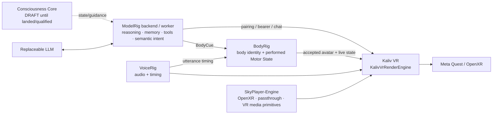

# Kaliv VR

Kaliv VR is the third first-party ModelRig client, alongside `android/` and `desktop/`.

It is a Unity/OpenXR client for Meta Quest. It talks to the same ModelRig backend and uses the same pairing/token model as the other Kaliv clients. VR playback, projection and passthrough mechanics come from the separate `Ternedal/SkyPlayer-Engine` package.

For the whole-product context, see [`docs/KALIV_SYSTEM_DEFINITION.md`](../docs/KALIV_SYSTEM_DEFINITION.md). Kaliv VR is the embodied presentation surface; it does not move body, voice or cognition authority into the renderer.

## Architecture



The product boundary is deliberate:

- **ModelRig / Kaliv VR** owns pairing, auth, model selection, Kaliv UX and the Quest presentation/rendering engine.
- **BodyRig** owns body identity and performed body-state semantics.
- **SkyPlayer-Engine** owns reusable XR/media mechanics.
- **Skyplayer** remains a separate Stash-oriented client of the same engine.

## Current landed scope

The landed first-party VR slice provides:

- code-driven XR rig; no hand-authored scene dependency
- Kaliv dark/gold world-space UI foundation
- controller-ray + gaze fallback interaction
- ModelRig `POST /api/v1/pair/claim`
- bearer-token persistence in Unity PlayerPrefs for bootstrap development
- `GET /api/v1/models`
- buffered `POST /api/v1/chat`
- SkyPlayer-Engine dependency pinned to an exact revision
- Quest/Android build script using IL2CPP + ARM64 + GLES3
- BodyRig VRM avatar loading with body/package/member-digest binding
- live `bodyrig.render_frame` v0.1 rendering
- BodyPrint height-scale presentation
- automatic active-body revision reload
- verified authored `idle.vrma` / `talk.vrma` state motion
- explicit persistent Body / Media / UI / Debug composition roots
- Kaliv-owned media facade over SkyPlayer-Engine with flat/VR180/VR360 projection bound to `KalivMedia`
- tracking-origin compensation propagated into immersive media orientation

The implementation is landed on `main`, but it is not yet a physically qualified finished VR product. Streaming chat, voice, RAG, tools/confirmation, richer spatial interaction and full Kaliv conversation UX still need parity with Android/Desktop, and Quest device evidence remains its own gate.

## Build

Open `vr/` in Unity **6000.4.10f1** with Android Build Support.

Use **Kaliv VR → Build Android APK** for an interactive editor build.

For the exact-head physical gate from the repository root on Windows:

```powershell
$sha = (git rev-parse HEAD).Trim()
.\scripts\run-kaliv-vr-quest-validation.ps1 -ExpectedSha $sha -Install -Launch
```

Omit `-Install -Launch` when only package restore / C# compile / Android IL2CPP build should be qualified. The operator requires a clean checkout before and after Unity, pins Unity **6000.4.10f1**, hashes the APK and writes local evidence to `validation/kaliv-vr-quest-latest.json`. It never sets physical headset acceptance true automatically.

Output:

`vr/release/output/KalivVR-dev.apk`

OpenXR/Meta Quest configuration is committed under `Assets/XR`: Android initializes XR on startup, uses the OpenXR loader, and enables Meta Quest Support, Oculus Touch and the SkyPlayer-Engine passthrough feature. XR Management 4.5 performs the loader initialization/startup from `m_InitManagerOnStart=1`; the serialized manager's `m_AutomaticLoading`/`m_AutomaticRunning` fields are therefore expected to remain false. The build script validates the committed authority and fails closed if it is missing or disabled; it does not silently repair XR settings during the build.

## Networking

The ModelRig backend must be reachable from Quest. As with Android, a backend bound only to `127.0.0.1` is unreachable from another device. Use `MODELRIG_HOST=0.0.0.0` on a trusted LAN or bind an appropriate Tailscale address.
