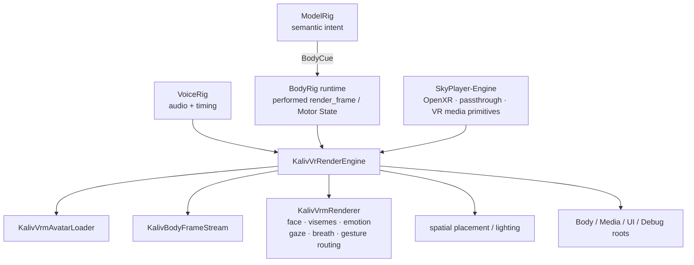

# Kaliv VR rendering engine

Kaliv VR owns a product rendering engine inside `vr/`. It is not the same thing as SkyPlayer-Engine. The whole-system authority model is defined in [`docs/KALIV_SYSTEM_DEFINITION.md`](../docs/KALIV_SYSTEM_DEFINITION.md).

## Ownership

**BodyRig is authority for performed body state.** Kaliv VR never invents body semantics, body identity or joint commands.

**Kaliv VR is authority for presentation.** It decides where the already-resolved body is placed, how the Quest scene is lit, which render layers are visible and how the user interacts with them.

**SkyPlayer-Engine is reusable infrastructure.** It owns playback/projection/passthrough mechanics, not Kaliv identity, conversation or body behavior.

## Current implementation

### Avatar asset path

1. Authenticated `GET /api/v1/body/active`.
2. Require `schema=modelrig-body-assets/v1`, `body_id` and `package_sha256`.
3. Authenticated `GET /api/v1/body/active/avatar.vrm`.
4. Require stable body/package identity across the two requests when the response headers are present.
5. Fetch and verify `bodyprint.json` against the same body/package revision.
6. Apply optional BodyPrint `shape.height_scale` as renderer-local avatar scale.
7. Verify `X-BodyRig-Member-SHA256` against the downloaded VRM bytes.
8. Cache the verified VRM under `Application.persistentDataPath/KalivVR/Bodies`.
9. Load VRM 1.0 with pinned UniVRM `v0.131.2`.
10. Run VRM first-person setup, show meshes and bind the humanoid renderer.

A body is never synthesized locally and Kaliv VR never reads arbitrary .mrbody members.

### Live state path

`KalivBodyFrameStream` consumes authenticated SSE from:

`GET /api/v1/body/frames`

Each `data:` payload must validate as canonical `bodyrig.render_frame` v0.1 before it can reach the renderer. Timestamps must advance inside one SSE connection. A reconnect resets only stream-local timestamp authority.

### Authored VRMA state motion

When the active package exposes `idle.vrma`, Kaliv VR can use the package's authored body pose through UniVRM's pinned `VrmAnimationImporter` runtime path. `talk.vrma` is selected while BodyRig state is `speaking`; otherwise `idle.vrma` remains the neutral baseline. If no idle clip exists, authored state motion stays off to avoid freezing a talk-only pose.

Every motion download is bearer-authenticated and bound to the same `body_id`, package digest and member SHA-256 as the accepted avatar revision.

The VRMA object is wrapped as a body-only `IVrm10Animation`: its ControlRig is delegated, but `ExpressionMap` is empty and `LookAt` is null. This prevents a motion file from taking authority over BodyRig blink, mouth/visemes, emotion or gaze. `gesture_01..03` are deliberately not guessed into semantic gestures until BodyRig provides an explicit mapping.

### Renderer mapping

The renderer is derived from the physically exercised BodyRig Unity/VRM reference renderer and retains its boundary:

- `blink` → VRM blink expression
- timed `aa/ih/ou/ee/oh` visemes → VRM mouth presets
- audio-envelope fallback → approximate `aa` mouth opening
- semantic emotion → VRM emotion preset
- `gaze_target=user|camera` → head/eye aiming at the HMD
- `gaze_target=object:*|world:*` → exact renderer-local target lookup; unknown target is a no-op
- renderer-neutral head hints → local head motion
- `breath` + energy → subtle chest movement
- semantic gestures → Animator routing with conservative procedural fallback
- interrupted/error → gesture cancellation and neutral speech mouth

No `HumanBodyBones`, Unity object paths or VRM expression identifiers cross back into ModelRig/BodyRig.

## Spatial target registry

`KalivSpatialTargetRegistry` maps exact renderer-neutral tokens such as `object:screen` or `world:door` to local Quest `Transform` objects. Registration happens through `KalivVrRenderEngine.RegisterObjectTarget` / `RegisterWorldTarget`.

The mapping never crosses back into BodyRig: no Unity hierarchy path, transform, bone or coordinate object is introduced into `bodyrig.render_frame`. Unknown targets remain local no-ops rather than being guessed.

## Spatial presence

The accepted VRM is first floor-aligned from its humanoid left/right foot bones after BodyPrint height scaling. The body root is then placed at floor level about 1.85 m in front of the current HMD and turned toward the user. `CENTRER KROP` re-applies this placement.

This is a Quest presentation rule, not BodyRig state.

`KalivTrackingOriginCompensator` also listens for Quest `trackingOriginUpdated` events. It waits at least one frame for the new tracked camera pose, then applies the same rigid camera-pose delta to the persistent Kaliv composition root. HMD/XR Origin is never moved by Kaliv. This keeps body, media, UI and debug surfaces visually stable across system recenter/tracking recovery.

The scene currently uses passthrough-first rendering and a conservative warm directional/ambient light setup suitable for MToon avatars. Later environment/lighting work belongs here.

## Render composition

Kaliv VR commits four Unity layers and stable scene roots:

- `KalivBody` → accepted BodyRig avatar and body presentation
- `KalivMedia` → SkyPlayer-Engine media/projection surfaces
- `KalivUI` → persistent Kaliv world-space UI
- `KalivDebug` → diagnostics/evidence overlays

`KalivVrComposition` owns those roots. The Quest build fails fast if the committed layer names are missing. The UI controller and its canvas share the same persistent `UiRoot`, so a code-generated boot scene cannot leave a visible canvas whose controller was destroyed during scene load.

### Media presentation

`KalivVrMediaRenderer` is the Kaliv-owned facade over `SkyPlayer.Engine.VrPlayer`. Generated flat/sphere geometry is parented under `MediaRoot` and assigned the `KalivMedia` layer by the pinned SkyPlayer-Engine presentation-root API.

`KalivVrRenderEngine` exposes open/stop/play-pause/seek/format/recenter/zoom/pan operations without importing Skyplayer/Stash product semantics. Flat media therefore follows the persistent composition root across Quest tracking-origin shifts. Immersive media remains camera-centered by SkyPlayer-Engine, while the same accepted origin rotation delta is applied to its projection base so VR180/360 orientation does not jump after recenter/tracking recovery.

## Quest 2 render-budget guard

On accepted avatar load, `KalivQuestRenderBudget` counts active renderers, skinned renderers, material slots, an estimated avatar draw-call count and rendered triangle indices. The current Quest 2 whole-scene guidance (<100 draw calls, <750k triangles) is used only as a soft warning when the **avatar alone** exceeds it.

Kaliv also records a renderer-scene snapshot when the avatar is accepted and whenever the SkyPlayer media display is created, rebuilt or cleared. That snapshot includes visible Unity `Renderer` geometry under the Kaliv product root, so body + flat/spherical media changes are visible in logs.

Neither snapshot is a performance gate. The renderer-scene count does not include Canvas/compositor/passthrough cost and cannot measure CPU/GPU frame time. 72 Hz / ~13.8 ms must still be demonstrated on the physical Quest 2 with profiling.

## Shader authority

Runtime VRM load means Unity cannot infer shader usage from the empty boot scene. Kaliv VR therefore commits the same player-build shader authority learned from the BodyRig physical renderer work:

- `VRM10/MToon10`
- `UniGLTF/UniUnlit`
- Unity `Standard`

They are pinned in `vr/ProjectSettings/GraphicsSettings.asset`.

## Next render slices

1. Richer bodyprint-driven proportions beyond the landed height-scale presentation.
2. Explicit semantic mapping for packaged `gesture_01..03` motions.
3. Quest performance tuning: physical 72 Hz profiling, LOD, shadows and foveation qualification beyond the landed avatar soft guard.
4. Physical Quest acceptance against the same BodyRig live-frame behavior already exercised on the reference Unity renderer.

The renderer is not production-qualified until the Unity/Android build and on-device Quest checks are green.
